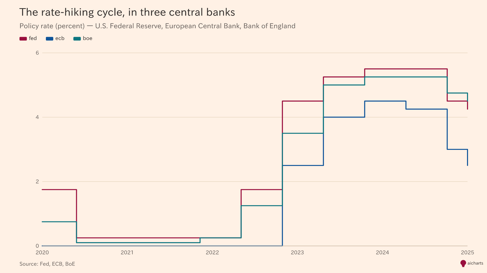
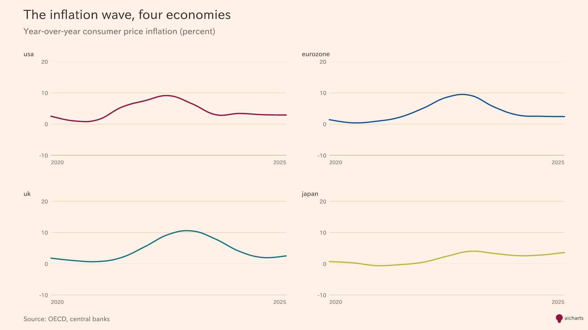
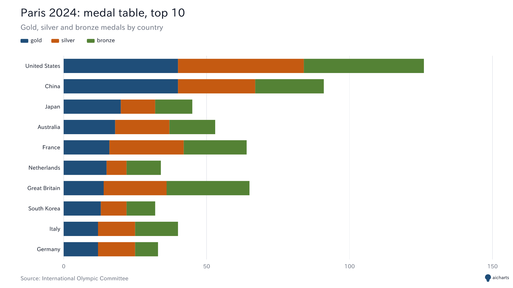

# aicharts

**Professional charts, straight from your AI chat.** Ask ChatGPT or Claude for
a chart, get an editorial-quality image back. No plugins, no code, no Chart.js.

<p align="center">
  
</p>

## Copy-paste this into ChatGPT to use aicharts

Open a new chat in ChatGPT, Claude, Gemini, or any AI assistant, paste the
block below as your first message, then ask for any chart you want.

````text
You can create charts for me using the aicharts API. Endpoint:

  https://mcp-charts.vercel.app/chart?j=<URL-ENCODED JSON>

When I ask for a chart:
1. Build a flat JSON config that describes the chart.
2. Always include: "chart" (type), "data" (array of row objects), and the
   correct field names for that chart type (see rules below).
3. URL-encode the JSON (use encodeURIComponent-style percent-encoding:
   " becomes %22, space becomes %20, { becomes %7B, } becomes %7D, etc).
4. Respond with ONLY a Markdown image that renders inline:

     

Chart types: line, bar, grouped-bar, stacked-bar, bar-split, stacked-area,
combo, line-split, pie, donut, geo.

Field rules (always include "data" on every chart):
- line, stacked-area, line-split, grouped-bar, stacked-bar, bar-split:
  set "x" (column name) and "y" (column name or array of columns).
- combo: set "x", "bars" (column or array), "lines" (column or array).
- bar: use either ("x","y") or ("label","value").
- pie, donut: use "label" and "value".
- geo: set "basemap" (one of: world, europe, usa, north-america,
  south-america, africa, asia, oceania, czech-republic, germany, france,
  united-kingdom), "code" (ISO3 country code column), and "value" column.

Optional on any chart: title, subtitle, source, palette, size, width, height.
Palettes: clarity (default), editorial, boardroom, vibrant, carbon, viridis,
earth, twilight, mono-blue, diverging-sunset.
Sizes: inline (800x500), share (1200x675, default), poster (1600x2000).

If I do not give you numbers, invent a realistic dataset yourself. Default to
"diverging-sunset" palette for maps, "editorial" or "clarity" otherwise. Keep
titles short and specific. Always include a source line.

Before you send the URL, mentally re-parse the JSON once to confirm every
key and string is wrapped in double quotes and every key has a colon after
it. A single missing quote breaks the whole chart.

Respond with the Markdown image only, nothing else.
````

Then try:

> Create a map of Europe for 2025 showing CO2 emissions per capita by country.

The assistant will reply with a Markdown image URL that renders like the map
at the top of this README. No setup, no API keys, no packages.

## Gallery

<p align="center">
  
  
</p>
<p align="center">
  
  
</p>
<p align="center">
  
  
</p>
<p align="center">
  
  
</p>

See [CHATGPT-EXAMPLES.md](./CHATGPT-EXAMPLES.md) for 30+ ready-to-paste prompts.

## Try it without ChatGPT

Every chart is a single URL. Open this one in a browser, email it, or paste it
into any Markdown editor — it renders as an image:

```
https://mcp-charts.vercel.app/chart?config=eyJjaGFydCI6ImJhciIsInRpdGxlIjoiUXVhcnRlcmx5IHJldmVudWUiLCJzdWJ0aXRsZSI6IkZZMjAyNSwgbWlsbGlvbnMgVVNEIiwiZGF0YSI6W3sibGFiZWwiOiJRMSIsInZhbHVlIjo0Mn0seyJsYWJlbCI6IlEyIiwidmFsdWUiOjU4fSx7ImxhYmVsIjoiUTMiLCJ2YWx1ZSI6NzF9LHsibGFiZWwiOiJRNCIsInZhbHVlIjo4OX1dfQ
```

That URL is the string `{"chart":"bar","title":"Quarterly revenue","subtitle":"FY2025, millions USD","data":[{"label":"Q1","value":42},{"label":"Q2","value":58},{"label":"Q3","value":71},{"label":"Q4","value":89}]}` base64url-encoded and tacked onto `?config=`. Change any value, rebuild
the URL, share the link.

Interactive playground and live encoder: [mcp-charts.vercel.app](https://mcp-charts.vercel.app).

## Embed in Markdown, Notion, or anywhere that shows images

```md

```

Works in GitHub READMEs, Notion, Obsidian, Slack message unfurls, GitBook,
Docusaurus — anywhere that renders Markdown images.

## Install (optional)

You only need this if you want to run charts locally, ship a library
dependency, or self-host the HTTP endpoint. The hosted endpoint above is free
and has no rate limits for reasonable use.

### As an npm library

```sh
npm install aicharts
```

```ts
import { render } from 'aicharts';

const png = await render({
  chart: 'bar',
  title: 'Quarterly revenue',
  data: [
    { label: 'Q1', value: 42 },
    { label: 'Q2', value: 58 },
    { label: 'Q3', value: 71 },
    { label: 'Q4', value: 89 },
  ],
});

// png is a Uint8Array. Write it, ship it, base64-encode it.
```

### As an MCP server (Claude Desktop, Cursor, Windsurf, etc.)

```sh
claude mcp add aicharts -- npx -y aicharts
```

Or point any HTTP MCP client at `https://mcp-charts.vercel.app/mcp`.

## What it can render

11 chart types, 10 palettes, 11 basemaps, 3 preset sizes.

| Chart type   | Use when                                        |
| ------------ | ----------------------------------------------- |
| line         | a trend over time, one or a few series          |
| line-split   | many series, each worth its own panel           |
| bar          | compare one metric across categories            |
| grouped-bar  | compare two or three metrics across categories  |
| stacked-bar  | parts of a whole across categories              |
| bar-split    | same categories, one panel per metric           |
| stacked-area | composition over time                           |
| combo        | bars and a line on one plot (e.g. rate + count) |
| pie          | parts of a whole, few slices                    |
| donut        | parts of a whole with a center value            |
| geo          | choropleth on a country, region, or world map   |

Palettes: `clarity` (default), `editorial`, `boardroom`, `vibrant`, `carbon`,
`viridis`, `earth`, `twilight`, `mono-blue`, `diverging-sunset`.

Basemaps: `world`, `europe`, `usa`, `north-america`, `south-america`,
`africa`, `asia`, `oceania`, `czech-republic`, `germany`, `france`,
`united-kingdom`.

## Links

- [CHATGPT-EXAMPLES.md](./CHATGPT-EXAMPLES.md) — 30+ ready-to-paste prompts
  with URLs you can click.
- [FOR-DEVELOPERS.md](./FOR-DEVELOPERS.md) — architecture, palette reference,
  contributing guide, HTTP / MCP API details.
- [mcp-charts.vercel.app](https://mcp-charts.vercel.app) — live demo and
  URL builder.
- [github.com/knapejar/aicharts](https://github.com/knapejar/aicharts) — source.

## License

MIT.
