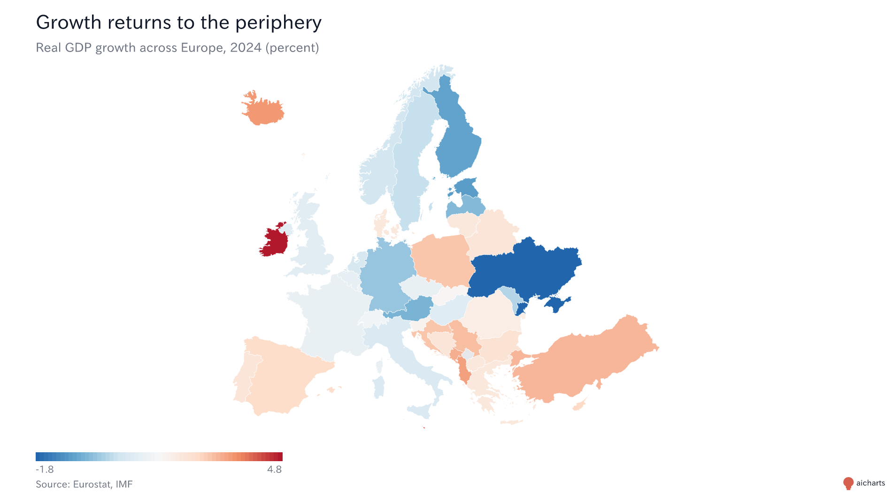
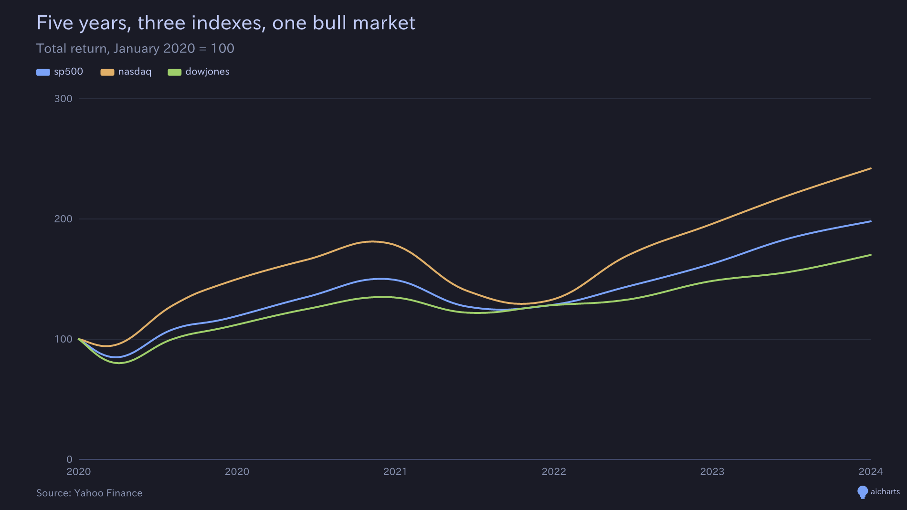
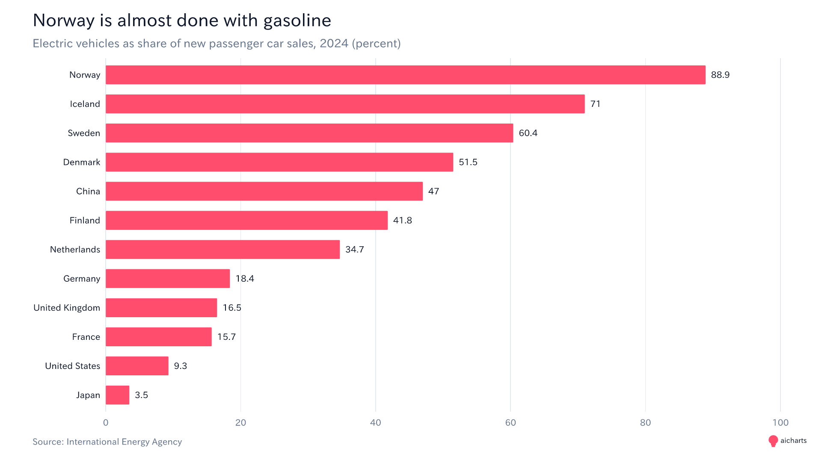
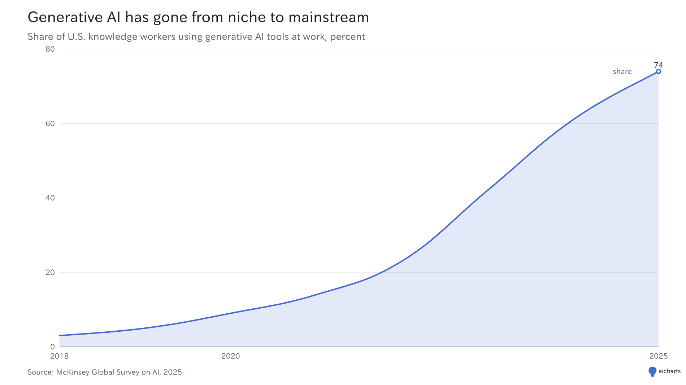
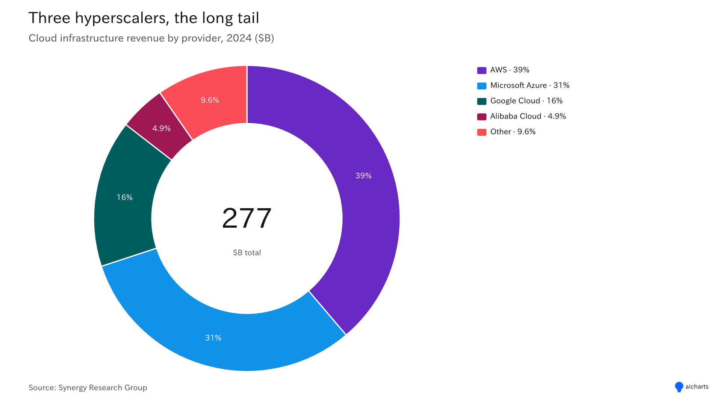
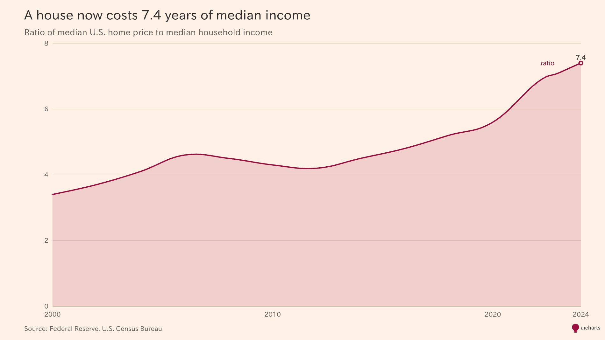
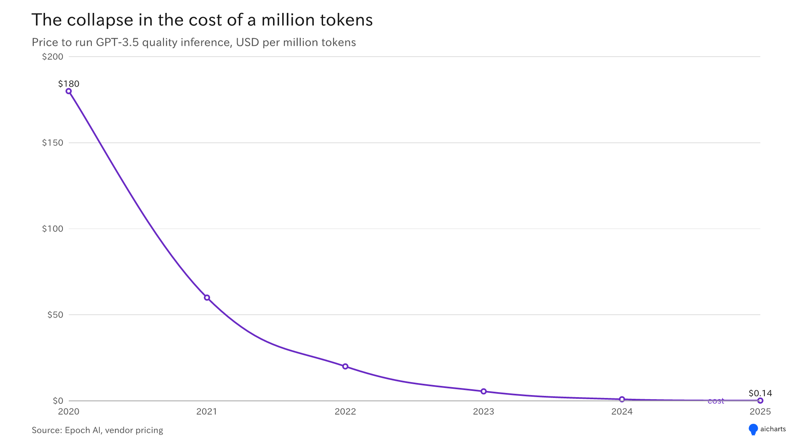

# aicharts

Professional chart PNGs for AI agents. Paste a URL, get a chart.

<p align="center">
  
  
  
</p>

## Try it in 30 seconds

Open this URL in a browser, paste it to ChatGPT or Claude, or pipe it through
curl — all three work:

```
https://mcp-charts.vercel.app/chart?config=eyJjaGFydCI6ImJhciIsInRpdGxlIjoiUXVhcnRlcmx5IHJldmVudWUiLCJzdWJ0aXRsZSI6IkZZMjAyNSwgbWlsbGlvbnMgVVNEIiwiZGF0YSI6W3sibGFiZWwiOiJRMSIsInZhbHVlIjo0Mn0seyJsYWJlbCI6IlEyIiwidmFsdWUiOjU4fSx7ImxhYmVsIjoiUTMiLCJ2YWx1ZSI6NzF9LHsibGFiZWwiOiJRNCIsInZhbHVlIjo4OX1dfQ
```

The query string is base64url-encoded JSON. The config in that URL is a
four-bar chart titled _Quarterly revenue_. Change the data, rebuild the URL,
share the link. That is the whole API.

## In ChatGPT, Claude, or any AI chat

Paste a prompt like this and the agent will fetch the image inline:

> Fetch this URL and show the image:
>
> `https://mcp-charts.vercel.app/chart?config=...`

Agents can also generate their own URLs on the fly — the schema is small (one
flat JSON config) and fully documented in
[CHATGPT-EXAMPLES.md](./CHATGPT-EXAMPLES.md). Try asking: "create a map of
Europe for 2025 showing how much CO2 each European country emits per capita."
A capable model will produce something like the URL below — which is a real,
working link you can click right now:

```
https://mcp-charts.vercel.app/chart?config=eyJjaGFydCI6ImdlbyIsInRpdGxlIjoiRXVyb3BlIENPMiBlbWlzc2lvbnMgcGVyIGNhcGl0YSwgMjAyNSIsInN1YnRpdGxlIjoiVG9ubmVzIG9mIENPMiBwZXIgcGVyc29uLCBlc3RpbWF0ZSIsInNvdXJjZSI6Ik91ciBXb3JsZCBpbiBEYXRhLCBFdXJvc3RhdCAoMjAyNSBlc3QuKSIsInBhbGV0dGUiOiJkaXZlcmdpbmctc3Vuc2V0IiwiYmFzZW1hcCI6ImV1cm9wZSIsImNvZGUiOiJjb2RlIiwidmFsdWUiOiJlbWlzc2lvbnMiLCJzY2FsZSI6InN0ZXBwZWQiLCJzdGVwcyI6NiwiZGF0YSI6W3siY29kZSI6IkxVWCIsImVtaXNzaW9ucyI6MTMuMn0seyJjb2RlIjoiQ1pFIiwiZW1pc3Npb25zIjo5LjF9LHsiY29kZSI6IkVTVCIsImVtaXNzaW9ucyI6OC45fSx7ImNvZGUiOiJERVUiLCJlbWlzc2lvbnMiOjcuN30seyJjb2RlIjoiUE9MIiwiZW1pc3Npb25zIjo3Ljl9LHsiY29kZSI6Ik5MRCIsImVtaXNzaW9ucyI6Ny4zfSx7ImNvZGUiOiJCRUwiLCJlbWlzc2lvbnMiOjcuMX0seyJjb2RlIjoiSVJMIiwiZW1pc3Npb25zIjo2Ljh9LHsiY29kZSI6IkZJTiIsImVtaXNzaW9ucyI6Ny40fSx7ImNvZGUiOiJBVVQiLCJlbWlzc2lvbnMiOjYuNX0seyJjb2RlIjoiQ1lQIiwiZW1pc3Npb25zIjo2LjB9LHsiY29kZSI6IkdSQyIsImVtaXNzaW9ucyI6NS42fSx7ImNvZGUiOiJJVEEiLCJlbWlzc2lvbnMiOjUuMn0seyJjb2RlIjoiU1ZLIiwiZW1pc3Npb25zIjo1LjR9LHsiY29kZSI6IlNWTiIsImVtaXNzaW9ucyI6NS4zfSx7ImNvZGUiOiJCR1IiLCJlbWlzc2lvbnMiOjUuOH0seyJjb2RlIjoiRE5LIiwiZW1pc3Npb25zIjo0Ljh9LHsiY29kZSI6IkxUVSIsImVtaXNzaW9ucyI6NC42fSx7ImNvZGUiOiJFU1AiLCJlbWlzc2lvbnMiOjQuOH0seyJjb2RlIjoiSFVOIiwiZW1pc3Npb25zIjo0LjV9LHsiY29kZSI6IkdCUiIsImVtaXNzaW9ucyI6NC40fSx7ImNvZGUiOiJGUkEiLCJlbWlzc2lvbnMiOjQuMX0seyJjb2RlIjoiSFJWIiwiZW1pc3Npb25zIjo0LjF9LHsiY29kZSI6IkxWQSIsImVtaXNzaW9ucyI6My45fSx7ImNvZGUiOiJST1UiLCJlbWlzc2lvbnMiOjMuOH0seyJjb2RlIjoiUFJUIiwiZW1pc3Npb25zIjozLjh9LHsiY29kZSI6IlNXRSIsImVtaXNzaW9ucyI6My4yfSx7ImNvZGUiOiJNTFQiLCJlbWlzc2lvbnMiOjMuM30seyJjb2RlIjoiQ0hFIiwiZW1pc3Npb25zIjozLjd9LHsiY29kZSI6Ik5PUiIsImVtaXNzaW9ucyI6Ni43fSx7ImNvZGUiOiJJU0wiLCJlbWlzc2lvbnMiOjguN31dfQ
```

## What it renders

11 chart types, 10 palettes, 11 basemaps, 3 sizes (`inline` 800x500,
`share` 1200x675, `poster` 1600x2000).

| Chart type   | Use when                                        |
| ------------ | ----------------------------------------------- |
| line         | a trend over time, one or a few series          |
| line-split   | many series, each worth its own panel           |
| bar          | compare a single metric across categories       |
| grouped-bar  | compare two or three metrics across categories  |
| stacked-bar  | parts of a whole across categories              |
| bar-split    | same categories, one panel per metric           |
| stacked-area | composition over time                           |
| combo        | bars and a line on one plot (e.g. rate + count) |
| pie          | parts of a whole, few slices                    |
| donut        | parts of a whole with a center value            |
| geo          | choropleth on a country, region, or world map   |

## More examples

<p align="center">
  
  
</p>
<p align="center">
  
  
</p>

AI adoption by sector (bars). Cloud market share over time (stacked area).
Housing affordability index across metros (line-split). Falling cost per
million tokens across major AI models (line).

## Use from code

```
npm install aicharts
```

```ts
import { render } from 'aicharts';

const png = await render({
  chart: 'bar',
  data: [
    { label: 'A', value: 12 },
    { label: 'B', value: 18 },
  ],
  title: 'Hello',
});
```

`render()` returns a `Uint8Array` containing a PNG.

## MCP server

aicharts ships as an MCP server so Claude, Cursor, and any MCP-capable agent
can call `render_chart` directly. Local install:

```
claude mcp add aicharts -- npx -y aicharts
```

Remote (ChatGPT custom connector, hosted Claude, or any HTTP MCP client):
point at `https://mcp-charts.vercel.app/mcp`.

## Links

- [CHATGPT-EXAMPLES.md](./CHATGPT-EXAMPLES.md) — 20+ ready-to-paste prompts.
- [FOR-DEVELOPERS.md](./FOR-DEVELOPERS.md) — architecture, palette reference,
  contributing guide.
- Live demo and playground: [mcp-charts.vercel.app](https://mcp-charts.vercel.app)
- Source: [github.com/knapejar/aicharts](https://github.com/knapejar/aicharts)

## License

MIT.
