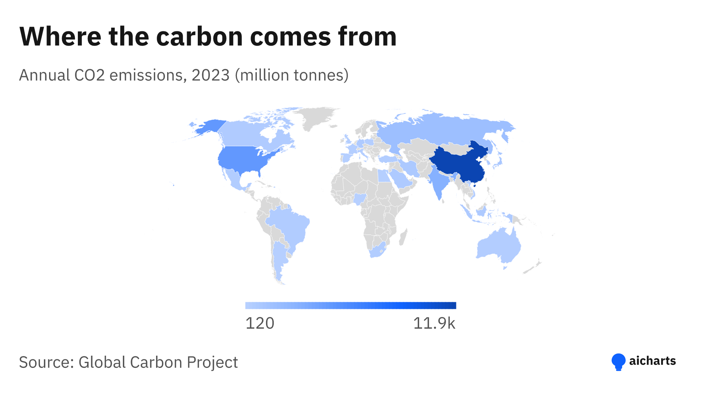
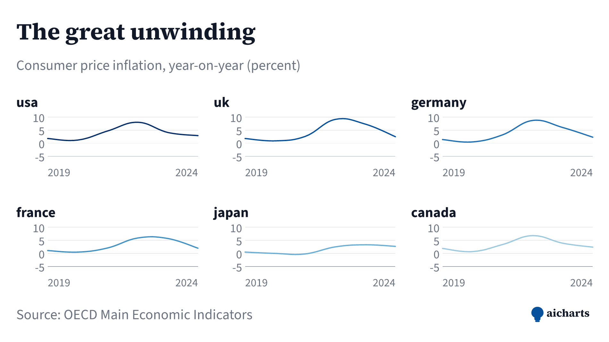
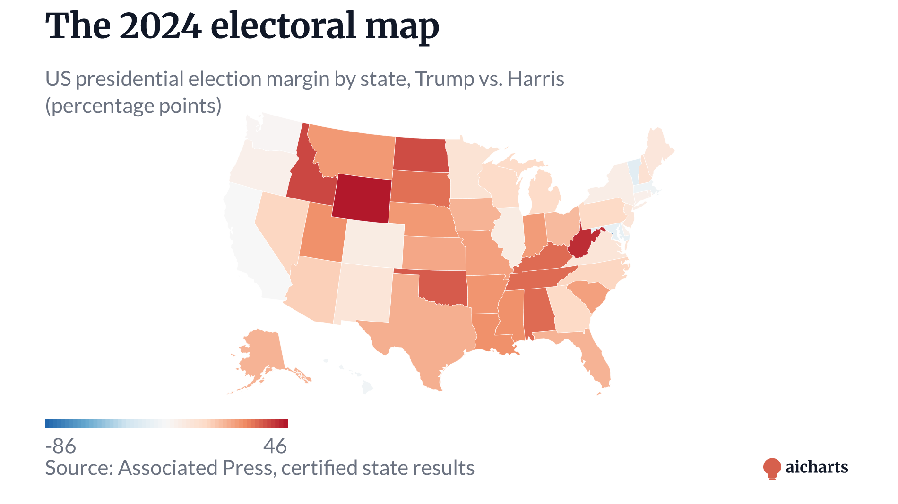
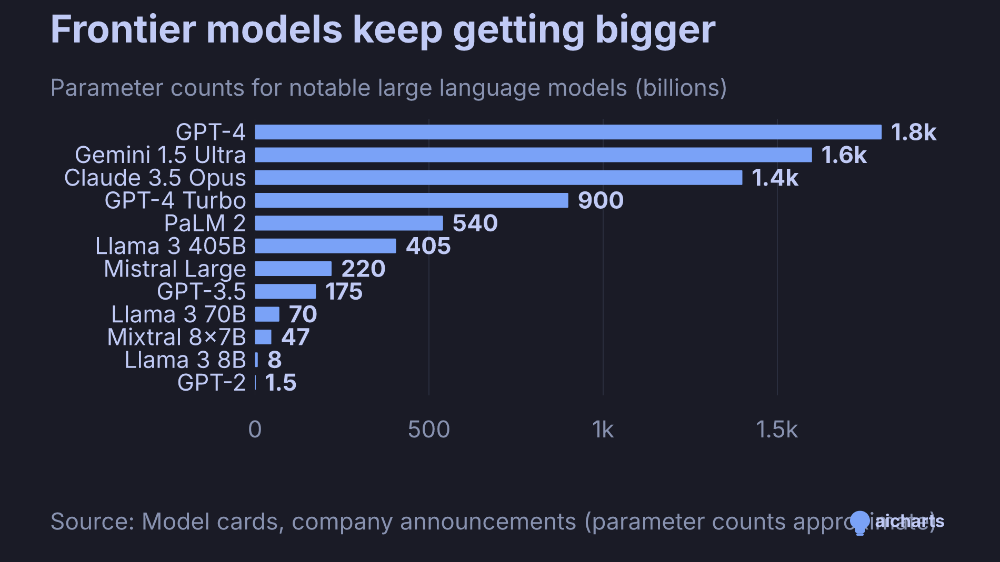
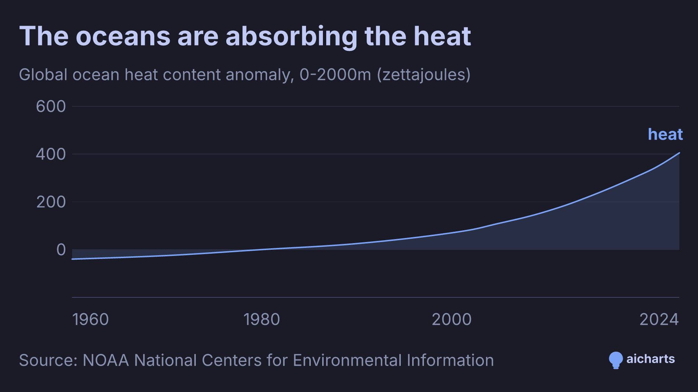
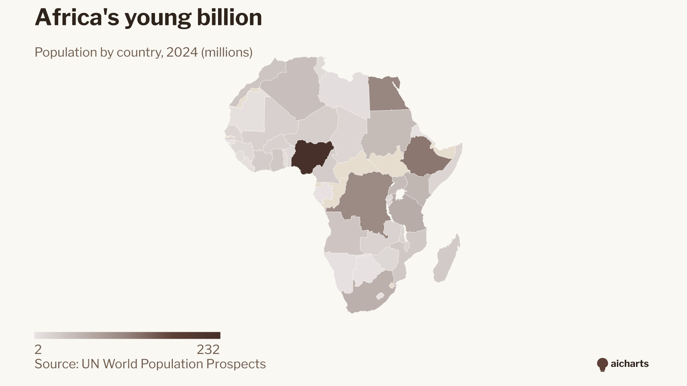

<p align="center">
  
</p>

<h1 align="center">aicharts</h1>

<p align="center"><strong>Make real charts inside any AI chat. Copy, paste, ask.</strong></p>

<p align="center">
  <a href="./examples/README.md">Show me 50 charts →</a>
  &nbsp;·&nbsp;
  <a href="https://mcp-charts.vercel.app">Live playground</a>
  &nbsp;·&nbsp;
  <a href="./FOR-DEVELOPERS.md">Tech reference</a>
</p>

---

## Use it now (60 seconds)

Works in **Claude.ai**, **ChatGPT**, and **Gemini** on the free tier. No
account, no install, no API key.

**Step 1.** Paste this block as your first message:

````text
You can render real charts in our chat by emitting a Markdown image:

  

How to respond when I ask for a chart:
1. Find real data (your knowledge or a web search). Don't invent numbers.
   Cite the source in the JSON's "source" field.
2. Build a JSON config (shape below).
3. URL-encode the JSON with percent-encoding — NOT base64.
   Cheatsheet: " %22  { %7B  } %7D  : %3A  , %2C  [ %5B  ] %5D  space %20
4. Reply with a SINGLE Markdown image line. No code block, no commentary.

JSON shape (only "chart" and "data" are required):

{ "chart":   "bar"|"line"|"pie"|"donut"|"stacked-area"|"grouped-bar"
            |"stacked-bar"|"combo"|"bar-split"|"line-split"|"geo",
  "data":    [{...row...}, ...],
  "title":   "...",
  "subtitle":"...",
  "source":  "...",
  "palette": "clarity"|"editorial"|"boardroom"|"vibrant"|"carbon"
            |"viridis"|"earth"|"twilight"|"mono-blue"|"diverging-sunset",
  "size":    "square"  (default - 1200x1200)
            |"share"   (landscape - 1200x675)
            |"poster"  (portrait - 1600x2000) }

Row shape per chart:
- bar / pie / donut: {"label":"...","value":number}
- line / stacked-area / line-split / grouped-bar / stacked-bar / bar-split:
    add "x" (one column name) and "y" (one name, or array of names for
    multiple series). Rows are wide - one column per series.
- combo: add "x","bars","lines".
- geo: add "basemap" (one of: world, europe, africa, asia, north-america,
    south-america, oceania, usa, germany, france, united-kingdom),
    "code" (column with the region code), and "value" (column with the
    number). Codes: ISO3 for continent/world maps (DEU, USA, CHN);
    two-letter for usa/germany state maps (CA, BY); full county names
    for united-kingdom ("Greater London", "Cornwall").

Worked example - bar chart of A=10, B=20:
  JSON: {"chart":"bar","title":"Demo","data":[{"label":"A","value":10},{"label":"B","value":20}]}
  URL:  https://mcp-charts.vercel.app/chart?j=%7B%22chart%22%3A%22bar%22%2C%22title%22%3A%22Demo%22%2C%22data%22%3A%5B%7B%22label%22%3A%22A%22%2C%22value%22%3A10%7D%2C%7B%22label%22%3A%22B%22%2C%22value%22%3A20%7D%5D%7D
````

**Step 2.** Send any chart request, in plain English:

> *"Chart of which countries eat the most potatoes per capita."*

The chart appears inline in the chat. That's the whole product.

## Show me what you can do

Real public data — AI growth, climate, elections, economy, demographics,
tech, sports — rendered at magazine quality across every chart type and
every palette. Each chart is just a URL.

<p align="center">
  <a href="./examples/README.md"></a>
  <a href="./examples/README.md"></a>
</p>
<p align="center">
  <a href="./examples/README.md"></a>
  <a href="./examples/README.md"></a>
</p>
<p align="center">
  <a href="./examples/README.md"></a>
  <a href="./examples/README.md"></a>
</p>

<p align="center">
  <a href="./examples/README.md"><strong>→ Show me all 50 charts</strong></a>
</p>

## Embed anywhere

Every chart is a URL that returns a PNG. That means any tool that renders
Markdown images also renders aicharts:

```md

```

GitHub READMEs, Notion, Obsidian, Slack unfurls, GitBook, Docusaurus,
Slidev, Marp, email — anywhere images render.

## Advanced

Only useful if you outgrow copy-paste.

**MCP server** for Claude Desktop, Cursor, Windsurf, etc.

```sh
claude mcp add aicharts -- npx -y aicharts
```

Or point any HTTP MCP client at `https://mcp-charts.vercel.app/mcp`.

**npm library** for your own app.

```sh
npm install aicharts
```

```ts
import { render } from 'aicharts';
const png = await render({
  chart: 'bar',
  title: 'Hello',
  data: [{ label: 'A', value: 12 }, { label: 'B', value: 18 }],
});
```

**Auto agent guide** — clients that fetch URLs (Cursor, Claude Code,
ChatGPT with Browse) can hit `https://mcp-charts.vercel.app/agent-guide`
or any bare `https://mcp-charts.vercel.app/chart` URL with an AI
user-agent — the server returns the same primer above as Markdown.

**Self-host on Vercel.** See [FOR-DEVELOPERS.md](./FOR-DEVELOPERS.md).

## What's inside

11 chart types — `line`, `bar`, `grouped-bar`, `stacked-bar`, `bar-split`,
`stacked-area`, `combo`, `line-split`, `pie`, `donut`, `geo`.

10 palettes — `clarity`, `editorial`, `boardroom`, `vibrant`, `carbon`,
`viridis`, `earth`, `twilight`, `mono-blue`, `diverging-sunset`.

11 basemaps — `world`, `europe`, `africa`, `asia`, `north-america`,
`south-america`, `oceania`, `usa`, `germany`, `france`, `united-kingdom`.

4 size presets — `inline` (800x500), `share` (1200x675),
`square` (1200x1200, default), `poster` (1600x2000).

## Links

- [examples/](./examples/README.md) — 50-chart zoo
- [CHATGPT-EXAMPLES.md](./CHATGPT-EXAMPLES.md) — 30+ ready-to-paste prompts
- [FOR-DEVELOPERS.md](./FOR-DEVELOPERS.md) — architecture, APIs, contributing
- [mcp-charts.vercel.app](https://mcp-charts.vercel.app) — live playground
- [github.com/knapejar/aicharts](https://github.com/knapejar/aicharts) — source

MIT license.
