# 50 charts, zero configuration — Landscape (share 1200x675)

Every chart below was produced by the [aicharts](../README.md) library in one pass from a flat JSON config. Click any chart — or the URL beneath it — to open the live rendered PNG. The rendering URL is deterministic and can be pasted into Notion, Slack, or any Markdown viewer that loads images.

Other aspect ratios for the same zoo:
- [square](README.square.md)
- [portrait](README.portrait.md)

---

### Generative AI has gone mainstream
_Share of US knowledge workers using AI at work (percent)_
Line · palette: editorial · size: share

[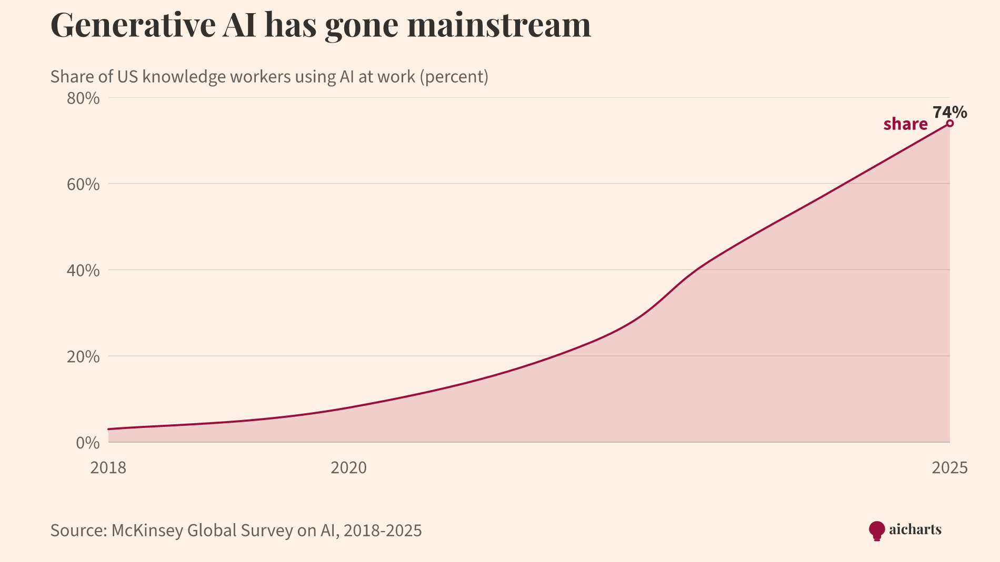](https://mcp-charts.vercel.app/chart?j=%7B%22chart%22%3A%22line%22%2C%22title%22%3A%22Generative%20AI%20has%20gone%20mainstream%22%2C%22subtitle%22%3A%22Share%20of%20US%20knowledge%20workers%20using%20AI%20at%20work%20(percent)%22%2C%22source%22%3A%22McKinsey%20Global%20Survey%20on%20AI%2C%202018-2025%22%2C%22palette%22%3A%22editorial%22%2C%22size%22%3A%22share%22%2C%22x%22%3A%22year%22%2C%22y%22%3A%22share%22%2C%22interpolation%22%3A%22curved%22%2C%22areaFill%22%3Atrue%2C%22showSymbols%22%3A%22last%22%2C%22showValueLabels%22%3A%22last%22%2C%22yFormat%22%3A%22percent%22%2C%22data%22%3A%5B%7B%22year%22%3A2018%2C%22share%22%3A3%7D%2C%7B%22year%22%3A2020%2C%22share%22%3A8%7D%2C%7B%22year%22%3A2022%2C%22share%22%3A23%7D%2C%7B%22year%22%3A2023%2C%22share%22%3A42%7D%2C%7B%22year%22%3A2024%2C%22share%22%3A58%7D%2C%7B%22year%22%3A2025%2C%22share%22%3A74%7D%5D%7D)

Open rendered PNG: <https://mcp-charts.vercel.app/chart?j=%7B%22chart%22%3A%22line%22%2C%22title%22%3A%22Generative%20AI%20has%20gone%20mainstream%22%2C%22subtitle%22%3A%22Share%20of%20US%20knowledge%20workers%20using%20AI%20at%20work%20(percent)%22%2C%22source%22%3A%22McKinsey%20Global%20Survey%20on%20AI%2C%202018-2025%22%2C%22palette%22%3A%22editorial%22%2C%22size%22%3A%22share%22%2C%22x%22%3A%22year%22%2C%22y%22%3A%22share%22%2C%22interpolation%22%3A%22curved%22%2C%22areaFill%22%3Atrue%2C%22showSymbols%22%3A%22last%22%2C%22showValueLabels%22%3A%22last%22%2C%22yFormat%22%3A%22percent%22%2C%22data%22%3A%5B%7B%22year%22%3A2018%2C%22share%22%3A3%7D%2C%7B%22year%22%3A2020%2C%22share%22%3A8%7D%2C%7B%22year%22%3A2022%2C%22share%22%3A23%7D%2C%7B%22year%22%3A2023%2C%22share%22%3A42%7D%2C%7B%22year%22%3A2024%2C%22share%22%3A58%7D%2C%7B%22year%22%3A2025%2C%22share%22%3A74%7D%5D%7D>

Source: McKinsey Global Survey on AI, 2018-2025

---

### Three hyperscalers, the long tail
_Global cloud infrastructure market share, Q4 2024 (percent)_
Bar · palette: clarity · size: share

[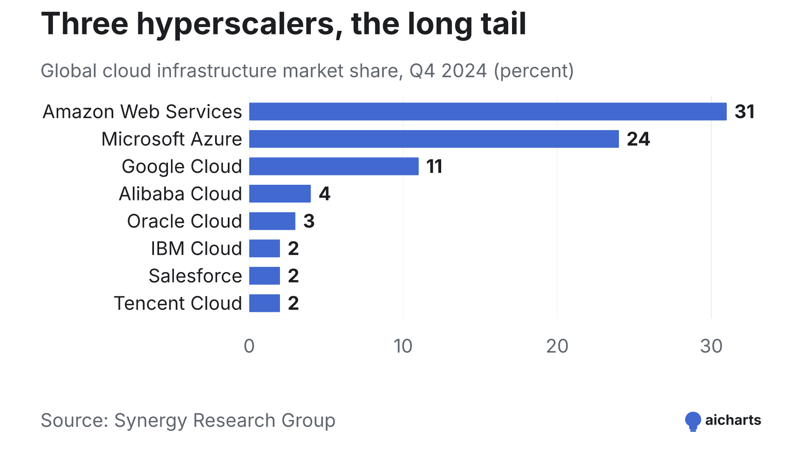](https://mcp-charts.vercel.app/chart?j=%7B%22chart%22%3A%22bar%22%2C%22title%22%3A%22Three%20hyperscalers%2C%20the%20long%20tail%22%2C%22subtitle%22%3A%22Global%20cloud%20infrastructure%20market%20share%2C%20Q4%202024%20(percent)%22%2C%22source%22%3A%22Synergy%20Research%20Group%22%2C%22palette%22%3A%22clarity%22%2C%22size%22%3A%22share%22%2C%22label%22%3A%22provider%22%2C%22value%22%3A%22share%22%2C%22orientation%22%3A%22horizontal%22%2C%22sort%22%3A%22desc%22%2C%22showValueLabels%22%3Atrue%2C%22data%22%3A%5B%7B%22provider%22%3A%22Amazon%20Web%20Services%22%2C%22share%22%3A31%7D%2C%7B%22provider%22%3A%22Microsoft%20Azure%22%2C%22share%22%3A24%7D%2C%7B%22provider%22%3A%22Google%20Cloud%22%2C%22share%22%3A11%7D%2C%7B%22provider%22%3A%22Alibaba%20Cloud%22%2C%22share%22%3A4%7D%2C%7B%22provider%22%3A%22Oracle%20Cloud%22%2C%22share%22%3A3%7D%2C%7B%22provider%22%3A%22IBM%20Cloud%22%2C%22share%22%3A2%7D%2C%7B%22provider%22%3A%22Salesforce%22%2C%22share%22%3A2%7D%2C%7B%22provider%22%3A%22Tencent%20Cloud%22%2C%22share%22%3A2%7D%5D%7D)

Open rendered PNG: <https://mcp-charts.vercel.app/chart?j=%7B%22chart%22%3A%22bar%22%2C%22title%22%3A%22Three%20hyperscalers%2C%20the%20long%20tail%22%2C%22subtitle%22%3A%22Global%20cloud%20infrastructure%20market%20share%2C%20Q4%202024%20(percent)%22%2C%22source%22%3A%22Synergy%20Research%20Group%22%2C%22palette%22%3A%22clarity%22%2C%22size%22%3A%22share%22%2C%22label%22%3A%22provider%22%2C%22value%22%3A%22share%22%2C%22orientation%22%3A%22horizontal%22%2C%22sort%22%3A%22desc%22%2C%22showValueLabels%22%3Atrue%2C%22data%22%3A%5B%7B%22provider%22%3A%22Amazon%20Web%20Services%22%2C%22share%22%3A31%7D%2C%7B%22provider%22%3A%22Microsoft%20Azure%22%2C%22share%22%3A24%7D%2C%7B%22provider%22%3A%22Google%20Cloud%22%2C%22share%22%3A11%7D%2C%7B%22provider%22%3A%22Alibaba%20Cloud%22%2C%22share%22%3A4%7D%2C%7B%22provider%22%3A%22Oracle%20Cloud%22%2C%22share%22%3A3%7D%2C%7B%22provider%22%3A%22IBM%20Cloud%22%2C%22share%22%3A2%7D%2C%7B%22provider%22%3A%22Salesforce%22%2C%22share%22%3A2%7D%2C%7B%22provider%22%3A%22Tencent%20Cloud%22%2C%22share%22%3A2%7D%5D%7D>

Source: Synergy Research Group

---

### The warming, year by year
_Global mean surface temperature anomaly vs. 1951-1980 baseline (degrees Celsius)_
Line · palette: diverging-sunset · size: share

[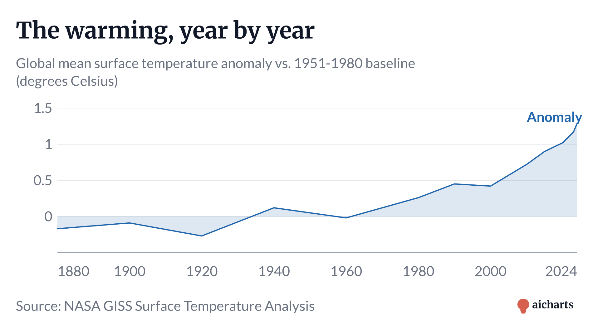](https://mcp-charts.vercel.app/chart?j=%7B%22chart%22%3A%22line%22%2C%22title%22%3A%22The%20warming%2C%20year%20by%20year%22%2C%22subtitle%22%3A%22Global%20mean%20surface%20temperature%20anomaly%20vs.%201951-1980%20baseline%20(degrees%20Celsius)%22%2C%22source%22%3A%22NASA%20GISS%20Surface%20Temperature%20Analysis%22%2C%22palette%22%3A%22diverging-sunset%22%2C%22size%22%3A%22share%22%2C%22x%22%3A%22year%22%2C%22y%22%3A%22anomaly%22%2C%22interpolation%22%3A%22linear%22%2C%22showSymbols%22%3A%22none%22%2C%22areaFill%22%3Atrue%2C%22data%22%3A%5B%7B%22year%22%3A1880%2C%22anomaly%22%3A-0.17%7D%2C%7B%22year%22%3A1900%2C%22anomaly%22%3A-0.09%7D%2C%7B%22year%22%3A1920%2C%22anomaly%22%3A-0.27%7D%2C%7B%22year%22%3A1940%2C%22anomaly%22%3A0.12%7D%2C%7B%22year%22%3A1960%2C%22anomaly%22%3A-0.02%7D%2C%7B%22year%22%3A1980%2C%22anomaly%22%3A0.26%7D%2C%7B%22year%22%3A1990%2C%22anomaly%22%3A0.45%7D%2C%7B%22year%22%3A2000%2C%22anomaly%22%3A0.42%7D%2C%7B%22year%22%3A2010%2C%22anomaly%22%3A0.72%7D%2C%7B%22year%22%3A2015%2C%22anomaly%22%3A0.9%7D%2C%7B%22year%22%3A2020%2C%22anomaly%22%3A1.02%7D%2C%7B%22year%22%3A2023%2C%22anomaly%22%3A1.17%7D%2C%7B%22year%22%3A2024%2C%22anomaly%22%3A1.29%7D%5D%7D)

Open rendered PNG: <https://mcp-charts.vercel.app/chart?j=%7B%22chart%22%3A%22line%22%2C%22title%22%3A%22The%20warming%2C%20year%20by%20year%22%2C%22subtitle%22%3A%22Global%20mean%20surface%20temperature%20anomaly%20vs.%201951-1980%20baseline%20(degrees%20Celsius)%22%2C%22source%22%3A%22NASA%20GISS%20Surface%20Temperature%20Analysis%22%2C%22palette%22%3A%22diverging-sunset%22%2C%22size%22%3A%22share%22%2C%22x%22%3A%22year%22%2C%22y%22%3A%22anomaly%22%2C%22interpolation%22%3A%22linear%22%2C%22showSymbols%22%3A%22none%22%2C%22areaFill%22%3Atrue%2C%22data%22%3A%5B%7B%22year%22%3A1880%2C%22anomaly%22%3A-0.17%7D%2C%7B%22year%22%3A1900%2C%22anomaly%22%3A-0.09%7D%2C%7B%22year%22%3A1920%2C%22anomaly%22%3A-0.27%7D%2C%7B%22year%22%3A1940%2C%22anomaly%22%3A0.12%7D%2C%7B%22year%22%3A1960%2C%22anomaly%22%3A-0.02%7D%2C%7B%22year%22%3A1980%2C%22anomaly%22%3A0.26%7D%2C%7B%22year%22%3A1990%2C%22anomaly%22%3A0.45%7D%2C%7B%22year%22%3A2000%2C%22anomaly%22%3A0.42%7D%2C%7B%22year%22%3A2010%2C%22anomaly%22%3A0.72%7D%2C%7B%22year%22%3A2015%2C%22anomaly%22%3A0.9%7D%2C%7B%22year%22%3A2020%2C%22anomaly%22%3A1.02%7D%2C%7B%22year%22%3A2023%2C%22anomaly%22%3A1.17%7D%2C%7B%22year%22%3A2024%2C%22anomaly%22%3A1.29%7D%5D%7D>

Source: NASA GISS Surface Temperature Analysis

---

### Where the carbon comes from
_Annual CO2 emissions, 2023 (million tonnes)_
Map · palette: carbon · size: share

%22%2C%22source%22%3A%22Global%20Carbon%20Project%22%2C%22palette%22%3A%22carbon%22%2C%22size%22%3A%22share%22%2C%22basemap%22%3A%22world%22%2C%22code%22%3A%22country%22%2C%22value%22%3A%22emissions%22%2C%22scale%22%3A%22stepped%22%2C%22data%22%3A%5B%7B%22country%22%3A%22CHN%22%2C%22emissions%22%3A11900%7D%2C%7B%22country%22%3A%22USA%22%2C%22emissions%22%3A4900%7D%2C%7B%22country%22%3A%22IND%22%2C%22emissions%22%3A3100%7D%2C%7B%22country%22%3A%22RUS%22%2C%22emissions%22%3A1700%7D%2C%7B%22country%22%3A%22JPN%22%2C%22emissions%22%3A990%7D%2C%7B%22country%22%3A%22IRN%22%2C%22emissions%22%3A780%7D%2C%7B%22country%22%3A%22DEU%22%2C%22emissions%22%3A670%7D%2C%7B%22country%22%3A%22SAU%22%2C%22emissions%22%3A660%7D%2C%7B%22country%22%3A%22IDN%22%2C%22emissions%22%3A650%7D%2C%7B%22country%22%3A%22KOR%22%2C%22emissions%22%3A620%7D%2C%7B%22country%22%3A%22CAN%22%2C%22emissions%22%3A570%7D%2C%7B%22country%22%3A%22BRA%22%2C%22emissions%22%3A490%7D%2C%7B%22country%22%3A%22TUR%22%2C%22emissions%22%3A430%7D%2C%7B%22country%22%3A%22MEX%22%2C%22emissions%22%3A410%7D%2C%7B%22country%22%3A%22AUS%22%2C%22emissions%22%3A390%7D%2C%7B%22country%22%3A%22GBR%22%2C%22emissions%22%3A330%7D%2C%7B%22country%22%3A%22FRA%22%2C%22emissions%22%3A300%7D%2C%7B%22country%22%3A%22ITA%22%2C%22emissions%22%3A320%7D%2C%7B%22country%22%3A%22POL%22%2C%22emissions%22%3A300%7D%2C%7B%22country%22%3A%22VNM%22%2C%22emissions%22%3A290%7D%2C%7B%22country%22%3A%22ZAF%22%2C%22emissions%22%3A440%7D%2C%7B%22country%22%3A%22ESP%22%2C%22emissions%22%3A220%7D%2C%7B%22country%22%3A%22NGA%22%2C%22emissions%22%3A120%7D%2C%7B%22country%22%3A%22EGY%22%2C%22emissions%22%3A260%7D%2C%7B%22country%22%3A%22ARG%22%2C%22emissions%22%3A180%7D%5D%7D)

Open rendered PNG: <https://mcp-charts.vercel.app/chart?j=%7B%22chart%22%3A%22geo%22%2C%22title%22%3A%22Where%20the%20carbon%20comes%20from%22%2C%22subtitle%22%3A%22Annual%20CO2%20emissions%2C%202023%20(million%20tonnes)%22%2C%22source%22%3A%22Global%20Carbon%20Project%22%2C%22palette%22%3A%22carbon%22%2C%22size%22%3A%22share%22%2C%22basemap%22%3A%22world%22%2C%22code%22%3A%22country%22%2C%22value%22%3A%22emissions%22%2C%22scale%22%3A%22stepped%22%2C%22data%22%3A%5B%7B%22country%22%3A%22CHN%22%2C%22emissions%22%3A11900%7D%2C%7B%22country%22%3A%22USA%22%2C%22emissions%22%3A4900%7D%2C%7B%22country%22%3A%22IND%22%2C%22emissions%22%3A3100%7D%2C%7B%22country%22%3A%22RUS%22%2C%22emissions%22%3A1700%7D%2C%7B%22country%22%3A%22JPN%22%2C%22emissions%22%3A990%7D%2C%7B%22country%22%3A%22IRN%22%2C%22emissions%22%3A780%7D%2C%7B%22country%22%3A%22DEU%22%2C%22emissions%22%3A670%7D%2C%7B%22country%22%3A%22SAU%22%2C%22emissions%22%3A660%7D%2C%7B%22country%22%3A%22IDN%22%2C%22emissions%22%3A650%7D%2C%7B%22country%22%3A%22KOR%22%2C%22emissions%22%3A620%7D%2C%7B%22country%22%3A%22CAN%22%2C%22emissions%22%3A570%7D%2C%7B%22country%22%3A%22BRA%22%2C%22emissions%22%3A490%7D%2C%7B%22country%22%3A%22TUR%22%2C%22emissions%22%3A430%7D%2C%7B%22country%22%3A%22MEX%22%2C%22emissions%22%3A410%7D%2C%7B%22country%22%3A%22AUS%22%2C%22emissions%22%3A390%7D%2C%7B%22country%22%3A%22GBR%22%2C%22emissions%22%3A330%7D%2C%7B%22country%22%3A%22FRA%22%2C%22emissions%22%3A300%7D%2C%7B%22country%22%3A%22ITA%22%2C%22emissions%22%3A320%7D%2C%7B%22country%22%3A%22POL%22%2C%22emissions%22%3A300%7D%2C%7B%22country%22%3A%22VNM%22%2C%22emissions%22%3A290%7D%2C%7B%22country%22%3A%22ZAF%22%2C%22emissions%22%3A440%7D%2C%7B%22country%22%3A%22ESP%22%2C%22emissions%22%3A220%7D%2C%7B%22country%22%3A%22NGA%22%2C%22emissions%22%3A120%7D%2C%7B%22country%22%3A%22EGY%22%2C%22emissions%22%3A260%7D%2C%7B%22country%22%3A%22ARG%22%2C%22emissions%22%3A180%7D%5D%7D>

Source: Global Carbon Project

---

### Coal peaks, solar surges
_Global electricity generation by source (terawatt-hours)_
Stacked area · palette: earth · size: share

[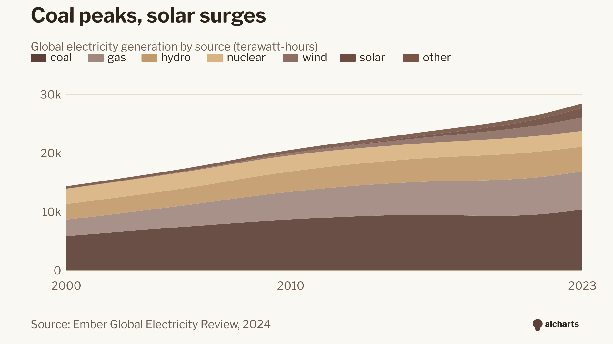](https://mcp-charts.vercel.app/chart?j=%7B%22chart%22%3A%22stacked-area%22%2C%22title%22%3A%22Coal%20peaks%2C%20solar%20surges%22%2C%22subtitle%22%3A%22Global%20electricity%20generation%20by%20source%20(terawatt-hours)%22%2C%22source%22%3A%22Ember%20Global%20Electricity%20Review%2C%202024%22%2C%22palette%22%3A%22earth%22%2C%22size%22%3A%22share%22%2C%22x%22%3A%22year%22%2C%22y%22%3A%5B%22coal%22%2C%22gas%22%2C%22hydro%22%2C%22nuclear%22%2C%22wind%22%2C%22solar%22%2C%22other%22%5D%2C%22interpolation%22%3A%22curved%22%2C%22data%22%3A%5B%7B%22year%22%3A2000%2C%22coal%22%3A5900%2C%22gas%22%3A2750%2C%22hydro%22%3A2700%2C%22nuclear%22%3A2600%2C%22wind%22%3A30%2C%22solar%22%3A1%2C%22other%22%3A400%7D%2C%7B%22year%22%3A2005%2C%22coal%22%3A7400%2C%22gas%22%3A3600%2C%22hydro%22%3A2900%2C%22nuclear%22%3A2770%2C%22wind%22%3A100%2C%22solar%22%3A4%2C%22other%22%3A460%7D%2C%7B%22year%22%3A2010%2C%22coal%22%3A8700%2C%22gas%22%3A4750%2C%22hydro%22%3A3450%2C%22nuclear%22%3A2760%2C%22wind%22%3A340%2C%22solar%22%3A32%2C%22other%22%3A540%7D%2C%7B%22year%22%3A2015%2C%22coal%22%3A9500%2C%22gas%22%3A5500%2C%22hydro%22%3A3900%2C%22nuclear%22%3A2570%2C%22wind%22%3A830%2C%22solar%22%3A250%2C%22other%22%3A610%7D%2C%7B%22year%22%3A2020%2C%22coal%22%3A9400%2C%22gas%22%3A6200%2C%22hydro%22%3A4360%2C%22nuclear%22%3A2700%2C%22wind%22%3A1590%2C%22solar%22%3A860%2C%22other%22%3A700%7D%2C%7B%22year%22%3A2023%2C%22coal%22%3A10400%2C%22gas%22%3A6500%2C%22hydro%22%3A4210%2C%22nuclear%22%3A2690%2C%22wind%22%3A2300%2C%22solar%22%3A1630%2C%22other%22%3A780%7D%5D%7D)

Open rendered PNG: <https://mcp-charts.vercel.app/chart?j=%7B%22chart%22%3A%22stacked-area%22%2C%22title%22%3A%22Coal%20peaks%2C%20solar%20surges%22%2C%22subtitle%22%3A%22Global%20electricity%20generation%20by%20source%20(terawatt-hours)%22%2C%22source%22%3A%22Ember%20Global%20Electricity%20Review%2C%202024%22%2C%22palette%22%3A%22earth%22%2C%22size%22%3A%22share%22%2C%22x%22%3A%22year%22%2C%22y%22%3A%5B%22coal%22%2C%22gas%22%2C%22hydro%22%2C%22nuclear%22%2C%22wind%22%2C%22solar%22%2C%22other%22%5D%2C%22interpolation%22%3A%22curved%22%2C%22data%22%3A%5B%7B%22year%22%3A2000%2C%22coal%22%3A5900%2C%22gas%22%3A2750%2C%22hydro%22%3A2700%2C%22nuclear%22%3A2600%2C%22wind%22%3A30%2C%22solar%22%3A1%2C%22other%22%3A400%7D%2C%7B%22year%22%3A2005%2C%22coal%22%3A7400%2C%22gas%22%3A3600%2C%22hydro%22%3A2900%2C%22nuclear%22%3A2770%2C%22wind%22%3A100%2C%22solar%22%3A4%2C%22other%22%3A460%7D%2C%7B%22year%22%3A2010%2C%22coal%22%3A8700%2C%22gas%22%3A4750%2C%22hydro%22%3A3450%2C%22nuclear%22%3A2760%2C%22wind%22%3A340%2C%22solar%22%3A32%2C%22other%22%3A540%7D%2C%7B%22year%22%3A2015%2C%22coal%22%3A9500%2C%22gas%22%3A5500%2C%22hydro%22%3A3900%2C%22nuclear%22%3A2570%2C%22wind%22%3A830%2C%22solar%22%3A250%2C%22other%22%3A610%7D%2C%7B%22year%22%3A2020%2C%22coal%22%3A9400%2C%22gas%22%3A6200%2C%22hydro%22%3A4360%2C%22nuclear%22%3A2700%2C%22wind%22%3A1590%2C%22solar%22%3A860%2C%22other%22%3A700%7D%2C%7B%22year%22%3A2023%2C%22coal%22%3A10400%2C%22gas%22%3A6500%2C%22hydro%22%3A4210%2C%22nuclear%22%3A2690%2C%22wind%22%3A2300%2C%22solar%22%3A1630%2C%22other%22%3A780%7D%5D%7D>

Source: Ember Global Electricity Review, 2024

---

### The economic heavyweights
_Nominal GDP, 2024 (trillion USD)_
Bar · palette: boardroom · size: share

[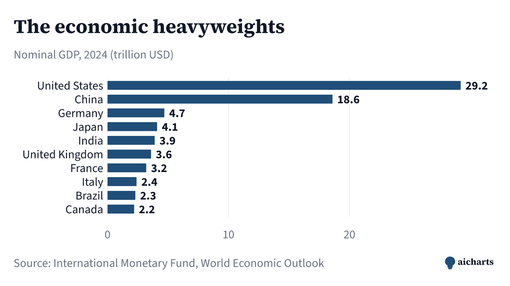](https://mcp-charts.vercel.app/chart?j=%7B%22chart%22%3A%22bar%22%2C%22title%22%3A%22The%20economic%20heavyweights%22%2C%22subtitle%22%3A%22Nominal%20GDP%2C%202024%20(trillion%20USD)%22%2C%22source%22%3A%22International%20Monetary%20Fund%2C%20World%20Economic%20Outlook%22%2C%22palette%22%3A%22boardroom%22%2C%22size%22%3A%22share%22%2C%22label%22%3A%22country%22%2C%22value%22%3A%22gdp%22%2C%22orientation%22%3A%22horizontal%22%2C%22sort%22%3A%22desc%22%2C%22showValueLabels%22%3Atrue%2C%22data%22%3A%5B%7B%22country%22%3A%22United%20States%22%2C%22gdp%22%3A29.2%7D%2C%7B%22country%22%3A%22China%22%2C%22gdp%22%3A18.6%7D%2C%7B%22country%22%3A%22Germany%22%2C%22gdp%22%3A4.7%7D%2C%7B%22country%22%3A%22Japan%22%2C%22gdp%22%3A4.1%7D%2C%7B%22country%22%3A%22India%22%2C%22gdp%22%3A3.9%7D%2C%7B%22country%22%3A%22United%20Kingdom%22%2C%22gdp%22%3A3.6%7D%2C%7B%22country%22%3A%22France%22%2C%22gdp%22%3A3.2%7D%2C%7B%22country%22%3A%22Italy%22%2C%22gdp%22%3A2.4%7D%2C%7B%22country%22%3A%22Brazil%22%2C%22gdp%22%3A2.3%7D%2C%7B%22country%22%3A%22Canada%22%2C%22gdp%22%3A2.2%7D%5D%7D)

Open rendered PNG: <https://mcp-charts.vercel.app/chart?j=%7B%22chart%22%3A%22bar%22%2C%22title%22%3A%22The%20economic%20heavyweights%22%2C%22subtitle%22%3A%22Nominal%20GDP%2C%202024%20(trillion%20USD)%22%2C%22source%22%3A%22International%20Monetary%20Fund%2C%20World%20Economic%20Outlook%22%2C%22palette%22%3A%22boardroom%22%2C%22size%22%3A%22share%22%2C%22label%22%3A%22country%22%2C%22value%22%3A%22gdp%22%2C%22orientation%22%3A%22horizontal%22%2C%22sort%22%3A%22desc%22%2C%22showValueLabels%22%3Atrue%2C%22data%22%3A%5B%7B%22country%22%3A%22United%20States%22%2C%22gdp%22%3A29.2%7D%2C%7B%22country%22%3A%22China%22%2C%22gdp%22%3A18.6%7D%2C%7B%22country%22%3A%22Germany%22%2C%22gdp%22%3A4.7%7D%2C%7B%22country%22%3A%22Japan%22%2C%22gdp%22%3A4.1%7D%2C%7B%22country%22%3A%22India%22%2C%22gdp%22%3A3.9%7D%2C%7B%22country%22%3A%22United%20Kingdom%22%2C%22gdp%22%3A3.6%7D%2C%7B%22country%22%3A%22France%22%2C%22gdp%22%3A3.2%7D%2C%7B%22country%22%3A%22Italy%22%2C%22gdp%22%3A2.4%7D%2C%7B%22country%22%3A%22Brazil%22%2C%22gdp%22%3A2.3%7D%2C%7B%22country%22%3A%22Canada%22%2C%22gdp%22%3A2.2%7D%5D%7D>

Source: International Monetary Fund, World Economic Outlook

---

### The great unwinding
_Consumer price inflation, year-on-year (percent)_
Small multiples (lines) · palette: mono-blue · size: share

%22%2C%22source%22%3A%22OECD%20Main%20Economic%20Indicators%22%2C%22palette%22%3A%22mono-blue%22%2C%22size%22%3A%22share%22%2C%22x%22%3A%22year%22%2C%22y%22%3A%5B%22usa%22%2C%22uk%22%2C%22germany%22%2C%22france%22%2C%22japan%22%2C%22canada%22%5D%2C%22columns%22%3A3%2C%22sharedScale%22%3Atrue%2C%22interpolation%22%3A%22curved%22%2C%22yFormat%22%3A%22percent%22%2C%22data%22%3A%5B%7B%22year%22%3A2019%2C%22usa%22%3A1.8%2C%22uk%22%3A1.8%2C%22germany%22%3A1.4%2C%22france%22%3A1.1%2C%22japan%22%3A0.5%2C%22canada%22%3A1.9%7D%2C%7B%22year%22%3A2020%2C%22usa%22%3A1.2%2C%22uk%22%3A0.9%2C%22germany%22%3A0.5%2C%22france%22%3A0.5%2C%22japan%22%3A0%2C%22canada%22%3A0.7%7D%2C%7B%22year%22%3A2021%2C%22usa%22%3A4.7%2C%22uk%22%3A2.6%2C%22germany%22%3A3.2%2C%22france%22%3A2.1%2C%22japan%22%3A-0.2%2C%22canada%22%3A3.4%7D%2C%7B%22year%22%3A2022%2C%22usa%22%3A8%2C%22uk%22%3A9.1%2C%22germany%22%3A8.7%2C%22france%22%3A5.9%2C%22japan%22%3A2.5%2C%22canada%22%3A6.8%7D%2C%7B%22year%22%3A2023%2C%22usa%22%3A4.1%2C%22uk%22%3A7.3%2C%22germany%22%3A6%2C%22france%22%3A5.7%2C%22japan%22%3A3.3%2C%22canada%22%3A3.9%7D%2C%7B%22year%22%3A2024%2C%22usa%22%3A2.9%2C%22uk%22%3A2.5%2C%22germany%22%3A2.3%2C%22france%22%3A2%2C%22japan%22%3A2.7%2C%22canada%22%3A2.4%7D%5D%7D)

Open rendered PNG: <https://mcp-charts.vercel.app/chart?j=%7B%22chart%22%3A%22line-split%22%2C%22title%22%3A%22The%20great%20unwinding%22%2C%22subtitle%22%3A%22Consumer%20price%20inflation%2C%20year-on-year%20(percent)%22%2C%22source%22%3A%22OECD%20Main%20Economic%20Indicators%22%2C%22palette%22%3A%22mono-blue%22%2C%22size%22%3A%22share%22%2C%22x%22%3A%22year%22%2C%22y%22%3A%5B%22usa%22%2C%22uk%22%2C%22germany%22%2C%22france%22%2C%22japan%22%2C%22canada%22%5D%2C%22columns%22%3A3%2C%22sharedScale%22%3Atrue%2C%22interpolation%22%3A%22curved%22%2C%22yFormat%22%3A%22percent%22%2C%22data%22%3A%5B%7B%22year%22%3A2019%2C%22usa%22%3A1.8%2C%22uk%22%3A1.8%2C%22germany%22%3A1.4%2C%22france%22%3A1.1%2C%22japan%22%3A0.5%2C%22canada%22%3A1.9%7D%2C%7B%22year%22%3A2020%2C%22usa%22%3A1.2%2C%22uk%22%3A0.9%2C%22germany%22%3A0.5%2C%22france%22%3A0.5%2C%22japan%22%3A0%2C%22canada%22%3A0.7%7D%2C%7B%22year%22%3A2021%2C%22usa%22%3A4.7%2C%22uk%22%3A2.6%2C%22germany%22%3A3.2%2C%22france%22%3A2.1%2C%22japan%22%3A-0.2%2C%22canada%22%3A3.4%7D%2C%7B%22year%22%3A2022%2C%22usa%22%3A8%2C%22uk%22%3A9.1%2C%22germany%22%3A8.7%2C%22france%22%3A5.9%2C%22japan%22%3A2.5%2C%22canada%22%3A6.8%7D%2C%7B%22year%22%3A2023%2C%22usa%22%3A4.1%2C%22uk%22%3A7.3%2C%22germany%22%3A6%2C%22france%22%3A5.7%2C%22japan%22%3A3.3%2C%22canada%22%3A3.9%7D%2C%7B%22year%22%3A2024%2C%22usa%22%3A2.9%2C%22uk%22%3A2.5%2C%22germany%22%3A2.3%2C%22france%22%3A2%2C%22japan%22%3A2.7%2C%22canada%22%3A2.4%7D%5D%7D>

Source: OECD Main Economic Indicators

---

### Apple's slice of the smartphone world
_Global smartphone shipments by vendor, Q4 2024_
Pie · palette: vibrant · size: share

[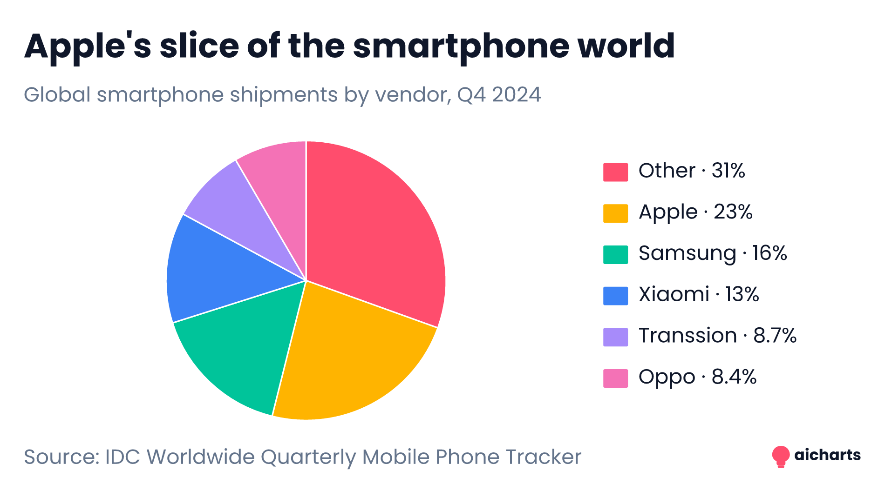](https://mcp-charts.vercel.app/chart?j=%7B%22chart%22%3A%22pie%22%2C%22title%22%3A%22Apple's%20slice%20of%20the%20smartphone%20world%22%2C%22subtitle%22%3A%22Global%20smartphone%20shipments%20by%20vendor%2C%20Q4%202024%22%2C%22source%22%3A%22IDC%20Worldwide%20Quarterly%20Mobile%20Phone%20Tracker%22%2C%22palette%22%3A%22vibrant%22%2C%22size%22%3A%22share%22%2C%22label%22%3A%22vendor%22%2C%22value%22%3A%22share%22%2C%22sort%22%3A%22desc%22%2C%22data%22%3A%5B%7B%22vendor%22%3A%22Apple%22%2C%22share%22%3A23.4%7D%2C%7B%22vendor%22%3A%22Samsung%22%2C%22share%22%3A16.2%7D%2C%7B%22vendor%22%3A%22Xiaomi%22%2C%22share%22%3A12.8%7D%2C%7B%22vendor%22%3A%22Transsion%22%2C%22share%22%3A8.7%7D%2C%7B%22vendor%22%3A%22Oppo%22%2C%22share%22%3A8.4%7D%2C%7B%22vendor%22%3A%22Other%22%2C%22share%22%3A30.5%7D%5D%7D)

Open rendered PNG: <https://mcp-charts.vercel.app/chart?j=%7B%22chart%22%3A%22pie%22%2C%22title%22%3A%22Apple's%20slice%20of%20the%20smartphone%20world%22%2C%22subtitle%22%3A%22Global%20smartphone%20shipments%20by%20vendor%2C%20Q4%202024%22%2C%22source%22%3A%22IDC%20Worldwide%20Quarterly%20Mobile%20Phone%20Tracker%22%2C%22palette%22%3A%22vibrant%22%2C%22size%22%3A%22share%22%2C%22label%22%3A%22vendor%22%2C%22value%22%3A%22share%22%2C%22sort%22%3A%22desc%22%2C%22data%22%3A%5B%7B%22vendor%22%3A%22Apple%22%2C%22share%22%3A23.4%7D%2C%7B%22vendor%22%3A%22Samsung%22%2C%22share%22%3A16.2%7D%2C%7B%22vendor%22%3A%22Xiaomi%22%2C%22share%22%3A12.8%7D%2C%7B%22vendor%22%3A%22Transsion%22%2C%22share%22%3A8.7%7D%2C%7B%22vendor%22%3A%22Oppo%22%2C%22share%22%3A8.4%7D%2C%7B%22vendor%22%3A%22Other%22%2C%22share%22%3A30.5%7D%5D%7D>

Source: IDC Worldwide Quarterly Mobile Phone Tracker

---

### Netflix keeps adding, at a price
_Global paid subscribers (bars, millions) and average revenue per member (line, USD/month)_
Bar + line · palette: vibrant · size: share

[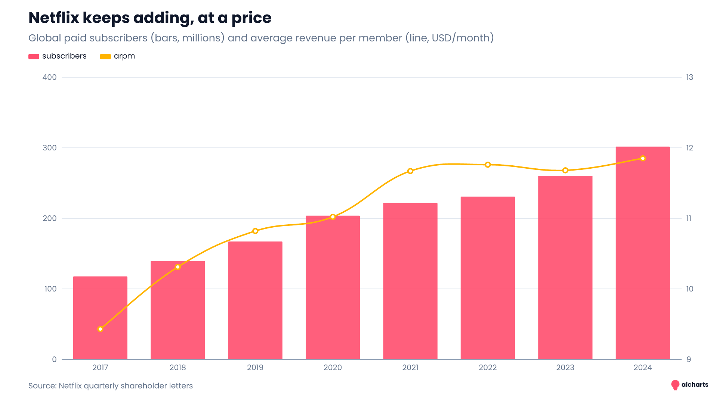](https://mcp-charts.vercel.app/chart?j=%7B%22chart%22%3A%22combo%22%2C%22title%22%3A%22Netflix%20keeps%20adding%2C%20at%20a%20price%22%2C%22subtitle%22%3A%22Global%20paid%20subscribers%20(bars%2C%20millions)%20and%20average%20revenue%20per%20member%20(line%2C%20USD%2Fmonth)%22%2C%22source%22%3A%22Netflix%20quarterly%20shareholder%20letters%22%2C%22palette%22%3A%22vibrant%22%2C%22size%22%3A%22share%22%2C%22x%22%3A%22year%22%2C%22bars%22%3A%22subscribers%22%2C%22lines%22%3A%22arpm%22%2C%22interpolation%22%3A%22curved%22%2C%22data%22%3A%5B%7B%22year%22%3A2017%2C%22subscribers%22%3A117.6%2C%22arpm%22%3A9.43%7D%2C%7B%22year%22%3A2018%2C%22subscribers%22%3A139.3%2C%22arpm%22%3A10.31%7D%2C%7B%22year%22%3A2019%2C%22subscribers%22%3A167.1%2C%22arpm%22%3A10.82%7D%2C%7B%22year%22%3A2020%2C%22subscribers%22%3A203.7%2C%22arpm%22%3A11.02%7D%2C%7B%22year%22%3A2021%2C%22subscribers%22%3A221.8%2C%22arpm%22%3A11.67%7D%2C%7B%22year%22%3A2022%2C%22subscribers%22%3A230.8%2C%22arpm%22%3A11.76%7D%2C%7B%22year%22%3A2023%2C%22subscribers%22%3A260.3%2C%22arpm%22%3A11.68%7D%2C%7B%22year%22%3A2024%2C%22subscribers%22%3A301.6%2C%22arpm%22%3A11.85%7D%5D%7D)

Open rendered PNG: <https://mcp-charts.vercel.app/chart?j=%7B%22chart%22%3A%22combo%22%2C%22title%22%3A%22Netflix%20keeps%20adding%2C%20at%20a%20price%22%2C%22subtitle%22%3A%22Global%20paid%20subscribers%20(bars%2C%20millions)%20and%20average%20revenue%20per%20member%20(line%2C%20USD%2Fmonth)%22%2C%22source%22%3A%22Netflix%20quarterly%20shareholder%20letters%22%2C%22palette%22%3A%22vibrant%22%2C%22size%22%3A%22share%22%2C%22x%22%3A%22year%22%2C%22bars%22%3A%22subscribers%22%2C%22lines%22%3A%22arpm%22%2C%22interpolation%22%3A%22curved%22%2C%22data%22%3A%5B%7B%22year%22%3A2017%2C%22subscribers%22%3A117.6%2C%22arpm%22%3A9.43%7D%2C%7B%22year%22%3A2018%2C%22subscribers%22%3A139.3%2C%22arpm%22%3A10.31%7D%2C%7B%22year%22%3A2019%2C%22subscribers%22%3A167.1%2C%22arpm%22%3A10.82%7D%2C%7B%22year%22%3A2020%2C%22subscribers%22%3A203.7%2C%22arpm%22%3A11.02%7D%2C%7B%22year%22%3A2021%2C%22subscribers%22%3A221.8%2C%22arpm%22%3A11.67%7D%2C%7B%22year%22%3A2022%2C%22subscribers%22%3A230.8%2C%22arpm%22%3A11.76%7D%2C%7B%22year%22%3A2023%2C%22subscribers%22%3A260.3%2C%22arpm%22%3A11.68%7D%2C%7B%22year%22%3A2024%2C%22subscribers%22%3A301.6%2C%22arpm%22%3A11.85%7D%5D%7D>

Source: Netflix quarterly shareholder letters

---

### The EV decade
_Global electric vehicle sales, by region (millions of units)_
Stacked bar · palette: viridis · size: share

[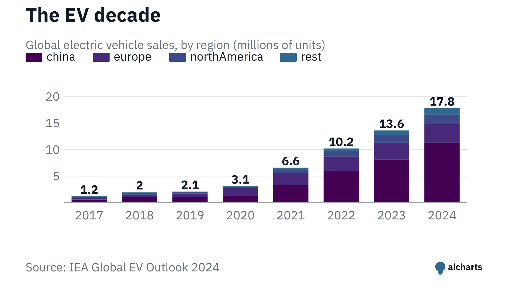](https://mcp-charts.vercel.app/chart?j=%7B%22chart%22%3A%22stacked-bar%22%2C%22title%22%3A%22The%20EV%20decade%22%2C%22subtitle%22%3A%22Global%20electric%20vehicle%20sales%2C%20by%20region%20(millions%20of%20units)%22%2C%22source%22%3A%22IEA%20Global%20EV%20Outlook%202024%22%2C%22palette%22%3A%22viridis%22%2C%22size%22%3A%22share%22%2C%22x%22%3A%22year%22%2C%22y%22%3A%5B%22china%22%2C%22europe%22%2C%22northAmerica%22%2C%22rest%22%5D%2C%22showTotals%22%3Atrue%2C%22data%22%3A%5B%7B%22year%22%3A2017%2C%22china%22%3A0.6%2C%22europe%22%3A0.3%2C%22northAmerica%22%3A0.2%2C%22rest%22%3A0.1%7D%2C%7B%22year%22%3A2018%2C%22china%22%3A1.1%2C%22europe%22%3A0.4%2C%22northAmerica%22%3A0.4%2C%22rest%22%3A0.1%7D%2C%7B%22year%22%3A2019%2C%22china%22%3A1.1%2C%22europe%22%3A0.6%2C%22northAmerica%22%3A0.3%2C%22rest%22%3A0.1%7D%2C%7B%22year%22%3A2020%2C%22china%22%3A1.3%2C%22europe%22%3A1.4%2C%22northAmerica%22%3A0.3%2C%22rest%22%3A0.1%7D%2C%7B%22year%22%3A2021%2C%22china%22%3A3.3%2C%22europe%22%3A2.3%2C%22northAmerica%22%3A0.7%2C%22rest%22%3A0.3%7D%2C%7B%22year%22%3A2022%2C%22china%22%3A6%2C%22europe%22%3A2.7%2C%22northAmerica%22%3A1%2C%22rest%22%3A0.5%7D%2C%7B%22year%22%3A2023%2C%22china%22%3A8.1%2C%22europe%22%3A3.2%2C%22northAmerica%22%3A1.5%2C%22rest%22%3A0.8%7D%2C%7B%22year%22%3A2024%2C%22china%22%3A11.3%2C%22europe%22%3A3.5%2C%22northAmerica%22%3A1.8%2C%22rest%22%3A1.2%7D%5D%7D)

Open rendered PNG: <https://mcp-charts.vercel.app/chart?j=%7B%22chart%22%3A%22stacked-bar%22%2C%22title%22%3A%22The%20EV%20decade%22%2C%22subtitle%22%3A%22Global%20electric%20vehicle%20sales%2C%20by%20region%20(millions%20of%20units)%22%2C%22source%22%3A%22IEA%20Global%20EV%20Outlook%202024%22%2C%22palette%22%3A%22viridis%22%2C%22size%22%3A%22share%22%2C%22x%22%3A%22year%22%2C%22y%22%3A%5B%22china%22%2C%22europe%22%2C%22northAmerica%22%2C%22rest%22%5D%2C%22showTotals%22%3Atrue%2C%22data%22%3A%5B%7B%22year%22%3A2017%2C%22china%22%3A0.6%2C%22europe%22%3A0.3%2C%22northAmerica%22%3A0.2%2C%22rest%22%3A0.1%7D%2C%7B%22year%22%3A2018%2C%22china%22%3A1.1%2C%22europe%22%3A0.4%2C%22northAmerica%22%3A0.4%2C%22rest%22%3A0.1%7D%2C%7B%22year%22%3A2019%2C%22china%22%3A1.1%2C%22europe%22%3A0.6%2C%22northAmerica%22%3A0.3%2C%22rest%22%3A0.1%7D%2C%7B%22year%22%3A2020%2C%22china%22%3A1.3%2C%22europe%22%3A1.4%2C%22northAmerica%22%3A0.3%2C%22rest%22%3A0.1%7D%2C%7B%22year%22%3A2021%2C%22china%22%3A3.3%2C%22europe%22%3A2.3%2C%22northAmerica%22%3A0.7%2C%22rest%22%3A0.3%7D%2C%7B%22year%22%3A2022%2C%22china%22%3A6%2C%22europe%22%3A2.7%2C%22northAmerica%22%3A1%2C%22rest%22%3A0.5%7D%2C%7B%22year%22%3A2023%2C%22china%22%3A8.1%2C%22europe%22%3A3.2%2C%22northAmerica%22%3A1.5%2C%22rest%22%3A0.8%7D%2C%7B%22year%22%3A2024%2C%22china%22%3A11.3%2C%22europe%22%3A3.5%2C%22northAmerica%22%3A1.8%2C%22rest%22%3A1.2%7D%5D%7D>

Source: IEA Global EV Outlook 2024

---

### Eight billion, unevenly spread
_World population by region, 2024 (millions)_
Pie · palette: earth · size: share

[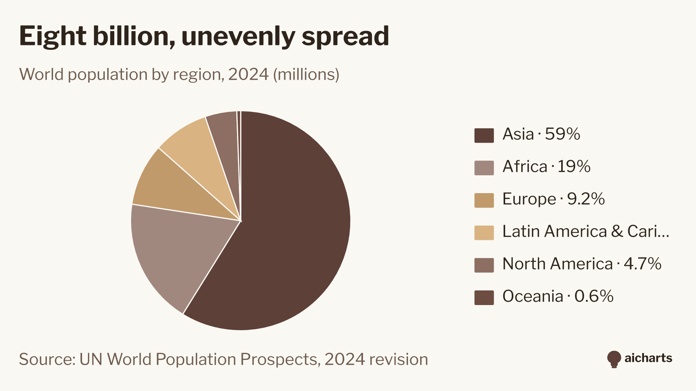](https://mcp-charts.vercel.app/chart?j=%7B%22chart%22%3A%22pie%22%2C%22title%22%3A%22Eight%20billion%2C%20unevenly%20spread%22%2C%22subtitle%22%3A%22World%20population%20by%20region%2C%202024%20(millions)%22%2C%22source%22%3A%22UN%20World%20Population%20Prospects%2C%202024%20revision%22%2C%22palette%22%3A%22earth%22%2C%22size%22%3A%22share%22%2C%22label%22%3A%22region%22%2C%22value%22%3A%22population%22%2C%22sort%22%3A%22desc%22%2C%22data%22%3A%5B%7B%22region%22%3A%22Asia%22%2C%22population%22%3A4780%7D%2C%7B%22region%22%3A%22Africa%22%2C%22population%22%3A1510%7D%2C%7B%22region%22%3A%22Europe%22%2C%22population%22%3A745%7D%2C%7B%22region%22%3A%22Latin%20America%20%26%20Caribbean%22%2C%22population%22%3A665%7D%2C%7B%22region%22%3A%22North%20America%22%2C%22population%22%3A380%7D%2C%7B%22region%22%3A%22Oceania%22%2C%22population%22%3A46%7D%5D%7D)

Open rendered PNG: <https://mcp-charts.vercel.app/chart?j=%7B%22chart%22%3A%22pie%22%2C%22title%22%3A%22Eight%20billion%2C%20unevenly%20spread%22%2C%22subtitle%22%3A%22World%20population%20by%20region%2C%202024%20(millions)%22%2C%22source%22%3A%22UN%20World%20Population%20Prospects%2C%202024%20revision%22%2C%22palette%22%3A%22earth%22%2C%22size%22%3A%22share%22%2C%22label%22%3A%22region%22%2C%22value%22%3A%22population%22%2C%22sort%22%3A%22desc%22%2C%22data%22%3A%5B%7B%22region%22%3A%22Asia%22%2C%22population%22%3A4780%7D%2C%7B%22region%22%3A%22Africa%22%2C%22population%22%3A1510%7D%2C%7B%22region%22%3A%22Europe%22%2C%22population%22%3A745%7D%2C%7B%22region%22%3A%22Latin%20America%20%26%20Caribbean%22%2C%22population%22%3A665%7D%2C%7B%22region%22%3A%22North%20America%22%2C%22population%22%3A380%7D%2C%7B%22region%22%3A%22Oceania%22%2C%22population%22%3A46%7D%5D%7D>

Source: UN World Population Prospects, 2024 revision

---

### Where the chips are made
_Share of global semiconductor fabrication capacity, 2024 (percent)_
Map · palette: twilight · size: share

[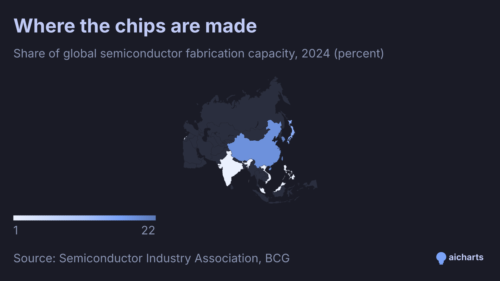](https://mcp-charts.vercel.app/chart?j=%7B%22chart%22%3A%22geo%22%2C%22title%22%3A%22Where%20the%20chips%20are%20made%22%2C%22subtitle%22%3A%22Share%20of%20global%20semiconductor%20fabrication%20capacity%2C%202024%20(percent)%22%2C%22source%22%3A%22Semiconductor%20Industry%20Association%2C%20BCG%22%2C%22palette%22%3A%22twilight%22%2C%22size%22%3A%22share%22%2C%22basemap%22%3A%22asia%22%2C%22code%22%3A%22country%22%2C%22value%22%3A%22share%22%2C%22scale%22%3A%22linear%22%2C%22data%22%3A%5B%7B%22country%22%3A%22TWN%22%2C%22share%22%3A22%7D%2C%7B%22country%22%3A%22KOR%22%2C%22share%22%3A21%7D%2C%7B%22country%22%3A%22JPN%22%2C%22share%22%3A15%7D%2C%7B%22country%22%3A%22CHN%22%2C%22share%22%3A19%7D%2C%7B%22country%22%3A%22USA%22%2C%22share%22%3A12%7D%2C%7B%22country%22%3A%22MYS%22%2C%22share%22%3A1%7D%2C%7B%22country%22%3A%22SGP%22%2C%22share%22%3A5%7D%2C%7B%22country%22%3A%22VNM%22%2C%22share%22%3A1%7D%2C%7B%22country%22%3A%22IND%22%2C%22share%22%3A1%7D%2C%7B%22country%22%3A%22ISR%22%2C%22share%22%3A2%7D%2C%7B%22country%22%3A%22PHL%22%2C%22share%22%3A1%7D%5D%7D)

Open rendered PNG: <https://mcp-charts.vercel.app/chart?j=%7B%22chart%22%3A%22geo%22%2C%22title%22%3A%22Where%20the%20chips%20are%20made%22%2C%22subtitle%22%3A%22Share%20of%20global%20semiconductor%20fabrication%20capacity%2C%202024%20(percent)%22%2C%22source%22%3A%22Semiconductor%20Industry%20Association%2C%20BCG%22%2C%22palette%22%3A%22twilight%22%2C%22size%22%3A%22share%22%2C%22basemap%22%3A%22asia%22%2C%22code%22%3A%22country%22%2C%22value%22%3A%22share%22%2C%22scale%22%3A%22linear%22%2C%22data%22%3A%5B%7B%22country%22%3A%22TWN%22%2C%22share%22%3A22%7D%2C%7B%22country%22%3A%22KOR%22%2C%22share%22%3A21%7D%2C%7B%22country%22%3A%22JPN%22%2C%22share%22%3A15%7D%2C%7B%22country%22%3A%22CHN%22%2C%22share%22%3A19%7D%2C%7B%22country%22%3A%22USA%22%2C%22share%22%3A12%7D%2C%7B%22country%22%3A%22MYS%22%2C%22share%22%3A1%7D%2C%7B%22country%22%3A%22SGP%22%2C%22share%22%3A5%7D%2C%7B%22country%22%3A%22VNM%22%2C%22share%22%3A1%7D%2C%7B%22country%22%3A%22IND%22%2C%22share%22%3A1%7D%2C%7B%22country%22%3A%22ISR%22%2C%22share%22%3A2%7D%2C%7B%22country%22%3A%22PHL%22%2C%22share%22%3A1%7D%5D%7D>

Source: Semiconductor Industry Association, BCG

---

### Tesla: revenue up, margins down
_Annual revenue (bars, billion USD) and automotive gross margin (line, percent)_
Bar + line · palette: carbon · size: share

[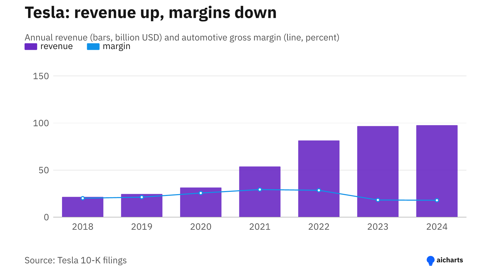](https://mcp-charts.vercel.app/chart?j=%7B%22chart%22%3A%22combo%22%2C%22title%22%3A%22Tesla%3A%20revenue%20up%2C%20margins%20down%22%2C%22subtitle%22%3A%22Annual%20revenue%20(bars%2C%20billion%20USD)%20and%20automotive%20gross%20margin%20(line%2C%20percent)%22%2C%22source%22%3A%22Tesla%2010-K%20filings%22%2C%22palette%22%3A%22carbon%22%2C%22size%22%3A%22share%22%2C%22x%22%3A%22year%22%2C%22bars%22%3A%22revenue%22%2C%22lines%22%3A%22margin%22%2C%22interpolation%22%3A%22linear%22%2C%22data%22%3A%5B%7B%22year%22%3A2018%2C%22revenue%22%3A21.5%2C%22margin%22%3A20.1%7D%2C%7B%22year%22%3A2019%2C%22revenue%22%3A24.6%2C%22margin%22%3A21.2%7D%2C%7B%22year%22%3A2020%2C%22revenue%22%3A31.5%2C%22margin%22%3A25.6%7D%2C%7B%22year%22%3A2021%2C%22revenue%22%3A53.8%2C%22margin%22%3A29.3%7D%2C%7B%22year%22%3A2022%2C%22revenue%22%3A81.5%2C%22margin%22%3A28.5%7D%2C%7B%22year%22%3A2023%2C%22revenue%22%3A96.8%2C%22margin%22%3A18.2%7D%2C%7B%22year%22%3A2024%2C%22revenue%22%3A97.7%2C%22margin%22%3A17.9%7D%5D%7D)

Open rendered PNG: <https://mcp-charts.vercel.app/chart?j=%7B%22chart%22%3A%22combo%22%2C%22title%22%3A%22Tesla%3A%20revenue%20up%2C%20margins%20down%22%2C%22subtitle%22%3A%22Annual%20revenue%20(bars%2C%20billion%20USD)%20and%20automotive%20gross%20margin%20(line%2C%20percent)%22%2C%22source%22%3A%22Tesla%2010-K%20filings%22%2C%22palette%22%3A%22carbon%22%2C%22size%22%3A%22share%22%2C%22x%22%3A%22year%22%2C%22bars%22%3A%22revenue%22%2C%22lines%22%3A%22margin%22%2C%22interpolation%22%3A%22linear%22%2C%22data%22%3A%5B%7B%22year%22%3A2018%2C%22revenue%22%3A21.5%2C%22margin%22%3A20.1%7D%2C%7B%22year%22%3A2019%2C%22revenue%22%3A24.6%2C%22margin%22%3A21.2%7D%2C%7B%22year%22%3A2020%2C%22revenue%22%3A31.5%2C%22margin%22%3A25.6%7D%2C%7B%22year%22%3A2021%2C%22revenue%22%3A53.8%2C%22margin%22%3A29.3%7D%2C%7B%22year%22%3A2022%2C%22revenue%22%3A81.5%2C%22margin%22%3A28.5%7D%2C%7B%22year%22%3A2023%2C%22revenue%22%3A96.8%2C%22margin%22%3A18.2%7D%2C%7B%22year%22%3A2024%2C%22revenue%22%3A97.7%2C%22margin%22%3A17.9%7D%5D%7D>

Source: Tesla 10-K filings

---

### Europe, unevenly green
_Share of gross final energy from renewables, 2023 (percent)_
Map · palette: viridis · size: share

[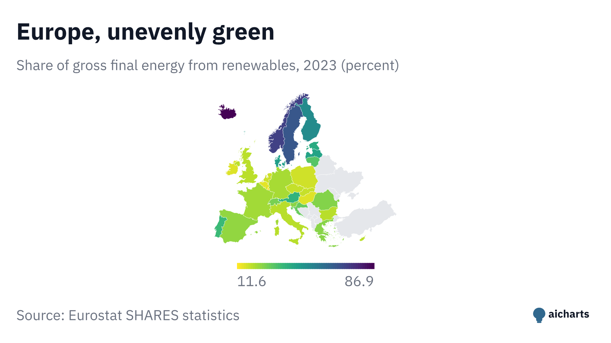](https://mcp-charts.vercel.app/chart?j=%7B%22chart%22%3A%22geo%22%2C%22title%22%3A%22Europe%2C%20unevenly%20green%22%2C%22subtitle%22%3A%22Share%20of%20gross%20final%20energy%20from%20renewables%2C%202023%20(percent)%22%2C%22source%22%3A%22Eurostat%20SHARES%20statistics%22%2C%22palette%22%3A%22viridis%22%2C%22size%22%3A%22share%22%2C%22basemap%22%3A%22europe%22%2C%22code%22%3A%22country%22%2C%22value%22%3A%22share%22%2C%22scale%22%3A%22linear%22%2C%22data%22%3A%5B%7B%22country%22%3A%22SWE%22%2C%22share%22%3A66.4%7D%2C%7B%22country%22%3A%22FIN%22%2C%22share%22%3A50.8%7D%2C%7B%22country%22%3A%22LVA%22%2C%22share%22%3A43.3%7D%2C%7B%22country%22%3A%22DNK%22%2C%22share%22%3A44.9%7D%2C%7B%22country%22%3A%22EST%22%2C%22share%22%3A41%7D%2C%7B%22country%22%3A%22PRT%22%2C%22share%22%3A35.9%7D%2C%7B%22country%22%3A%22AUT%22%2C%22share%22%3A38.2%7D%2C%7B%22country%22%3A%22HRV%22%2C%22share%22%3A29.5%7D%2C%7B%22country%22%3A%22LTU%22%2C%22share%22%3A31.9%7D%2C%7B%22country%22%3A%22NOR%22%2C%22share%22%3A72.3%7D%2C%7B%22country%22%3A%22ROU%22%2C%22share%22%3A25.8%7D%2C%7B%22country%22%3A%22ESP%22%2C%22share%22%3A24.1%7D%2C%7B%22country%22%3A%22SVN%22%2C%22share%22%3A25%7D%2C%7B%22country%22%3A%22GRC%22%2C%22share%22%3A25.3%7D%2C%7B%22country%22%3A%22ITA%22%2C%22share%22%3A19.6%7D%2C%7B%22country%22%3A%22DEU%22%2C%22share%22%3A21.6%7D%2C%7B%22country%22%3A%22FRA%22%2C%22share%22%3A22.2%7D%2C%7B%22country%22%3A%22BGR%22%2C%22share%22%3A19.6%7D%2C%7B%22country%22%3A%22CZE%22%2C%22share%22%3A18.2%7D%2C%7B%22country%22%3A%22POL%22%2C%22share%22%3A16.9%7D%2C%7B%22country%22%3A%22HUN%22%2C%22share%22%3A15.2%7D%2C%7B%22country%22%3A%22SVK%22%2C%22share%22%3A18%7D%2C%7B%22country%22%3A%22CYP%22%2C%22share%22%3A19.4%7D%2C%7B%22country%22%3A%22MLT%22%2C%22share%22%3A14.8%7D%2C%7B%22country%22%3A%22LUX%22%2C%22share%22%3A11.6%7D%2C%7B%22country%22%3A%22NLD%22%2C%22share%22%3A17.2%7D%2C%7B%22country%22%3A%22BEL%22%2C%22share%22%3A14.6%7D%2C%7B%22country%22%3A%22IRL%22%2C%22share%22%3A15.3%7D%2C%7B%22country%22%3A%22CHE%22%2C%22share%22%3A27.2%7D%2C%7B%22country%22%3A%22GBR%22%2C%22share%22%3A19.4%7D%2C%7B%22country%22%3A%22ISL%22%2C%22share%22%3A86.9%7D%5D%7D)

Open rendered PNG: <https://mcp-charts.vercel.app/chart?j=%7B%22chart%22%3A%22geo%22%2C%22title%22%3A%22Europe%2C%20unevenly%20green%22%2C%22subtitle%22%3A%22Share%20of%20gross%20final%20energy%20from%20renewables%2C%202023%20(percent)%22%2C%22source%22%3A%22Eurostat%20SHARES%20statistics%22%2C%22palette%22%3A%22viridis%22%2C%22size%22%3A%22share%22%2C%22basemap%22%3A%22europe%22%2C%22code%22%3A%22country%22%2C%22value%22%3A%22share%22%2C%22scale%22%3A%22linear%22%2C%22data%22%3A%5B%7B%22country%22%3A%22SWE%22%2C%22share%22%3A66.4%7D%2C%7B%22country%22%3A%22FIN%22%2C%22share%22%3A50.8%7D%2C%7B%22country%22%3A%22LVA%22%2C%22share%22%3A43.3%7D%2C%7B%22country%22%3A%22DNK%22%2C%22share%22%3A44.9%7D%2C%7B%22country%22%3A%22EST%22%2C%22share%22%3A41%7D%2C%7B%22country%22%3A%22PRT%22%2C%22share%22%3A35.9%7D%2C%7B%22country%22%3A%22AUT%22%2C%22share%22%3A38.2%7D%2C%7B%22country%22%3A%22HRV%22%2C%22share%22%3A29.5%7D%2C%7B%22country%22%3A%22LTU%22%2C%22share%22%3A31.9%7D%2C%7B%22country%22%3A%22NOR%22%2C%22share%22%3A72.3%7D%2C%7B%22country%22%3A%22ROU%22%2C%22share%22%3A25.8%7D%2C%7B%22country%22%3A%22ESP%22%2C%22share%22%3A24.1%7D%2C%7B%22country%22%3A%22SVN%22%2C%22share%22%3A25%7D%2C%7B%22country%22%3A%22GRC%22%2C%22share%22%3A25.3%7D%2C%7B%22country%22%3A%22ITA%22%2C%22share%22%3A19.6%7D%2C%7B%22country%22%3A%22DEU%22%2C%22share%22%3A21.6%7D%2C%7B%22country%22%3A%22FRA%22%2C%22share%22%3A22.2%7D%2C%7B%22country%22%3A%22BGR%22%2C%22share%22%3A19.6%7D%2C%7B%22country%22%3A%22CZE%22%2C%22share%22%3A18.2%7D%2C%7B%22country%22%3A%22POL%22%2C%22share%22%3A16.9%7D%2C%7B%22country%22%3A%22HUN%22%2C%22share%22%3A15.2%7D%2C%7B%22country%22%3A%22SVK%22%2C%22share%22%3A18%7D%2C%7B%22country%22%3A%22CYP%22%2C%22share%22%3A19.4%7D%2C%7B%22country%22%3A%22MLT%22%2C%22share%22%3A14.8%7D%2C%7B%22country%22%3A%22LUX%22%2C%22share%22%3A11.6%7D%2C%7B%22country%22%3A%22NLD%22%2C%22share%22%3A17.2%7D%2C%7B%22country%22%3A%22BEL%22%2C%22share%22%3A14.6%7D%2C%7B%22country%22%3A%22IRL%22%2C%22share%22%3A15.3%7D%2C%7B%22country%22%3A%22CHE%22%2C%22share%22%3A27.2%7D%2C%7B%22country%22%3A%22GBR%22%2C%22share%22%3A19.4%7D%2C%7B%22country%22%3A%22ISL%22%2C%22share%22%3A86.9%7D%5D%7D>

Source: Eurostat SHARES statistics

---

### The streaming standings
_Global paid subscribers by service, end of 2024 (millions)_
Grouped bar · palette: vibrant · size: share

[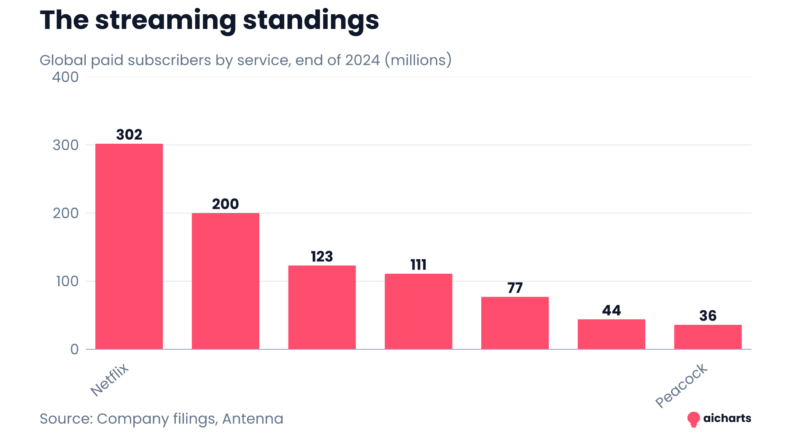](https://mcp-charts.vercel.app/chart?j=%7B%22chart%22%3A%22grouped-bar%22%2C%22title%22%3A%22The%20streaming%20standings%22%2C%22subtitle%22%3A%22Global%20paid%20subscribers%20by%20service%2C%20end%20of%202024%20(millions)%22%2C%22source%22%3A%22Company%20filings%2C%20Antenna%22%2C%22palette%22%3A%22vibrant%22%2C%22size%22%3A%22share%22%2C%22x%22%3A%22service%22%2C%22y%22%3A%5B%22subscribers%22%5D%2C%22orientation%22%3A%22horizontal%22%2C%22showValueLabels%22%3Atrue%2C%22data%22%3A%5B%7B%22service%22%3A%22Netflix%22%2C%22subscribers%22%3A302%7D%2C%7B%22service%22%3A%22Amazon%20Prime%20Video%22%2C%22subscribers%22%3A200%7D%2C%7B%22service%22%3A%22Disney%2B%22%2C%22subscribers%22%3A123%7D%2C%7B%22service%22%3A%22Max%20(HBO)%22%2C%22subscribers%22%3A111%7D%2C%7B%22service%22%3A%22Paramount%2B%22%2C%22subscribers%22%3A77%7D%2C%7B%22service%22%3A%22Apple%20TV%2B%22%2C%22subscribers%22%3A44%7D%2C%7B%22service%22%3A%22Peacock%22%2C%22subscribers%22%3A36%7D%5D%7D)

Open rendered PNG: <https://mcp-charts.vercel.app/chart?j=%7B%22chart%22%3A%22grouped-bar%22%2C%22title%22%3A%22The%20streaming%20standings%22%2C%22subtitle%22%3A%22Global%20paid%20subscribers%20by%20service%2C%20end%20of%202024%20(millions)%22%2C%22source%22%3A%22Company%20filings%2C%20Antenna%22%2C%22palette%22%3A%22vibrant%22%2C%22size%22%3A%22share%22%2C%22x%22%3A%22service%22%2C%22y%22%3A%5B%22subscribers%22%5D%2C%22orientation%22%3A%22horizontal%22%2C%22showValueLabels%22%3Atrue%2C%22data%22%3A%5B%7B%22service%22%3A%22Netflix%22%2C%22subscribers%22%3A302%7D%2C%7B%22service%22%3A%22Amazon%20Prime%20Video%22%2C%22subscribers%22%3A200%7D%2C%7B%22service%22%3A%22Disney%2B%22%2C%22subscribers%22%3A123%7D%2C%7B%22service%22%3A%22Max%20(HBO)%22%2C%22subscribers%22%3A111%7D%2C%7B%22service%22%3A%22Paramount%2B%22%2C%22subscribers%22%3A77%7D%2C%7B%22service%22%3A%22Apple%20TV%2B%22%2C%22subscribers%22%3A44%7D%2C%7B%22service%22%3A%22Peacock%22%2C%22subscribers%22%3A36%7D%5D%7D>

Source: Company filings, Antenna

---

### Paris 2024: the medals ledger
_Top medal-winning countries, Summer Olympics 2024_
Stacked bar · palette: editorial · size: share

[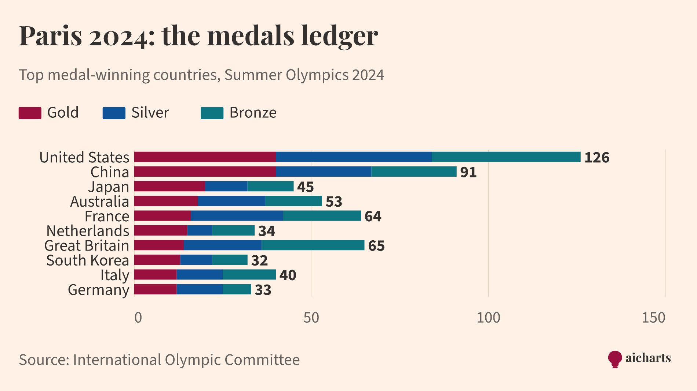](https://mcp-charts.vercel.app/chart?j=%7B%22chart%22%3A%22stacked-bar%22%2C%22title%22%3A%22Paris%202024%3A%20the%20medals%20ledger%22%2C%22subtitle%22%3A%22Top%20medal-winning%20countries%2C%20Summer%20Olympics%202024%22%2C%22source%22%3A%22International%20Olympic%20Committee%22%2C%22palette%22%3A%22editorial%22%2C%22size%22%3A%22share%22%2C%22x%22%3A%22country%22%2C%22y%22%3A%5B%22gold%22%2C%22silver%22%2C%22bronze%22%5D%2C%22orientation%22%3A%22horizontal%22%2C%22showTotals%22%3Atrue%2C%22data%22%3A%5B%7B%22country%22%3A%22United%20States%22%2C%22gold%22%3A40%2C%22silver%22%3A44%2C%22bronze%22%3A42%7D%2C%7B%22country%22%3A%22China%22%2C%22gold%22%3A40%2C%22silver%22%3A27%2C%22bronze%22%3A24%7D%2C%7B%22country%22%3A%22Japan%22%2C%22gold%22%3A20%2C%22silver%22%3A12%2C%22bronze%22%3A13%7D%2C%7B%22country%22%3A%22Australia%22%2C%22gold%22%3A18%2C%22silver%22%3A19%2C%22bronze%22%3A16%7D%2C%7B%22country%22%3A%22France%22%2C%22gold%22%3A16%2C%22silver%22%3A26%2C%22bronze%22%3A22%7D%2C%7B%22country%22%3A%22Netherlands%22%2C%22gold%22%3A15%2C%22silver%22%3A7%2C%22bronze%22%3A12%7D%2C%7B%22country%22%3A%22Great%20Britain%22%2C%22gold%22%3A14%2C%22silver%22%3A22%2C%22bronze%22%3A29%7D%2C%7B%22country%22%3A%22South%20Korea%22%2C%22gold%22%3A13%2C%22silver%22%3A9%2C%22bronze%22%3A10%7D%2C%7B%22country%22%3A%22Italy%22%2C%22gold%22%3A12%2C%22silver%22%3A13%2C%22bronze%22%3A15%7D%2C%7B%22country%22%3A%22Germany%22%2C%22gold%22%3A12%2C%22silver%22%3A13%2C%22bronze%22%3A8%7D%5D%7D)

Open rendered PNG: <https://mcp-charts.vercel.app/chart?j=%7B%22chart%22%3A%22stacked-bar%22%2C%22title%22%3A%22Paris%202024%3A%20the%20medals%20ledger%22%2C%22subtitle%22%3A%22Top%20medal-winning%20countries%2C%20Summer%20Olympics%202024%22%2C%22source%22%3A%22International%20Olympic%20Committee%22%2C%22palette%22%3A%22editorial%22%2C%22size%22%3A%22share%22%2C%22x%22%3A%22country%22%2C%22y%22%3A%5B%22gold%22%2C%22silver%22%2C%22bronze%22%5D%2C%22orientation%22%3A%22horizontal%22%2C%22showTotals%22%3Atrue%2C%22data%22%3A%5B%7B%22country%22%3A%22United%20States%22%2C%22gold%22%3A40%2C%22silver%22%3A44%2C%22bronze%22%3A42%7D%2C%7B%22country%22%3A%22China%22%2C%22gold%22%3A40%2C%22silver%22%3A27%2C%22bronze%22%3A24%7D%2C%7B%22country%22%3A%22Japan%22%2C%22gold%22%3A20%2C%22silver%22%3A12%2C%22bronze%22%3A13%7D%2C%7B%22country%22%3A%22Australia%22%2C%22gold%22%3A18%2C%22silver%22%3A19%2C%22bronze%22%3A16%7D%2C%7B%22country%22%3A%22France%22%2C%22gold%22%3A16%2C%22silver%22%3A26%2C%22bronze%22%3A22%7D%2C%7B%22country%22%3A%22Netherlands%22%2C%22gold%22%3A15%2C%22silver%22%3A7%2C%22bronze%22%3A12%7D%2C%7B%22country%22%3A%22Great%20Britain%22%2C%22gold%22%3A14%2C%22silver%22%3A22%2C%22bronze%22%3A29%7D%2C%7B%22country%22%3A%22South%20Korea%22%2C%22gold%22%3A13%2C%22silver%22%3A9%2C%22bronze%22%3A10%7D%2C%7B%22country%22%3A%22Italy%22%2C%22gold%22%3A12%2C%22silver%22%3A13%2C%22bronze%22%3A15%7D%2C%7B%22country%22%3A%22Germany%22%2C%22gold%22%3A12%2C%22silver%22%3A13%2C%22bronze%22%3A8%7D%5D%7D>

Source: International Olympic Committee

---

### The long life divide
_Life expectancy at birth, selected countries (years)_
Small multiples (lines) · palette: earth · size: share

[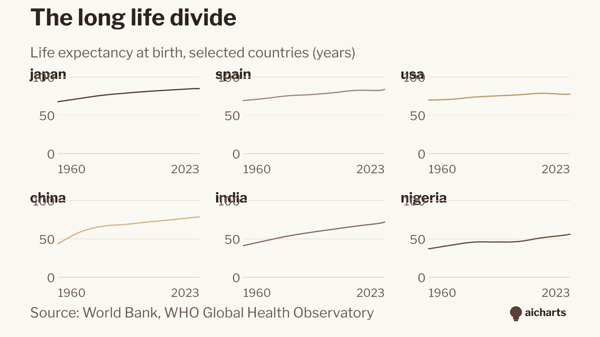](https://mcp-charts.vercel.app/chart?j=%7B%22chart%22%3A%22line-split%22%2C%22title%22%3A%22The%20long%20life%20divide%22%2C%22subtitle%22%3A%22Life%20expectancy%20at%20birth%2C%20selected%20countries%20(years)%22%2C%22source%22%3A%22World%20Bank%2C%20WHO%20Global%20Health%20Observatory%22%2C%22palette%22%3A%22earth%22%2C%22size%22%3A%22share%22%2C%22x%22%3A%22year%22%2C%22y%22%3A%5B%22japan%22%2C%22spain%22%2C%22usa%22%2C%22china%22%2C%22india%22%2C%22nigeria%22%5D%2C%22columns%22%3A3%2C%22sharedScale%22%3Atrue%2C%22interpolation%22%3A%22curved%22%2C%22data%22%3A%5B%7B%22year%22%3A1960%2C%22japan%22%3A67.7%2C%22spain%22%3A69.1%2C%22usa%22%3A69.8%2C%22china%22%3A43.7%2C%22india%22%3A41.2%2C%22nigeria%22%3A37.1%7D%2C%7B%22year%22%3A1970%2C%22japan%22%3A72%2C%22spain%22%3A72%2C%22usa%22%3A70.8%2C%22china%22%3A59.1%2C%22india%22%3A47.7%2C%22nigeria%22%3A41.8%7D%2C%7B%22year%22%3A1980%2C%22japan%22%3A76.1%2C%22spain%22%3A75.4%2C%22usa%22%3A73.6%2C%22china%22%3A66.5%2C%22india%22%3A53.8%2C%22nigeria%22%3A45.8%7D%2C%7B%22year%22%3A1990%2C%22japan%22%3A78.8%2C%22spain%22%3A76.9%2C%22usa%22%3A75.2%2C%22china%22%3A68.9%2C%22india%22%3A58.5%2C%22nigeria%22%3A46%7D%2C%7B%22year%22%3A2000%2C%22japan%22%3A81.1%2C%22spain%22%3A79.3%2C%22usa%22%3A76.6%2C%22china%22%3A72%2C%22india%22%3A62.6%2C%22nigeria%22%3A46.6%7D%2C%7B%22year%22%3A2010%2C%22japan%22%3A82.9%2C%22spain%22%3A82.4%2C%22usa%22%3A78.6%2C%22china%22%3A74.8%2C%22india%22%3A66.6%2C%22nigeria%22%3A51.3%7D%2C%7B%22year%22%3A2020%2C%22japan%22%3A84.6%2C%22spain%22%3A82.3%2C%22usa%22%3A77.3%2C%22china%22%3A77.9%2C%22india%22%3A70.1%2C%22nigeria%22%3A54.7%7D%2C%7B%22year%22%3A2023%2C%22japan%22%3A84.7%2C%22spain%22%3A83.7%2C%22usa%22%3A77.5%2C%22china%22%3A78.6%2C%22india%22%3A72%2C%22nigeria%22%3A56.1%7D%5D%7D)

Open rendered PNG: <https://mcp-charts.vercel.app/chart?j=%7B%22chart%22%3A%22line-split%22%2C%22title%22%3A%22The%20long%20life%20divide%22%2C%22subtitle%22%3A%22Life%20expectancy%20at%20birth%2C%20selected%20countries%20(years)%22%2C%22source%22%3A%22World%20Bank%2C%20WHO%20Global%20Health%20Observatory%22%2C%22palette%22%3A%22earth%22%2C%22size%22%3A%22share%22%2C%22x%22%3A%22year%22%2C%22y%22%3A%5B%22japan%22%2C%22spain%22%2C%22usa%22%2C%22china%22%2C%22india%22%2C%22nigeria%22%5D%2C%22columns%22%3A3%2C%22sharedScale%22%3Atrue%2C%22interpolation%22%3A%22curved%22%2C%22data%22%3A%5B%7B%22year%22%3A1960%2C%22japan%22%3A67.7%2C%22spain%22%3A69.1%2C%22usa%22%3A69.8%2C%22china%22%3A43.7%2C%22india%22%3A41.2%2C%22nigeria%22%3A37.1%7D%2C%7B%22year%22%3A1970%2C%22japan%22%3A72%2C%22spain%22%3A72%2C%22usa%22%3A70.8%2C%22china%22%3A59.1%2C%22india%22%3A47.7%2C%22nigeria%22%3A41.8%7D%2C%7B%22year%22%3A1980%2C%22japan%22%3A76.1%2C%22spain%22%3A75.4%2C%22usa%22%3A73.6%2C%22china%22%3A66.5%2C%22india%22%3A53.8%2C%22nigeria%22%3A45.8%7D%2C%7B%22year%22%3A1990%2C%22japan%22%3A78.8%2C%22spain%22%3A76.9%2C%22usa%22%3A75.2%2C%22china%22%3A68.9%2C%22india%22%3A58.5%2C%22nigeria%22%3A46%7D%2C%7B%22year%22%3A2000%2C%22japan%22%3A81.1%2C%22spain%22%3A79.3%2C%22usa%22%3A76.6%2C%22china%22%3A72%2C%22india%22%3A62.6%2C%22nigeria%22%3A46.6%7D%2C%7B%22year%22%3A2010%2C%22japan%22%3A82.9%2C%22spain%22%3A82.4%2C%22usa%22%3A78.6%2C%22china%22%3A74.8%2C%22india%22%3A66.6%2C%22nigeria%22%3A51.3%7D%2C%7B%22year%22%3A2020%2C%22japan%22%3A84.6%2C%22spain%22%3A82.3%2C%22usa%22%3A77.3%2C%22china%22%3A77.9%2C%22india%22%3A70.1%2C%22nigeria%22%3A54.7%7D%2C%7B%22year%22%3A2023%2C%22japan%22%3A84.7%2C%22spain%22%3A83.7%2C%22usa%22%3A77.5%2C%22china%22%3A78.6%2C%22india%22%3A72%2C%22nigeria%22%3A56.1%7D%5D%7D>

Source: World Bank, WHO Global Health Observatory

---

### Big Tech's research bill
_Annual R&D spending, 2024 (billion USD)_
Bar · palette: carbon · size: share

[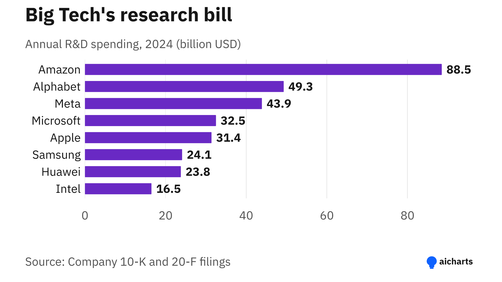](https://mcp-charts.vercel.app/chart?j=%7B%22chart%22%3A%22bar%22%2C%22title%22%3A%22Big%20Tech's%20research%20bill%22%2C%22subtitle%22%3A%22Annual%20R%26D%20spending%2C%202024%20(billion%20USD)%22%2C%22source%22%3A%22Company%2010-K%20and%2020-F%20filings%22%2C%22palette%22%3A%22carbon%22%2C%22size%22%3A%22share%22%2C%22label%22%3A%22company%22%2C%22value%22%3A%22spend%22%2C%22orientation%22%3A%22horizontal%22%2C%22sort%22%3A%22desc%22%2C%22showValueLabels%22%3Atrue%2C%22data%22%3A%5B%7B%22company%22%3A%22Amazon%22%2C%22spend%22%3A88.5%7D%2C%7B%22company%22%3A%22Alphabet%22%2C%22spend%22%3A49.3%7D%2C%7B%22company%22%3A%22Meta%22%2C%22spend%22%3A43.9%7D%2C%7B%22company%22%3A%22Microsoft%22%2C%22spend%22%3A32.5%7D%2C%7B%22company%22%3A%22Apple%22%2C%22spend%22%3A31.4%7D%2C%7B%22company%22%3A%22Samsung%22%2C%22spend%22%3A24.1%7D%2C%7B%22company%22%3A%22Huawei%22%2C%22spend%22%3A23.8%7D%2C%7B%22company%22%3A%22Intel%22%2C%22spend%22%3A16.5%7D%5D%7D)

Open rendered PNG: <https://mcp-charts.vercel.app/chart?j=%7B%22chart%22%3A%22bar%22%2C%22title%22%3A%22Big%20Tech's%20research%20bill%22%2C%22subtitle%22%3A%22Annual%20R%26D%20spending%2C%202024%20(billion%20USD)%22%2C%22source%22%3A%22Company%2010-K%20and%2020-F%20filings%22%2C%22palette%22%3A%22carbon%22%2C%22size%22%3A%22share%22%2C%22label%22%3A%22company%22%2C%22value%22%3A%22spend%22%2C%22orientation%22%3A%22horizontal%22%2C%22sort%22%3A%22desc%22%2C%22showValueLabels%22%3Atrue%2C%22data%22%3A%5B%7B%22company%22%3A%22Amazon%22%2C%22spend%22%3A88.5%7D%2C%7B%22company%22%3A%22Alphabet%22%2C%22spend%22%3A49.3%7D%2C%7B%22company%22%3A%22Meta%22%2C%22spend%22%3A43.9%7D%2C%7B%22company%22%3A%22Microsoft%22%2C%22spend%22%3A32.5%7D%2C%7B%22company%22%3A%22Apple%22%2C%22spend%22%3A31.4%7D%2C%7B%22company%22%3A%22Samsung%22%2C%22spend%22%3A24.1%7D%2C%7B%22company%22%3A%22Huawei%22%2C%22spend%22%3A23.8%7D%2C%7B%22company%22%3A%22Intel%22%2C%22spend%22%3A16.5%7D%5D%7D>

Source: Company 10-K and 20-F filings

---

### The US job market, in one line
_Monthly unemployment rate, seasonally adjusted (percent)_
Line · palette: mono-blue · size: share

[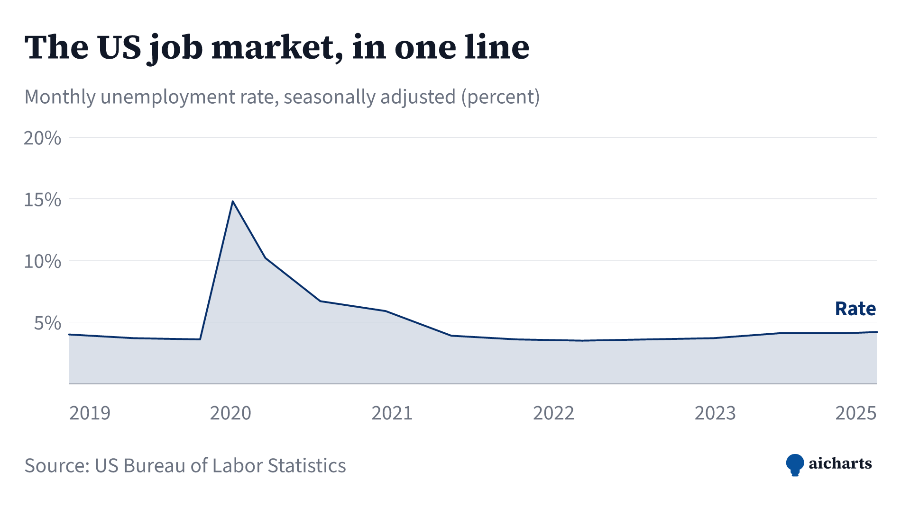](https://mcp-charts.vercel.app/chart?j=%7B%22chart%22%3A%22line%22%2C%22title%22%3A%22The%20US%20job%20market%2C%20in%20one%20line%22%2C%22subtitle%22%3A%22Monthly%20unemployment%20rate%2C%20seasonally%20adjusted%20(percent)%22%2C%22source%22%3A%22US%20Bureau%20of%20Labor%20Statistics%22%2C%22palette%22%3A%22mono-blue%22%2C%22size%22%3A%22share%22%2C%22x%22%3A%22month%22%2C%22y%22%3A%22rate%22%2C%22interpolation%22%3A%22linear%22%2C%22showSymbols%22%3A%22none%22%2C%22areaFill%22%3Atrue%2C%22yFormat%22%3A%22percent%22%2C%22data%22%3A%5B%7B%22month%22%3A%222019-01%22%2C%22rate%22%3A4%7D%2C%7B%22month%22%3A%222019-07%22%2C%22rate%22%3A3.7%7D%2C%7B%22month%22%3A%222020-01%22%2C%22rate%22%3A3.6%7D%2C%7B%22month%22%3A%222020-04%22%2C%22rate%22%3A14.8%7D%2C%7B%22month%22%3A%222020-07%22%2C%22rate%22%3A10.2%7D%2C%7B%22month%22%3A%222020-12%22%2C%22rate%22%3A6.7%7D%2C%7B%22month%22%3A%222021-06%22%2C%22rate%22%3A5.9%7D%2C%7B%22month%22%3A%222021-12%22%2C%22rate%22%3A3.9%7D%2C%7B%22month%22%3A%222022-06%22%2C%22rate%22%3A3.6%7D%2C%7B%22month%22%3A%222022-12%22%2C%22rate%22%3A3.5%7D%2C%7B%22month%22%3A%222023-06%22%2C%22rate%22%3A3.6%7D%2C%7B%22month%22%3A%222023-12%22%2C%22rate%22%3A3.7%7D%2C%7B%22month%22%3A%222024-06%22%2C%22rate%22%3A4.1%7D%2C%7B%22month%22%3A%222024-12%22%2C%22rate%22%3A4.1%7D%2C%7B%22month%22%3A%222025-03%22%2C%22rate%22%3A4.2%7D%5D%7D)

Open rendered PNG: <https://mcp-charts.vercel.app/chart?j=%7B%22chart%22%3A%22line%22%2C%22title%22%3A%22The%20US%20job%20market%2C%20in%20one%20line%22%2C%22subtitle%22%3A%22Monthly%20unemployment%20rate%2C%20seasonally%20adjusted%20(percent)%22%2C%22source%22%3A%22US%20Bureau%20of%20Labor%20Statistics%22%2C%22palette%22%3A%22mono-blue%22%2C%22size%22%3A%22share%22%2C%22x%22%3A%22month%22%2C%22y%22%3A%22rate%22%2C%22interpolation%22%3A%22linear%22%2C%22showSymbols%22%3A%22none%22%2C%22areaFill%22%3Atrue%2C%22yFormat%22%3A%22percent%22%2C%22data%22%3A%5B%7B%22month%22%3A%222019-01%22%2C%22rate%22%3A4%7D%2C%7B%22month%22%3A%222019-07%22%2C%22rate%22%3A3.7%7D%2C%7B%22month%22%3A%222020-01%22%2C%22rate%22%3A3.6%7D%2C%7B%22month%22%3A%222020-04%22%2C%22rate%22%3A14.8%7D%2C%7B%22month%22%3A%222020-07%22%2C%22rate%22%3A10.2%7D%2C%7B%22month%22%3A%222020-12%22%2C%22rate%22%3A6.7%7D%2C%7B%22month%22%3A%222021-06%22%2C%22rate%22%3A5.9%7D%2C%7B%22month%22%3A%222021-12%22%2C%22rate%22%3A3.9%7D%2C%7B%22month%22%3A%222022-06%22%2C%22rate%22%3A3.6%7D%2C%7B%22month%22%3A%222022-12%22%2C%22rate%22%3A3.5%7D%2C%7B%22month%22%3A%222023-06%22%2C%22rate%22%3A3.6%7D%2C%7B%22month%22%3A%222023-12%22%2C%22rate%22%3A3.7%7D%2C%7B%22month%22%3A%222024-06%22%2C%22rate%22%3A4.1%7D%2C%7B%22month%22%3A%222024-12%22%2C%22rate%22%3A4.1%7D%2C%7B%22month%22%3A%222025-03%22%2C%22rate%22%3A4.2%7D%5D%7D>

Source: US Bureau of Labor Statistics

---

### What the world is streaming
_Share of global Spotify streams by genre, 2024_
Donut · palette: twilight · size: share

[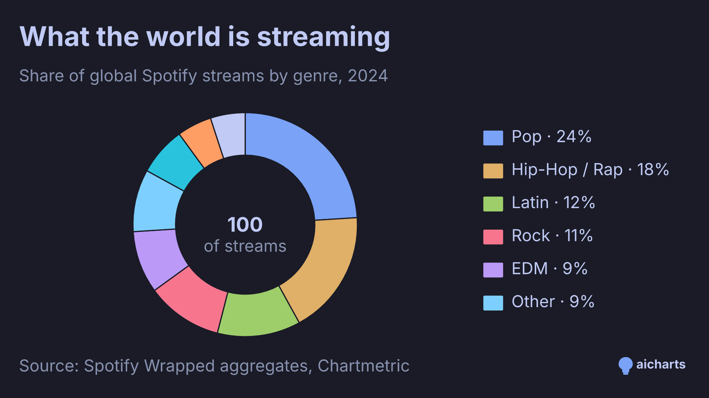](https://mcp-charts.vercel.app/chart?j=%7B%22chart%22%3A%22donut%22%2C%22title%22%3A%22What%20the%20world%20is%20streaming%22%2C%22subtitle%22%3A%22Share%20of%20global%20Spotify%20streams%20by%20genre%2C%202024%22%2C%22source%22%3A%22Spotify%20Wrapped%20aggregates%2C%20Chartmetric%22%2C%22palette%22%3A%22twilight%22%2C%22size%22%3A%22share%22%2C%22label%22%3A%22genre%22%2C%22value%22%3A%22share%22%2C%22sort%22%3A%22desc%22%2C%22centerValue%22%3A%22sum%22%2C%22centerLabel%22%3A%22of%20streams%22%2C%22data%22%3A%5B%7B%22genre%22%3A%22Pop%22%2C%22share%22%3A24%7D%2C%7B%22genre%22%3A%22Hip-Hop%20%2F%20Rap%22%2C%22share%22%3A18%7D%2C%7B%22genre%22%3A%22Latin%22%2C%22share%22%3A12%7D%2C%7B%22genre%22%3A%22Rock%22%2C%22share%22%3A11%7D%2C%7B%22genre%22%3A%22EDM%22%2C%22share%22%3A9%7D%2C%7B%22genre%22%3A%22R%26B%22%2C%22share%22%3A7%7D%2C%7B%22genre%22%3A%22K-Pop%22%2C%22share%22%3A5%7D%2C%7B%22genre%22%3A%22Country%22%2C%22share%22%3A5%7D%2C%7B%22genre%22%3A%22Other%22%2C%22share%22%3A9%7D%5D%7D)

Open rendered PNG: <https://mcp-charts.vercel.app/chart?j=%7B%22chart%22%3A%22donut%22%2C%22title%22%3A%22What%20the%20world%20is%20streaming%22%2C%22subtitle%22%3A%22Share%20of%20global%20Spotify%20streams%20by%20genre%2C%202024%22%2C%22source%22%3A%22Spotify%20Wrapped%20aggregates%2C%20Chartmetric%22%2C%22palette%22%3A%22twilight%22%2C%22size%22%3A%22share%22%2C%22label%22%3A%22genre%22%2C%22value%22%3A%22share%22%2C%22sort%22%3A%22desc%22%2C%22centerValue%22%3A%22sum%22%2C%22centerLabel%22%3A%22of%20streams%22%2C%22data%22%3A%5B%7B%22genre%22%3A%22Pop%22%2C%22share%22%3A24%7D%2C%7B%22genre%22%3A%22Hip-Hop%20%2F%20Rap%22%2C%22share%22%3A18%7D%2C%7B%22genre%22%3A%22Latin%22%2C%22share%22%3A12%7D%2C%7B%22genre%22%3A%22Rock%22%2C%22share%22%3A11%7D%2C%7B%22genre%22%3A%22EDM%22%2C%22share%22%3A9%7D%2C%7B%22genre%22%3A%22R%26B%22%2C%22share%22%3A7%7D%2C%7B%22genre%22%3A%22K-Pop%22%2C%22share%22%3A5%7D%2C%7B%22genre%22%3A%22Country%22%2C%22share%22%3A5%7D%2C%7B%22genre%22%3A%22Other%22%2C%22share%22%3A9%7D%5D%7D>

Source: Spotify Wrapped aggregates, Chartmetric

---

### Apple's pivot to services
_Net sales by segment (billion USD)_
Stacked area · palette: clarity · size: share

[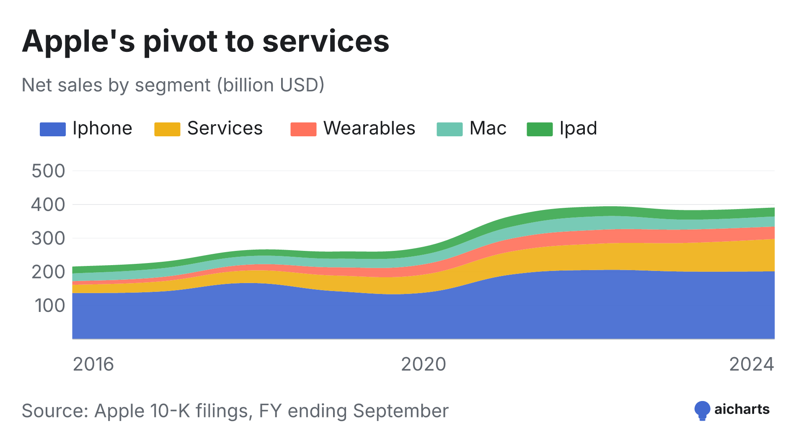](https://mcp-charts.vercel.app/chart?j=%7B%22chart%22%3A%22stacked-area%22%2C%22title%22%3A%22Apple's%20pivot%20to%20services%22%2C%22subtitle%22%3A%22Net%20sales%20by%20segment%20(billion%20USD)%22%2C%22source%22%3A%22Apple%2010-K%20filings%2C%20FY%20ending%20September%22%2C%22palette%22%3A%22clarity%22%2C%22size%22%3A%22share%22%2C%22x%22%3A%22year%22%2C%22y%22%3A%5B%22iphone%22%2C%22services%22%2C%22wearables%22%2C%22mac%22%2C%22ipad%22%5D%2C%22interpolation%22%3A%22curved%22%2C%22data%22%3A%5B%7B%22year%22%3A2016%2C%22iphone%22%3A136.7%2C%22services%22%3A24.3%2C%22wearables%22%3A11.1%2C%22mac%22%3A22.8%2C%22ipad%22%3A20.6%7D%2C%7B%22year%22%3A2017%2C%22iphone%22%3A141.3%2C%22services%22%3A29.9%2C%22wearables%22%3A12.8%2C%22mac%22%3A25.8%2C%22ipad%22%3A19.2%7D%2C%7B%22year%22%3A2018%2C%22iphone%22%3A166.7%2C%22services%22%3A37.2%2C%22wearables%22%3A17.4%2C%22mac%22%3A25.2%2C%22ipad%22%3A18.4%7D%2C%7B%22year%22%3A2019%2C%22iphone%22%3A142.4%2C%22services%22%3A46.3%2C%22wearables%22%3A24.5%2C%22mac%22%3A25.7%2C%22ipad%22%3A21.3%7D%2C%7B%22year%22%3A2020%2C%22iphone%22%3A137.8%2C%22services%22%3A53.8%2C%22wearables%22%3A30.6%2C%22mac%22%3A28.6%2C%22ipad%22%3A23.7%7D%2C%7B%22year%22%3A2021%2C%22iphone%22%3A191.9%2C%22services%22%3A68.4%2C%22wearables%22%3A38.4%2C%22mac%22%3A35.2%2C%22ipad%22%3A31.9%7D%2C%7B%22year%22%3A2022%2C%22iphone%22%3A205.5%2C%22services%22%3A78.1%2C%22wearables%22%3A41.2%2C%22mac%22%3A40.2%2C%22ipad%22%3A29.3%7D%2C%7B%22year%22%3A2023%2C%22iphone%22%3A200.6%2C%22services%22%3A85.2%2C%22wearables%22%3A39.8%2C%22mac%22%3A29.4%2C%22ipad%22%3A28.3%7D%2C%7B%22year%22%3A2024%2C%22iphone%22%3A201.2%2C%22services%22%3A96.2%2C%22wearables%22%3A37%2C%22mac%22%3A29.9%2C%22ipad%22%3A26.7%7D%5D%7D)

Open rendered PNG: <https://mcp-charts.vercel.app/chart?j=%7B%22chart%22%3A%22stacked-area%22%2C%22title%22%3A%22Apple's%20pivot%20to%20services%22%2C%22subtitle%22%3A%22Net%20sales%20by%20segment%20(billion%20USD)%22%2C%22source%22%3A%22Apple%2010-K%20filings%2C%20FY%20ending%20September%22%2C%22palette%22%3A%22clarity%22%2C%22size%22%3A%22share%22%2C%22x%22%3A%22year%22%2C%22y%22%3A%5B%22iphone%22%2C%22services%22%2C%22wearables%22%2C%22mac%22%2C%22ipad%22%5D%2C%22interpolation%22%3A%22curved%22%2C%22data%22%3A%5B%7B%22year%22%3A2016%2C%22iphone%22%3A136.7%2C%22services%22%3A24.3%2C%22wearables%22%3A11.1%2C%22mac%22%3A22.8%2C%22ipad%22%3A20.6%7D%2C%7B%22year%22%3A2017%2C%22iphone%22%3A141.3%2C%22services%22%3A29.9%2C%22wearables%22%3A12.8%2C%22mac%22%3A25.8%2C%22ipad%22%3A19.2%7D%2C%7B%22year%22%3A2018%2C%22iphone%22%3A166.7%2C%22services%22%3A37.2%2C%22wearables%22%3A17.4%2C%22mac%22%3A25.2%2C%22ipad%22%3A18.4%7D%2C%7B%22year%22%3A2019%2C%22iphone%22%3A142.4%2C%22services%22%3A46.3%2C%22wearables%22%3A24.5%2C%22mac%22%3A25.7%2C%22ipad%22%3A21.3%7D%2C%7B%22year%22%3A2020%2C%22iphone%22%3A137.8%2C%22services%22%3A53.8%2C%22wearables%22%3A30.6%2C%22mac%22%3A28.6%2C%22ipad%22%3A23.7%7D%2C%7B%22year%22%3A2021%2C%22iphone%22%3A191.9%2C%22services%22%3A68.4%2C%22wearables%22%3A38.4%2C%22mac%22%3A35.2%2C%22ipad%22%3A31.9%7D%2C%7B%22year%22%3A2022%2C%22iphone%22%3A205.5%2C%22services%22%3A78.1%2C%22wearables%22%3A41.2%2C%22mac%22%3A40.2%2C%22ipad%22%3A29.3%7D%2C%7B%22year%22%3A2023%2C%22iphone%22%3A200.6%2C%22services%22%3A85.2%2C%22wearables%22%3A39.8%2C%22mac%22%3A29.4%2C%22ipad%22%3A28.3%7D%2C%7B%22year%22%3A2024%2C%22iphone%22%3A201.2%2C%22services%22%3A96.2%2C%22wearables%22%3A37%2C%22mac%22%3A29.9%2C%22ipad%22%3A26.7%7D%5D%7D>

Source: Apple 10-K filings, FY ending September

---

### Bitcoin's jagged ascent
_Year-end price of one bitcoin (USD)_
Line · palette: vibrant · size: share

[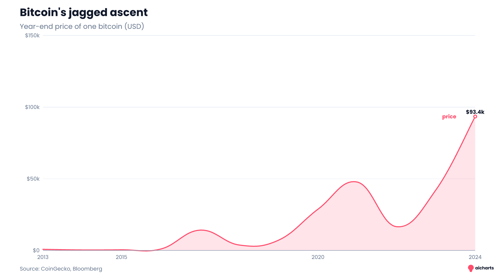](https://mcp-charts.vercel.app/chart?j=%7B%22chart%22%3A%22line%22%2C%22title%22%3A%22Bitcoin's%20jagged%20ascent%22%2C%22subtitle%22%3A%22Year-end%20price%20of%20one%20bitcoin%20(USD)%22%2C%22source%22%3A%22CoinGecko%2C%20Bloomberg%22%2C%22palette%22%3A%22vibrant%22%2C%22size%22%3A%22share%22%2C%22x%22%3A%22year%22%2C%22y%22%3A%22price%22%2C%22interpolation%22%3A%22curved%22%2C%22areaFill%22%3Atrue%2C%22showSymbols%22%3A%22last%22%2C%22showValueLabels%22%3A%22last%22%2C%22yFormat%22%3A%22currency%22%2C%22data%22%3A%5B%7B%22year%22%3A2013%2C%22price%22%3A754%7D%2C%7B%22year%22%3A2014%2C%22price%22%3A318%7D%2C%7B%22year%22%3A2015%2C%22price%22%3A430%7D%2C%7B%22year%22%3A2016%2C%22price%22%3A963%7D%2C%7B%22year%22%3A2017%2C%22price%22%3A14156%7D%2C%7B%22year%22%3A2018%2C%22price%22%3A3742%7D%2C%7B%22year%22%3A2019%2C%22price%22%3A7179%7D%2C%7B%22year%22%3A2020%2C%22price%22%3A28768%7D%2C%7B%22year%22%3A2021%2C%22price%22%3A47686%7D%2C%7B%22year%22%3A2022%2C%22price%22%3A16547%7D%2C%7B%22year%22%3A2023%2C%22price%22%3A42207%7D%2C%7B%22year%22%3A2024%2C%22price%22%3A93429%7D%5D%7D)

Open rendered PNG: <https://mcp-charts.vercel.app/chart?j=%7B%22chart%22%3A%22line%22%2C%22title%22%3A%22Bitcoin's%20jagged%20ascent%22%2C%22subtitle%22%3A%22Year-end%20price%20of%20one%20bitcoin%20(USD)%22%2C%22source%22%3A%22CoinGecko%2C%20Bloomberg%22%2C%22palette%22%3A%22vibrant%22%2C%22size%22%3A%22share%22%2C%22x%22%3A%22year%22%2C%22y%22%3A%22price%22%2C%22interpolation%22%3A%22curved%22%2C%22areaFill%22%3Atrue%2C%22showSymbols%22%3A%22last%22%2C%22showValueLabels%22%3A%22last%22%2C%22yFormat%22%3A%22currency%22%2C%22data%22%3A%5B%7B%22year%22%3A2013%2C%22price%22%3A754%7D%2C%7B%22year%22%3A2014%2C%22price%22%3A318%7D%2C%7B%22year%22%3A2015%2C%22price%22%3A430%7D%2C%7B%22year%22%3A2016%2C%22price%22%3A963%7D%2C%7B%22year%22%3A2017%2C%22price%22%3A14156%7D%2C%7B%22year%22%3A2018%2C%22price%22%3A3742%7D%2C%7B%22year%22%3A2019%2C%22price%22%3A7179%7D%2C%7B%22year%22%3A2020%2C%22price%22%3A28768%7D%2C%7B%22year%22%3A2021%2C%22price%22%3A47686%7D%2C%7B%22year%22%3A2022%2C%22price%22%3A16547%7D%2C%7B%22year%22%3A2023%2C%22price%22%3A42207%7D%2C%7B%22year%22%3A2024%2C%22price%22%3A93429%7D%5D%7D>

Source: CoinGecko, Bloomberg

---

### The heavier world
_Adult obesity rate, selected OECD countries (percent, 2022-23)_
Bar · palette: diverging-sunset · size: share

[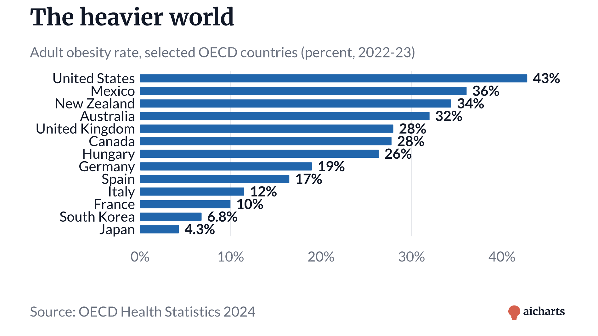](https://mcp-charts.vercel.app/chart?j=%7B%22chart%22%3A%22bar%22%2C%22title%22%3A%22The%20heavier%20world%22%2C%22subtitle%22%3A%22Adult%20obesity%20rate%2C%20selected%20OECD%20countries%20(percent%2C%202022-23)%22%2C%22source%22%3A%22OECD%20Health%20Statistics%202024%22%2C%22palette%22%3A%22diverging-sunset%22%2C%22size%22%3A%22share%22%2C%22label%22%3A%22country%22%2C%22value%22%3A%22rate%22%2C%22orientation%22%3A%22horizontal%22%2C%22sort%22%3A%22desc%22%2C%22showValueLabels%22%3Atrue%2C%22yFormat%22%3A%22percent%22%2C%22data%22%3A%5B%7B%22country%22%3A%22United%20States%22%2C%22rate%22%3A42.8%7D%2C%7B%22country%22%3A%22Mexico%22%2C%22rate%22%3A36.1%7D%2C%7B%22country%22%3A%22New%20Zealand%22%2C%22rate%22%3A34.4%7D%2C%7B%22country%22%3A%22United%20Kingdom%22%2C%22rate%22%3A28%7D%2C%7B%22country%22%3A%22Hungary%22%2C%22rate%22%3A26.4%7D%2C%7B%22country%22%3A%22Canada%22%2C%22rate%22%3A27.8%7D%2C%7B%22country%22%3A%22Australia%22%2C%22rate%22%3A32%7D%2C%7B%22country%22%3A%22Germany%22%2C%22rate%22%3A19%7D%2C%7B%22country%22%3A%22Spain%22%2C%22rate%22%3A16.5%7D%2C%7B%22country%22%3A%22France%22%2C%22rate%22%3A10%7D%2C%7B%22country%22%3A%22Italy%22%2C%22rate%22%3A11.5%7D%2C%7B%22country%22%3A%22Japan%22%2C%22rate%22%3A4.3%7D%2C%7B%22country%22%3A%22South%20Korea%22%2C%22rate%22%3A6.8%7D%5D%7D)

Open rendered PNG: <https://mcp-charts.vercel.app/chart?j=%7B%22chart%22%3A%22bar%22%2C%22title%22%3A%22The%20heavier%20world%22%2C%22subtitle%22%3A%22Adult%20obesity%20rate%2C%20selected%20OECD%20countries%20(percent%2C%202022-23)%22%2C%22source%22%3A%22OECD%20Health%20Statistics%202024%22%2C%22palette%22%3A%22diverging-sunset%22%2C%22size%22%3A%22share%22%2C%22label%22%3A%22country%22%2C%22value%22%3A%22rate%22%2C%22orientation%22%3A%22horizontal%22%2C%22sort%22%3A%22desc%22%2C%22showValueLabels%22%3Atrue%2C%22yFormat%22%3A%22percent%22%2C%22data%22%3A%5B%7B%22country%22%3A%22United%20States%22%2C%22rate%22%3A42.8%7D%2C%7B%22country%22%3A%22Mexico%22%2C%22rate%22%3A36.1%7D%2C%7B%22country%22%3A%22New%20Zealand%22%2C%22rate%22%3A34.4%7D%2C%7B%22country%22%3A%22United%20Kingdom%22%2C%22rate%22%3A28%7D%2C%7B%22country%22%3A%22Hungary%22%2C%22rate%22%3A26.4%7D%2C%7B%22country%22%3A%22Canada%22%2C%22rate%22%3A27.8%7D%2C%7B%22country%22%3A%22Australia%22%2C%22rate%22%3A32%7D%2C%7B%22country%22%3A%22Germany%22%2C%22rate%22%3A19%7D%2C%7B%22country%22%3A%22Spain%22%2C%22rate%22%3A16.5%7D%2C%7B%22country%22%3A%22France%22%2C%22rate%22%3A10%7D%2C%7B%22country%22%3A%22Italy%22%2C%22rate%22%3A11.5%7D%2C%7B%22country%22%3A%22Japan%22%2C%22rate%22%3A4.3%7D%2C%7B%22country%22%3A%22South%20Korea%22%2C%22rate%22%3A6.8%7D%5D%7D>

Source: OECD Health Statistics 2024

---

### The unicorn club
_Top AI startup valuations by round, 2024 (billion USD)_
Small multiples (bars) · palette: twilight · size: share

[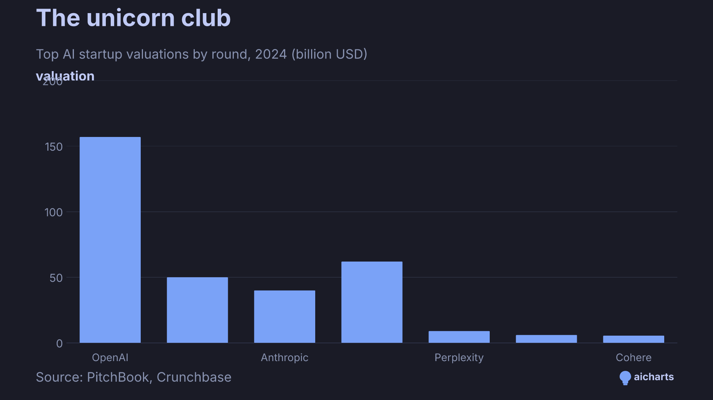](https://mcp-charts.vercel.app/chart?j=%7B%22chart%22%3A%22bar-split%22%2C%22title%22%3A%22The%20unicorn%20club%22%2C%22subtitle%22%3A%22Top%20AI%20startup%20valuations%20by%20round%2C%202024%20(billion%20USD)%22%2C%22source%22%3A%22PitchBook%2C%20Crunchbase%22%2C%22palette%22%3A%22twilight%22%2C%22size%22%3A%22share%22%2C%22x%22%3A%22company%22%2C%22y%22%3A%5B%22valuation%22%5D%2C%22columns%22%3A1%2C%22data%22%3A%5B%7B%22company%22%3A%22OpenAI%22%2C%22valuation%22%3A157%7D%2C%7B%22company%22%3A%22xAI%22%2C%22valuation%22%3A50%7D%2C%7B%22company%22%3A%22Anthropic%22%2C%22valuation%22%3A40%7D%2C%7B%22company%22%3A%22Databricks%22%2C%22valuation%22%3A62%7D%2C%7B%22company%22%3A%22Perplexity%22%2C%22valuation%22%3A9%7D%2C%7B%22company%22%3A%22Mistral%22%2C%22valuation%22%3A6%7D%2C%7B%22company%22%3A%22Cohere%22%2C%22valuation%22%3A5.5%7D%5D%7D)

Open rendered PNG: <https://mcp-charts.vercel.app/chart?j=%7B%22chart%22%3A%22bar-split%22%2C%22title%22%3A%22The%20unicorn%20club%22%2C%22subtitle%22%3A%22Top%20AI%20startup%20valuations%20by%20round%2C%202024%20(billion%20USD)%22%2C%22source%22%3A%22PitchBook%2C%20Crunchbase%22%2C%22palette%22%3A%22twilight%22%2C%22size%22%3A%22share%22%2C%22x%22%3A%22company%22%2C%22y%22%3A%5B%22valuation%22%5D%2C%22columns%22%3A1%2C%22data%22%3A%5B%7B%22company%22%3A%22OpenAI%22%2C%22valuation%22%3A157%7D%2C%7B%22company%22%3A%22xAI%22%2C%22valuation%22%3A50%7D%2C%7B%22company%22%3A%22Anthropic%22%2C%22valuation%22%3A40%7D%2C%7B%22company%22%3A%22Databricks%22%2C%22valuation%22%3A62%7D%2C%7B%22company%22%3A%22Perplexity%22%2C%22valuation%22%3A9%7D%2C%7B%22company%22%3A%22Mistral%22%2C%22valuation%22%3A6%7D%2C%7B%22company%22%3A%22Cohere%22%2C%22valuation%22%3A5.5%7D%5D%7D>

Source: PitchBook, Crunchbase

---

### A flight's carbon footprint
_Share of CO2 emissions per economy-class passenger on a long-haul flight_
Donut · palette: earth · size: share

[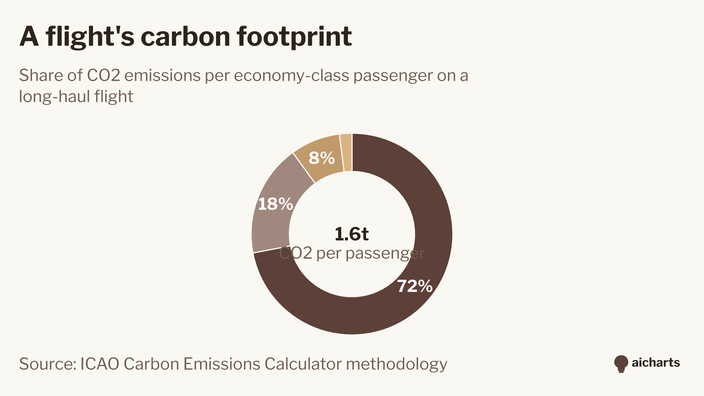](https://mcp-charts.vercel.app/chart?j=%7B%22chart%22%3A%22donut%22%2C%22title%22%3A%22A%20flight's%20carbon%20footprint%22%2C%22subtitle%22%3A%22Share%20of%20CO2%20emissions%20per%20economy-class%20passenger%20on%20a%20long-haul%20flight%22%2C%22source%22%3A%22ICAO%20Carbon%20Emissions%20Calculator%20methodology%22%2C%22palette%22%3A%22earth%22%2C%22size%22%3A%22share%22%2C%22label%22%3A%22component%22%2C%22value%22%3A%22share%22%2C%22centerValue%22%3A%221.6t%22%2C%22centerLabel%22%3A%22CO2%20per%20passenger%22%2C%22data%22%3A%5B%7B%22component%22%3A%22Jet%20fuel%20combustion%22%2C%22share%22%3A72%7D%2C%7B%22component%22%3A%22Fuel%20production%20%26%20transport%22%2C%22share%22%3A18%7D%2C%7B%22component%22%3A%22Non-CO2%20effects%20(contrails)%22%2C%22share%22%3A8%7D%2C%7B%22component%22%3A%22Ground%20operations%22%2C%22share%22%3A2%7D%5D%7D)

Open rendered PNG: <https://mcp-charts.vercel.app/chart?j=%7B%22chart%22%3A%22donut%22%2C%22title%22%3A%22A%20flight's%20carbon%20footprint%22%2C%22subtitle%22%3A%22Share%20of%20CO2%20emissions%20per%20economy-class%20passenger%20on%20a%20long-haul%20flight%22%2C%22source%22%3A%22ICAO%20Carbon%20Emissions%20Calculator%20methodology%22%2C%22palette%22%3A%22earth%22%2C%22size%22%3A%22share%22%2C%22label%22%3A%22component%22%2C%22value%22%3A%22share%22%2C%22centerValue%22%3A%221.6t%22%2C%22centerLabel%22%3A%22CO2%20per%20passenger%22%2C%22data%22%3A%5B%7B%22component%22%3A%22Jet%20fuel%20combustion%22%2C%22share%22%3A72%7D%2C%7B%22component%22%3A%22Fuel%20production%20%26%20transport%22%2C%22share%22%3A18%7D%2C%7B%22component%22%3A%22Non-CO2%20effects%20(contrails)%22%2C%22share%22%3A8%7D%2C%7B%22component%22%3A%22Ground%20operations%22%2C%22share%22%3A2%7D%5D%7D>

Source: ICAO Carbon Emissions Calculator methodology

---

### The 2024 electoral map
_US presidential election margin by state, Trump vs. Harris (percentage points)_
Map · palette: diverging-sunset · size: share

%22%2C%22source%22%3A%22Associated%20Press%2C%20certified%20state%20results%22%2C%22palette%22%3A%22diverging-sunset%22%2C%22size%22%3A%22share%22%2C%22basemap%22%3A%22usa%22%2C%22code%22%3A%22state%22%2C%22value%22%3A%22margin%22%2C%22scale%22%3A%22diverging%22%2C%22data%22%3A%5B%7B%22state%22%3A%22AL%22%2C%22margin%22%3A30%7D%2C%7B%22state%22%3A%22AK%22%2C%22margin%22%3A13%7D%2C%7B%22state%22%3A%22AZ%22%2C%22margin%22%3A5%7D%2C%7B%22state%22%3A%22AR%22%2C%22margin%22%3A21%7D%2C%7B%22state%22%3A%22CA%22%2C%22margin%22%3A-20%7D%2C%7B%22state%22%3A%22CO%22%2C%22margin%22%3A-11%7D%2C%7B%22state%22%3A%22CT%22%2C%22margin%22%3A-14%7D%2C%7B%22state%22%3A%22DE%22%2C%22margin%22%3A-15%7D%2C%7B%22state%22%3A%22FL%22%2C%22margin%22%3A13%7D%2C%7B%22state%22%3A%22GA%22%2C%22margin%22%3A2%7D%2C%7B%22state%22%3A%22HI%22%2C%22margin%22%3A-24%7D%2C%7B%22state%22%3A%22ID%22%2C%22margin%22%3A37%7D%2C%7B%22state%22%3A%22IL%22%2C%22margin%22%3A-11%7D%2C%7B%22state%22%3A%22IN%22%2C%22margin%22%3A19%7D%2C%7B%22state%22%3A%22IA%22%2C%22margin%22%3A13%7D%2C%7B%22state%22%3A%22KS%22%2C%22margin%22%3A16%7D%2C%7B%22state%22%3A%22KY%22%2C%22margin%22%3A30%7D%2C%7B%22state%22%3A%22LA%22%2C%22margin%22%3A22%7D%2C%7B%22state%22%3A%22ME%22%2C%22margin%22%3A-7%7D%2C%7B%22state%22%3A%22MD%22%2C%22margin%22%3A-29%7D%2C%7B%22state%22%3A%22MA%22%2C%22margin%22%3A-25%7D%2C%7B%22state%22%3A%22MI%22%2C%22margin%22%3A1%7D%2C%7B%22state%22%3A%22MN%22%2C%22margin%22%3A-4%7D%2C%7B%22state%22%3A%22MS%22%2C%22margin%22%3A22%7D%2C%7B%22state%22%3A%22MO%22%2C%22margin%22%3A18%7D%2C%7B%22state%22%3A%22MT%22%2C%22margin%22%3A20%7D%2C%7B%22state%22%3A%22NE%22%2C%22margin%22%3A20%7D%2C%7B%22state%22%3A%22NV%22%2C%22margin%22%3A3%7D%2C%7B%22state%22%3A%22NH%22%2C%22margin%22%3A-3%7D%2C%7B%22state%22%3A%22NJ%22%2C%22margin%22%3A-6%7D%2C%7B%22state%22%3A%22NM%22%2C%22margin%22%3A-6%7D%2C%7B%22state%22%3A%22NY%22%2C%22margin%22%3A-12%7D%2C%7B%22state%22%3A%22NC%22%2C%22margin%22%3A3%7D%2C%7B%22state%22%3A%22ND%22%2C%22margin%22%3A36%7D%2C%7B%22state%22%3A%22OH%22%2C%22margin%22%3A11%7D%2C%7B%22state%22%3A%22OK%22%2C%22margin%22%3A33%7D%2C%7B%22state%22%3A%22OR%22%2C%22margin%22%3A-14%7D%2C%7B%22state%22%3A%22PA%22%2C%22margin%22%3A2%7D%2C%7B%22state%22%3A%22RI%22%2C%22margin%22%3A-14%7D%2C%7B%22state%22%3A%22SC%22%2C%22margin%22%3A18%7D%2C%7B%22state%22%3A%22SD%22%2C%22margin%22%3A29%7D%2C%7B%22state%22%3A%22TN%22%2C%22margin%22%3A30%7D%2C%7B%22state%22%3A%22TX%22%2C%22margin%22%3A14%7D%2C%7B%22state%22%3A%22UT%22%2C%22margin%22%3A22%7D%2C%7B%22state%22%3A%22VT%22%2C%22margin%22%3A-32%7D%2C%7B%22state%22%3A%22VA%22%2C%22margin%22%3A-6%7D%2C%7B%22state%22%3A%22WA%22%2C%22margin%22%3A-18%7D%2C%7B%22state%22%3A%22WV%22%2C%22margin%22%3A42%7D%2C%7B%22state%22%3A%22WI%22%2C%22margin%22%3A1%7D%2C%7B%22state%22%3A%22WY%22%2C%22margin%22%3A46%7D%2C%7B%22state%22%3A%22DC%22%2C%22margin%22%3A-86%7D%5D%7D)

Open rendered PNG: <https://mcp-charts.vercel.app/chart?j=%7B%22chart%22%3A%22geo%22%2C%22title%22%3A%22The%202024%20electoral%20map%22%2C%22subtitle%22%3A%22US%20presidential%20election%20margin%20by%20state%2C%20Trump%20vs.%20Harris%20(percentage%20points)%22%2C%22source%22%3A%22Associated%20Press%2C%20certified%20state%20results%22%2C%22palette%22%3A%22diverging-sunset%22%2C%22size%22%3A%22share%22%2C%22basemap%22%3A%22usa%22%2C%22code%22%3A%22state%22%2C%22value%22%3A%22margin%22%2C%22scale%22%3A%22diverging%22%2C%22data%22%3A%5B%7B%22state%22%3A%22AL%22%2C%22margin%22%3A30%7D%2C%7B%22state%22%3A%22AK%22%2C%22margin%22%3A13%7D%2C%7B%22state%22%3A%22AZ%22%2C%22margin%22%3A5%7D%2C%7B%22state%22%3A%22AR%22%2C%22margin%22%3A21%7D%2C%7B%22state%22%3A%22CA%22%2C%22margin%22%3A-20%7D%2C%7B%22state%22%3A%22CO%22%2C%22margin%22%3A-11%7D%2C%7B%22state%22%3A%22CT%22%2C%22margin%22%3A-14%7D%2C%7B%22state%22%3A%22DE%22%2C%22margin%22%3A-15%7D%2C%7B%22state%22%3A%22FL%22%2C%22margin%22%3A13%7D%2C%7B%22state%22%3A%22GA%22%2C%22margin%22%3A2%7D%2C%7B%22state%22%3A%22HI%22%2C%22margin%22%3A-24%7D%2C%7B%22state%22%3A%22ID%22%2C%22margin%22%3A37%7D%2C%7B%22state%22%3A%22IL%22%2C%22margin%22%3A-11%7D%2C%7B%22state%22%3A%22IN%22%2C%22margin%22%3A19%7D%2C%7B%22state%22%3A%22IA%22%2C%22margin%22%3A13%7D%2C%7B%22state%22%3A%22KS%22%2C%22margin%22%3A16%7D%2C%7B%22state%22%3A%22KY%22%2C%22margin%22%3A30%7D%2C%7B%22state%22%3A%22LA%22%2C%22margin%22%3A22%7D%2C%7B%22state%22%3A%22ME%22%2C%22margin%22%3A-7%7D%2C%7B%22state%22%3A%22MD%22%2C%22margin%22%3A-29%7D%2C%7B%22state%22%3A%22MA%22%2C%22margin%22%3A-25%7D%2C%7B%22state%22%3A%22MI%22%2C%22margin%22%3A1%7D%2C%7B%22state%22%3A%22MN%22%2C%22margin%22%3A-4%7D%2C%7B%22state%22%3A%22MS%22%2C%22margin%22%3A22%7D%2C%7B%22state%22%3A%22MO%22%2C%22margin%22%3A18%7D%2C%7B%22state%22%3A%22MT%22%2C%22margin%22%3A20%7D%2C%7B%22state%22%3A%22NE%22%2C%22margin%22%3A20%7D%2C%7B%22state%22%3A%22NV%22%2C%22margin%22%3A3%7D%2C%7B%22state%22%3A%22NH%22%2C%22margin%22%3A-3%7D%2C%7B%22state%22%3A%22NJ%22%2C%22margin%22%3A-6%7D%2C%7B%22state%22%3A%22NM%22%2C%22margin%22%3A-6%7D%2C%7B%22state%22%3A%22NY%22%2C%22margin%22%3A-12%7D%2C%7B%22state%22%3A%22NC%22%2C%22margin%22%3A3%7D%2C%7B%22state%22%3A%22ND%22%2C%22margin%22%3A36%7D%2C%7B%22state%22%3A%22OH%22%2C%22margin%22%3A11%7D%2C%7B%22state%22%3A%22OK%22%2C%22margin%22%3A33%7D%2C%7B%22state%22%3A%22OR%22%2C%22margin%22%3A-14%7D%2C%7B%22state%22%3A%22PA%22%2C%22margin%22%3A2%7D%2C%7B%22state%22%3A%22RI%22%2C%22margin%22%3A-14%7D%2C%7B%22state%22%3A%22SC%22%2C%22margin%22%3A18%7D%2C%7B%22state%22%3A%22SD%22%2C%22margin%22%3A29%7D%2C%7B%22state%22%3A%22TN%22%2C%22margin%22%3A30%7D%2C%7B%22state%22%3A%22TX%22%2C%22margin%22%3A14%7D%2C%7B%22state%22%3A%22UT%22%2C%22margin%22%3A22%7D%2C%7B%22state%22%3A%22VT%22%2C%22margin%22%3A-32%7D%2C%7B%22state%22%3A%22VA%22%2C%22margin%22%3A-6%7D%2C%7B%22state%22%3A%22WA%22%2C%22margin%22%3A-18%7D%2C%7B%22state%22%3A%22WV%22%2C%22margin%22%3A42%7D%2C%7B%22state%22%3A%22WI%22%2C%22margin%22%3A1%7D%2C%7B%22state%22%3A%22WY%22%2C%22margin%22%3A46%7D%2C%7B%22state%22%3A%22DC%22%2C%22margin%22%3A-86%7D%5D%7D>

Source: Associated Press, certified state results

---

### The fastest adoption curve in history
_Months to reach 100 million monthly users_
Line · palette: editorial · size: share

[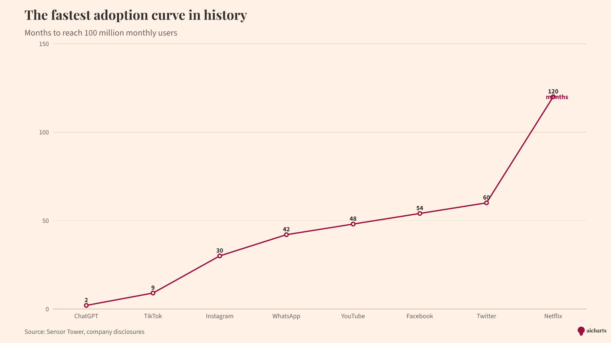](https://mcp-charts.vercel.app/chart?j=%7B%22chart%22%3A%22line%22%2C%22title%22%3A%22The%20fastest%20adoption%20curve%20in%20history%22%2C%22subtitle%22%3A%22Months%20to%20reach%20100%20million%20monthly%20users%22%2C%22source%22%3A%22Sensor%20Tower%2C%20company%20disclosures%22%2C%22palette%22%3A%22editorial%22%2C%22size%22%3A%22share%22%2C%22x%22%3A%22service%22%2C%22y%22%3A%22months%22%2C%22interpolation%22%3A%22linear%22%2C%22showSymbols%22%3A%22all%22%2C%22showValueLabels%22%3A%22all%22%2C%22data%22%3A%5B%7B%22service%22%3A%22ChatGPT%22%2C%22months%22%3A2%7D%2C%7B%22service%22%3A%22TikTok%22%2C%22months%22%3A9%7D%2C%7B%22service%22%3A%22Instagram%22%2C%22months%22%3A30%7D%2C%7B%22service%22%3A%22WhatsApp%22%2C%22months%22%3A42%7D%2C%7B%22service%22%3A%22YouTube%22%2C%22months%22%3A48%7D%2C%7B%22service%22%3A%22Facebook%22%2C%22months%22%3A54%7D%2C%7B%22service%22%3A%22Twitter%22%2C%22months%22%3A60%7D%2C%7B%22service%22%3A%22Netflix%22%2C%22months%22%3A120%7D%5D%7D)

Open rendered PNG: <https://mcp-charts.vercel.app/chart?j=%7B%22chart%22%3A%22line%22%2C%22title%22%3A%22The%20fastest%20adoption%20curve%20in%20history%22%2C%22subtitle%22%3A%22Months%20to%20reach%20100%20million%20monthly%20users%22%2C%22source%22%3A%22Sensor%20Tower%2C%20company%20disclosures%22%2C%22palette%22%3A%22editorial%22%2C%22size%22%3A%22share%22%2C%22x%22%3A%22service%22%2C%22y%22%3A%22months%22%2C%22interpolation%22%3A%22linear%22%2C%22showSymbols%22%3A%22all%22%2C%22showValueLabels%22%3A%22all%22%2C%22data%22%3A%5B%7B%22service%22%3A%22ChatGPT%22%2C%22months%22%3A2%7D%2C%7B%22service%22%3A%22TikTok%22%2C%22months%22%3A9%7D%2C%7B%22service%22%3A%22Instagram%22%2C%22months%22%3A30%7D%2C%7B%22service%22%3A%22WhatsApp%22%2C%22months%22%3A42%7D%2C%7B%22service%22%3A%22YouTube%22%2C%22months%22%3A48%7D%2C%7B%22service%22%3A%22Facebook%22%2C%22months%22%3A54%7D%2C%7B%22service%22%3A%22Twitter%22%2C%22months%22%3A60%7D%2C%7B%22service%22%3A%22Netflix%22%2C%22months%22%3A120%7D%5D%7D>

Source: Sensor Tower, company disclosures

---

### The NBA title holders
_NBA championships by franchise, 1947-2024_
Pie · palette: editorial · size: share

[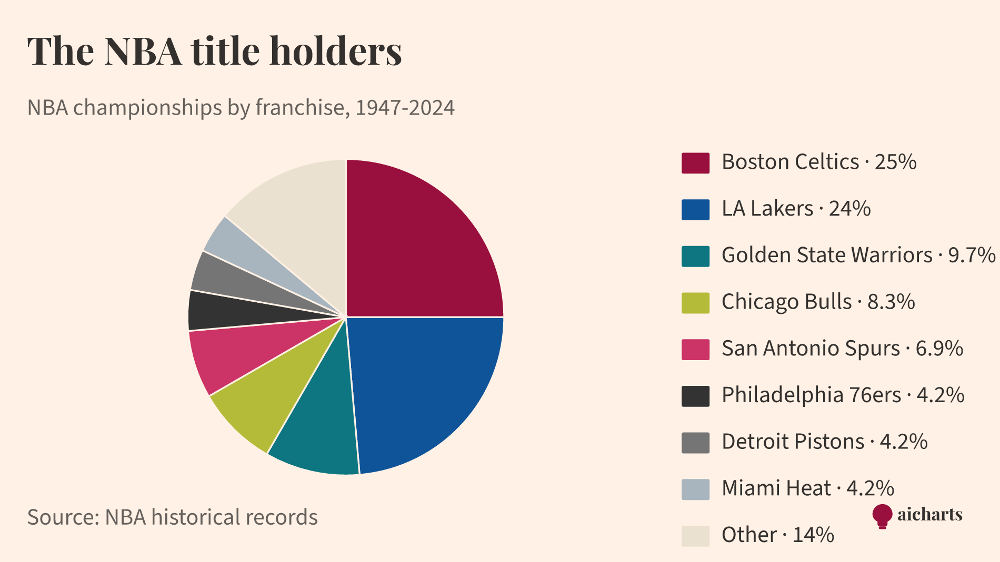](https://mcp-charts.vercel.app/chart?j=%7B%22chart%22%3A%22pie%22%2C%22title%22%3A%22The%20NBA%20title%20holders%22%2C%22subtitle%22%3A%22NBA%20championships%20by%20franchise%2C%201947-2024%22%2C%22source%22%3A%22NBA%20historical%20records%22%2C%22palette%22%3A%22editorial%22%2C%22size%22%3A%22share%22%2C%22label%22%3A%22team%22%2C%22value%22%3A%22titles%22%2C%22sort%22%3A%22desc%22%2C%22otherThreshold%22%3A0.04%2C%22data%22%3A%5B%7B%22team%22%3A%22Boston%20Celtics%22%2C%22titles%22%3A18%7D%2C%7B%22team%22%3A%22LA%20Lakers%22%2C%22titles%22%3A17%7D%2C%7B%22team%22%3A%22Golden%20State%20Warriors%22%2C%22titles%22%3A7%7D%2C%7B%22team%22%3A%22Chicago%20Bulls%22%2C%22titles%22%3A6%7D%2C%7B%22team%22%3A%22San%20Antonio%20Spurs%22%2C%22titles%22%3A5%7D%2C%7B%22team%22%3A%22Philadelphia%2076ers%22%2C%22titles%22%3A3%7D%2C%7B%22team%22%3A%22Detroit%20Pistons%22%2C%22titles%22%3A3%7D%2C%7B%22team%22%3A%22Miami%20Heat%22%2C%22titles%22%3A3%7D%2C%7B%22team%22%3A%22Houston%20Rockets%22%2C%22titles%22%3A2%7D%2C%7B%22team%22%3A%22New%20York%20Knicks%22%2C%22titles%22%3A2%7D%2C%7B%22team%22%3A%22Denver%20Nuggets%22%2C%22titles%22%3A1%7D%2C%7B%22team%22%3A%22Milwaukee%20Bucks%22%2C%22titles%22%3A2%7D%2C%7B%22team%22%3A%22Toronto%20Raptors%22%2C%22titles%22%3A1%7D%2C%7B%22team%22%3A%22Cleveland%20Cavaliers%22%2C%22titles%22%3A1%7D%2C%7B%22team%22%3A%22Dallas%20Mavericks%22%2C%22titles%22%3A1%7D%5D%7D)

Open rendered PNG: <https://mcp-charts.vercel.app/chart?j=%7B%22chart%22%3A%22pie%22%2C%22title%22%3A%22The%20NBA%20title%20holders%22%2C%22subtitle%22%3A%22NBA%20championships%20by%20franchise%2C%201947-2024%22%2C%22source%22%3A%22NBA%20historical%20records%22%2C%22palette%22%3A%22editorial%22%2C%22size%22%3A%22share%22%2C%22label%22%3A%22team%22%2C%22value%22%3A%22titles%22%2C%22sort%22%3A%22desc%22%2C%22otherThreshold%22%3A0.04%2C%22data%22%3A%5B%7B%22team%22%3A%22Boston%20Celtics%22%2C%22titles%22%3A18%7D%2C%7B%22team%22%3A%22LA%20Lakers%22%2C%22titles%22%3A17%7D%2C%7B%22team%22%3A%22Golden%20State%20Warriors%22%2C%22titles%22%3A7%7D%2C%7B%22team%22%3A%22Chicago%20Bulls%22%2C%22titles%22%3A6%7D%2C%7B%22team%22%3A%22San%20Antonio%20Spurs%22%2C%22titles%22%3A5%7D%2C%7B%22team%22%3A%22Philadelphia%2076ers%22%2C%22titles%22%3A3%7D%2C%7B%22team%22%3A%22Detroit%20Pistons%22%2C%22titles%22%3A3%7D%2C%7B%22team%22%3A%22Miami%20Heat%22%2C%22titles%22%3A3%7D%2C%7B%22team%22%3A%22Houston%20Rockets%22%2C%22titles%22%3A2%7D%2C%7B%22team%22%3A%22New%20York%20Knicks%22%2C%22titles%22%3A2%7D%2C%7B%22team%22%3A%22Denver%20Nuggets%22%2C%22titles%22%3A1%7D%2C%7B%22team%22%3A%22Milwaukee%20Bucks%22%2C%22titles%22%3A2%7D%2C%7B%22team%22%3A%22Toronto%20Raptors%22%2C%22titles%22%3A1%7D%2C%7B%22team%22%3A%22Cleveland%20Cavaliers%22%2C%22titles%22%3A1%7D%2C%7B%22team%22%3A%22Dallas%20Mavericks%22%2C%22titles%22%3A1%7D%5D%7D>

Source: NBA historical records

---

### China's export mix
_Merchandise exports by category (billion USD)_
Stacked bar · palette: boardroom · size: share

[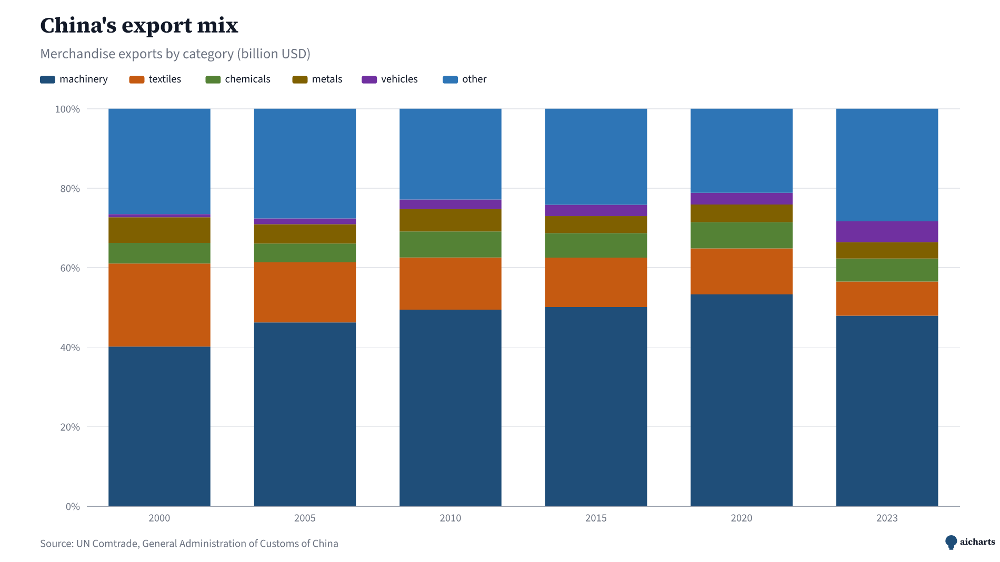](https://mcp-charts.vercel.app/chart?j=%7B%22chart%22%3A%22stacked-bar%22%2C%22title%22%3A%22China's%20export%20mix%22%2C%22subtitle%22%3A%22Merchandise%20exports%20by%20category%20(billion%20USD)%22%2C%22source%22%3A%22UN%20Comtrade%2C%20General%20Administration%20of%20Customs%20of%20China%22%2C%22palette%22%3A%22boardroom%22%2C%22size%22%3A%22share%22%2C%22x%22%3A%22year%22%2C%22y%22%3A%5B%22machinery%22%2C%22textiles%22%2C%22chemicals%22%2C%22metals%22%2C%22vehicles%22%2C%22other%22%5D%2C%22normalize%22%3Atrue%2C%22data%22%3A%5B%7B%22year%22%3A2000%2C%22machinery%22%3A100%2C%22textiles%22%3A52%2C%22chemicals%22%3A13%2C%22metals%22%3A16%2C%22vehicles%22%3A2%2C%22other%22%3A66%7D%2C%7B%22year%22%3A2005%2C%22machinery%22%3A352%2C%22textiles%22%3A115%2C%22chemicals%22%3A36%2C%22metals%22%3A37%2C%22vehicles%22%3A11%2C%22other%22%3A210%7D%2C%7B%22year%22%3A2010%2C%22machinery%22%3A780%2C%22textiles%22%3A207%2C%22chemicals%22%3A103%2C%22metals%22%3A89%2C%22vehicles%22%3A38%2C%22other%22%3A360%7D%2C%7B%22year%22%3A2015%2C%22machinery%22%3A1140%2C%22textiles%22%3A283%2C%22chemicals%22%3A140%2C%22metals%22%3A98%2C%22vehicles%22%3A64%2C%22other%22%3A550%7D%2C%7B%22year%22%3A2020%2C%22machinery%22%3A1380%2C%22textiles%22%3A300%2C%22chemicals%22%3A170%2C%22metals%22%3A116%2C%22vehicles%22%3A76%2C%22other%22%3A548%7D%2C%7B%22year%22%3A2023%2C%22machinery%22%3A1620%2C%22textiles%22%3A291%2C%22chemicals%22%3A195%2C%22metals%22%3A139%2C%22vehicles%22%3A178%2C%22other%22%3A957%7D%5D%7D)

Open rendered PNG: <https://mcp-charts.vercel.app/chart?j=%7B%22chart%22%3A%22stacked-bar%22%2C%22title%22%3A%22China's%20export%20mix%22%2C%22subtitle%22%3A%22Merchandise%20exports%20by%20category%20(billion%20USD)%22%2C%22source%22%3A%22UN%20Comtrade%2C%20General%20Administration%20of%20Customs%20of%20China%22%2C%22palette%22%3A%22boardroom%22%2C%22size%22%3A%22share%22%2C%22x%22%3A%22year%22%2C%22y%22%3A%5B%22machinery%22%2C%22textiles%22%2C%22chemicals%22%2C%22metals%22%2C%22vehicles%22%2C%22other%22%5D%2C%22normalize%22%3Atrue%2C%22data%22%3A%5B%7B%22year%22%3A2000%2C%22machinery%22%3A100%2C%22textiles%22%3A52%2C%22chemicals%22%3A13%2C%22metals%22%3A16%2C%22vehicles%22%3A2%2C%22other%22%3A66%7D%2C%7B%22year%22%3A2005%2C%22machinery%22%3A352%2C%22textiles%22%3A115%2C%22chemicals%22%3A36%2C%22metals%22%3A37%2C%22vehicles%22%3A11%2C%22other%22%3A210%7D%2C%7B%22year%22%3A2010%2C%22machinery%22%3A780%2C%22textiles%22%3A207%2C%22chemicals%22%3A103%2C%22metals%22%3A89%2C%22vehicles%22%3A38%2C%22other%22%3A360%7D%2C%7B%22year%22%3A2015%2C%22machinery%22%3A1140%2C%22textiles%22%3A283%2C%22chemicals%22%3A140%2C%22metals%22%3A98%2C%22vehicles%22%3A64%2C%22other%22%3A550%7D%2C%7B%22year%22%3A2020%2C%22machinery%22%3A1380%2C%22textiles%22%3A300%2C%22chemicals%22%3A170%2C%22metals%22%3A116%2C%22vehicles%22%3A76%2C%22other%22%3A548%7D%2C%7B%22year%22%3A2023%2C%22machinery%22%3A1620%2C%22textiles%22%3A291%2C%22chemicals%22%3A195%2C%22metals%22%3A139%2C%22vehicles%22%3A178%2C%22other%22%3A957%7D%5D%7D>

Source: UN Comtrade, General Administration of Customs of China

---

### The tech reset
_Reported tech sector layoffs by year (thousands of workers)_
Bar · palette: carbon · size: share

[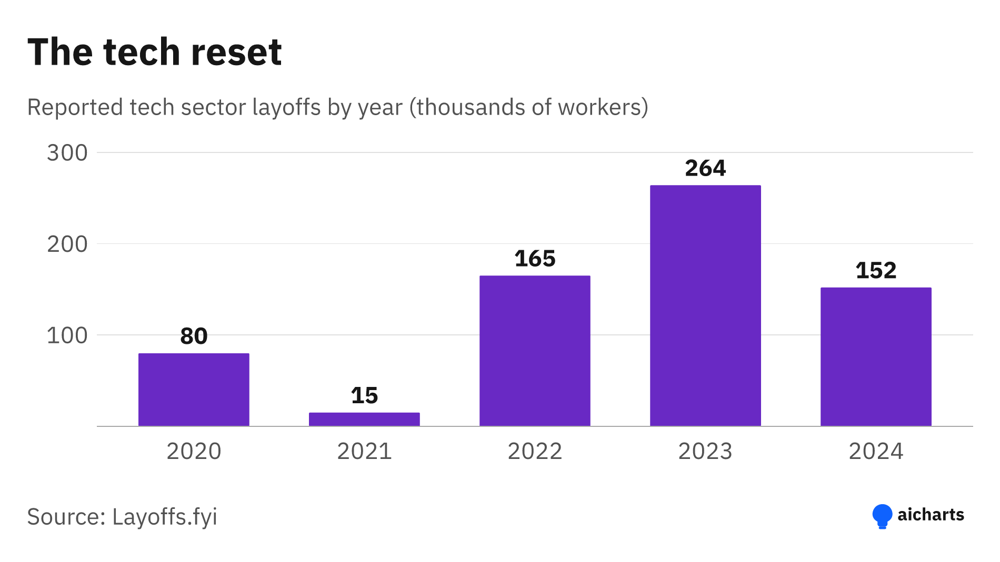](https://mcp-charts.vercel.app/chart?j=%7B%22chart%22%3A%22bar%22%2C%22title%22%3A%22The%20tech%20reset%22%2C%22subtitle%22%3A%22Reported%20tech%20sector%20layoffs%20by%20year%20(thousands%20of%20workers)%22%2C%22source%22%3A%22Layoffs.fyi%22%2C%22palette%22%3A%22carbon%22%2C%22size%22%3A%22share%22%2C%22x%22%3A%22year%22%2C%22y%22%3A%22count%22%2C%22orientation%22%3A%22vertical%22%2C%22showValueLabels%22%3Atrue%2C%22data%22%3A%5B%7B%22year%22%3A2020%2C%22count%22%3A80%7D%2C%7B%22year%22%3A2021%2C%22count%22%3A15%7D%2C%7B%22year%22%3A2022%2C%22count%22%3A165%7D%2C%7B%22year%22%3A2023%2C%22count%22%3A264%7D%2C%7B%22year%22%3A2024%2C%22count%22%3A152%7D%5D%7D)

Open rendered PNG: <https://mcp-charts.vercel.app/chart?j=%7B%22chart%22%3A%22bar%22%2C%22title%22%3A%22The%20tech%20reset%22%2C%22subtitle%22%3A%22Reported%20tech%20sector%20layoffs%20by%20year%20(thousands%20of%20workers)%22%2C%22source%22%3A%22Layoffs.fyi%22%2C%22palette%22%3A%22carbon%22%2C%22size%22%3A%22share%22%2C%22x%22%3A%22year%22%2C%22y%22%3A%22count%22%2C%22orientation%22%3A%22vertical%22%2C%22showValueLabels%22%3Atrue%2C%22data%22%3A%5B%7B%22year%22%3A2020%2C%22count%22%3A80%7D%2C%7B%22year%22%3A2021%2C%22count%22%3A15%7D%2C%7B%22year%22%3A2022%2C%22count%22%3A165%7D%2C%7B%22year%22%3A2023%2C%22count%22%3A264%7D%2C%7B%22year%22%3A2024%2C%22count%22%3A152%7D%5D%7D>

Source: Layoffs.fyi

---

### Germany's economic map
_Gross domestic product by Land, 2023 (billion euros)_
Map · palette: clarity · size: share

[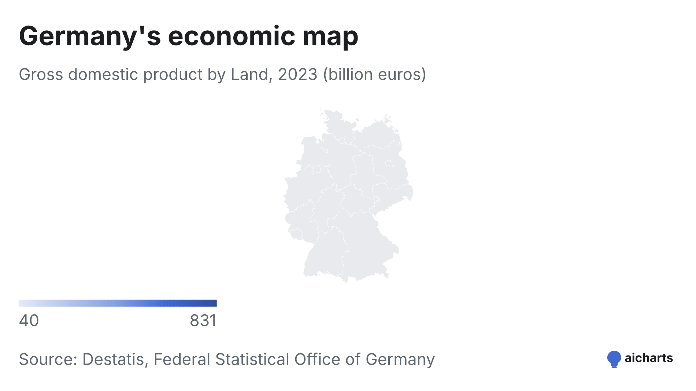](https://mcp-charts.vercel.app/chart?j=%7B%22chart%22%3A%22geo%22%2C%22title%22%3A%22Germany's%20economic%20map%22%2C%22subtitle%22%3A%22Gross%20domestic%20product%20by%20Land%2C%202023%20(billion%20euros)%22%2C%22source%22%3A%22Destatis%2C%20Federal%20Statistical%20Office%20of%20Germany%22%2C%22palette%22%3A%22clarity%22%2C%22size%22%3A%22share%22%2C%22basemap%22%3A%22germany%22%2C%22code%22%3A%22state%22%2C%22value%22%3A%22gdp%22%2C%22scale%22%3A%22linear%22%2C%22data%22%3A%5B%7B%22state%22%3A%22BW%22%2C%22gdp%22%3A611%7D%2C%7B%22state%22%3A%22BY%22%2C%22gdp%22%3A767%7D%2C%7B%22state%22%3A%22BE%22%2C%22gdp%22%3A183%7D%2C%7B%22state%22%3A%22BB%22%2C%22gdp%22%3A91%7D%2C%7B%22state%22%3A%22HB%22%2C%22gdp%22%3A40%7D%2C%7B%22state%22%3A%22HH%22%2C%22gdp%22%3A163%7D%2C%7B%22state%22%3A%22HE%22%2C%22gdp%22%3A348%7D%2C%7B%22state%22%3A%22MV%22%2C%22gdp%22%3A57%7D%2C%7B%22state%22%3A%22NI%22%2C%22gdp%22%3A355%7D%2C%7B%22state%22%3A%22NW%22%2C%22gdp%22%3A831%7D%2C%7B%22state%22%3A%22RP%22%2C%22gdp%22%3A179%7D%2C%7B%22state%22%3A%22SL%22%2C%22gdp%22%3A41%7D%2C%7B%22state%22%3A%22SN%22%2C%22gdp%22%3A156%7D%2C%7B%22state%22%3A%22ST%22%2C%22gdp%22%3A74%7D%2C%7B%22state%22%3A%22SH%22%2C%22gdp%22%3A113%7D%2C%7B%22state%22%3A%22TH%22%2C%22gdp%22%3A74%7D%5D%7D)

Open rendered PNG: <https://mcp-charts.vercel.app/chart?j=%7B%22chart%22%3A%22geo%22%2C%22title%22%3A%22Germany's%20economic%20map%22%2C%22subtitle%22%3A%22Gross%20domestic%20product%20by%20Land%2C%202023%20(billion%20euros)%22%2C%22source%22%3A%22Destatis%2C%20Federal%20Statistical%20Office%20of%20Germany%22%2C%22palette%22%3A%22clarity%22%2C%22size%22%3A%22share%22%2C%22basemap%22%3A%22germany%22%2C%22code%22%3A%22state%22%2C%22value%22%3A%22gdp%22%2C%22scale%22%3A%22linear%22%2C%22data%22%3A%5B%7B%22state%22%3A%22BW%22%2C%22gdp%22%3A611%7D%2C%7B%22state%22%3A%22BY%22%2C%22gdp%22%3A767%7D%2C%7B%22state%22%3A%22BE%22%2C%22gdp%22%3A183%7D%2C%7B%22state%22%3A%22BB%22%2C%22gdp%22%3A91%7D%2C%7B%22state%22%3A%22HB%22%2C%22gdp%22%3A40%7D%2C%7B%22state%22%3A%22HH%22%2C%22gdp%22%3A163%7D%2C%7B%22state%22%3A%22HE%22%2C%22gdp%22%3A348%7D%2C%7B%22state%22%3A%22MV%22%2C%22gdp%22%3A57%7D%2C%7B%22state%22%3A%22NI%22%2C%22gdp%22%3A355%7D%2C%7B%22state%22%3A%22NW%22%2C%22gdp%22%3A831%7D%2C%7B%22state%22%3A%22RP%22%2C%22gdp%22%3A179%7D%2C%7B%22state%22%3A%22SL%22%2C%22gdp%22%3A41%7D%2C%7B%22state%22%3A%22SN%22%2C%22gdp%22%3A156%7D%2C%7B%22state%22%3A%22ST%22%2C%22gdp%22%3A74%7D%2C%7B%22state%22%3A%22SH%22%2C%22gdp%22%3A113%7D%2C%7B%22state%22%3A%22TH%22%2C%22gdp%22%3A74%7D%5D%7D>

Source: Destatis, Federal Statistical Office of Germany

---

### The trillion-dollar overhang
_Total outstanding US federal student loans (billion USD)_
Line · palette: mono-blue · size: share

[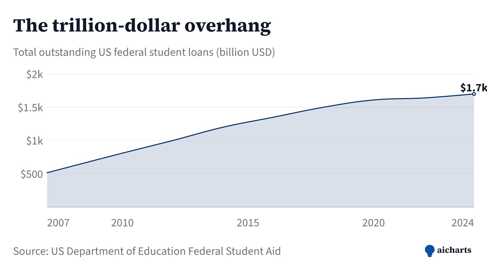](https://mcp-charts.vercel.app/chart?j=%7B%22chart%22%3A%22line%22%2C%22title%22%3A%22The%20trillion-dollar%20overhang%22%2C%22subtitle%22%3A%22Total%20outstanding%20US%20federal%20student%20loans%20(billion%20USD)%22%2C%22source%22%3A%22US%20Department%20of%20Education%20Federal%20Student%20Aid%22%2C%22palette%22%3A%22mono-blue%22%2C%22size%22%3A%22share%22%2C%22x%22%3A%22year%22%2C%22y%22%3A%22debt%22%2C%22interpolation%22%3A%22curved%22%2C%22areaFill%22%3Atrue%2C%22showSymbols%22%3A%22last%22%2C%22showValueLabels%22%3A%22last%22%2C%22yFormat%22%3A%22currency%22%2C%22data%22%3A%5B%7B%22year%22%3A2007%2C%22debt%22%3A516%7D%2C%7B%22year%22%3A2010%2C%22debt%22%3A811%7D%2C%7B%22year%22%3A2012%2C%22debt%22%3A1000%7D%2C%7B%22year%22%3A2014%2C%22debt%22%3A1200%7D%2C%7B%22year%22%3A2016%2C%22debt%22%3A1350%7D%2C%7B%22year%22%3A2018%2C%22debt%22%3A1500%7D%2C%7B%22year%22%3A2020%2C%22debt%22%3A1610%7D%2C%7B%22year%22%3A2022%2C%22debt%22%3A1640%7D%2C%7B%22year%22%3A2024%2C%22debt%22%3A1700%7D%5D%7D)

Open rendered PNG: <https://mcp-charts.vercel.app/chart?j=%7B%22chart%22%3A%22line%22%2C%22title%22%3A%22The%20trillion-dollar%20overhang%22%2C%22subtitle%22%3A%22Total%20outstanding%20US%20federal%20student%20loans%20(billion%20USD)%22%2C%22source%22%3A%22US%20Department%20of%20Education%20Federal%20Student%20Aid%22%2C%22palette%22%3A%22mono-blue%22%2C%22size%22%3A%22share%22%2C%22x%22%3A%22year%22%2C%22y%22%3A%22debt%22%2C%22interpolation%22%3A%22curved%22%2C%22areaFill%22%3Atrue%2C%22showSymbols%22%3A%22last%22%2C%22showValueLabels%22%3A%22last%22%2C%22yFormat%22%3A%22currency%22%2C%22data%22%3A%5B%7B%22year%22%3A2007%2C%22debt%22%3A516%7D%2C%7B%22year%22%3A2010%2C%22debt%22%3A811%7D%2C%7B%22year%22%3A2012%2C%22debt%22%3A1000%7D%2C%7B%22year%22%3A2014%2C%22debt%22%3A1200%7D%2C%7B%22year%22%3A2016%2C%22debt%22%3A1350%7D%2C%7B%22year%22%3A2018%2C%22debt%22%3A1500%7D%2C%7B%22year%22%3A2020%2C%22debt%22%3A1610%7D%2C%7B%22year%22%3A2022%2C%22debt%22%3A1640%7D%2C%7B%22year%22%3A2024%2C%22debt%22%3A1700%7D%5D%7D>

Source: US Department of Education Federal Student Aid

---

### The Messi-Ronaldo era
_International career goals, as of Jan 2025_
Grouped bar · palette: vibrant · size: share

[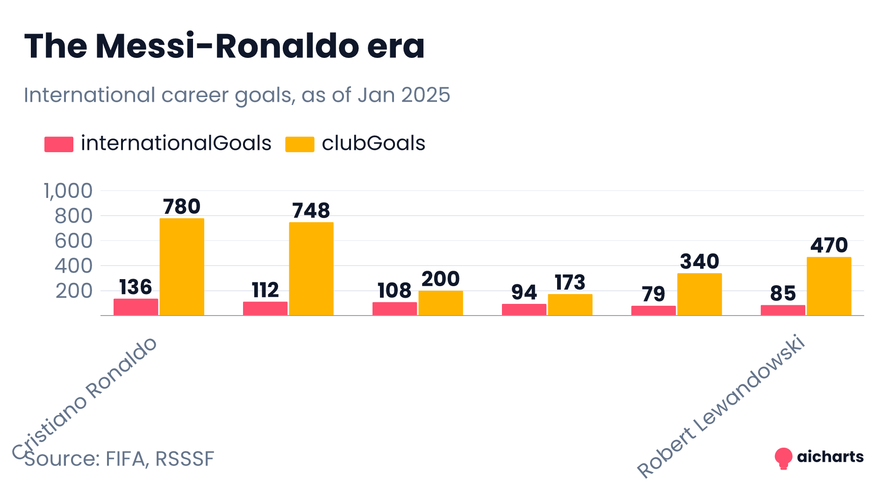](https://mcp-charts.vercel.app/chart?j=%7B%22chart%22%3A%22grouped-bar%22%2C%22title%22%3A%22The%20Messi-Ronaldo%20era%22%2C%22subtitle%22%3A%22International%20career%20goals%2C%20as%20of%20Jan%202025%22%2C%22source%22%3A%22FIFA%2C%20RSSSF%22%2C%22palette%22%3A%22vibrant%22%2C%22size%22%3A%22share%22%2C%22x%22%3A%22player%22%2C%22y%22%3A%5B%22internationalGoals%22%2C%22clubGoals%22%5D%2C%22showValueLabels%22%3Atrue%2C%22data%22%3A%5B%7B%22player%22%3A%22Cristiano%20Ronaldo%22%2C%22internationalGoals%22%3A136%2C%22clubGoals%22%3A780%7D%2C%7B%22player%22%3A%22Lionel%20Messi%22%2C%22internationalGoals%22%3A112%2C%22clubGoals%22%3A748%7D%2C%7B%22player%22%3A%22Ali%20Daei%22%2C%22internationalGoals%22%3A108%2C%22clubGoals%22%3A200%7D%2C%7B%22player%22%3A%22Sunil%20Chhetri%22%2C%22internationalGoals%22%3A94%2C%22clubGoals%22%3A173%7D%2C%7B%22player%22%3A%22Neymar%22%2C%22internationalGoals%22%3A79%2C%22clubGoals%22%3A340%7D%2C%7B%22player%22%3A%22Robert%20Lewandowski%22%2C%22internationalGoals%22%3A85%2C%22clubGoals%22%3A470%7D%5D%7D)

Open rendered PNG: <https://mcp-charts.vercel.app/chart?j=%7B%22chart%22%3A%22grouped-bar%22%2C%22title%22%3A%22The%20Messi-Ronaldo%20era%22%2C%22subtitle%22%3A%22International%20career%20goals%2C%20as%20of%20Jan%202025%22%2C%22source%22%3A%22FIFA%2C%20RSSSF%22%2C%22palette%22%3A%22vibrant%22%2C%22size%22%3A%22share%22%2C%22x%22%3A%22player%22%2C%22y%22%3A%5B%22internationalGoals%22%2C%22clubGoals%22%5D%2C%22showValueLabels%22%3Atrue%2C%22data%22%3A%5B%7B%22player%22%3A%22Cristiano%20Ronaldo%22%2C%22internationalGoals%22%3A136%2C%22clubGoals%22%3A780%7D%2C%7B%22player%22%3A%22Lionel%20Messi%22%2C%22internationalGoals%22%3A112%2C%22clubGoals%22%3A748%7D%2C%7B%22player%22%3A%22Ali%20Daei%22%2C%22internationalGoals%22%3A108%2C%22clubGoals%22%3A200%7D%2C%7B%22player%22%3A%22Sunil%20Chhetri%22%2C%22internationalGoals%22%3A94%2C%22clubGoals%22%3A173%7D%2C%7B%22player%22%3A%22Neymar%22%2C%22internationalGoals%22%3A79%2C%22clubGoals%22%3A340%7D%2C%7B%22player%22%3A%22Robert%20Lewandowski%22%2C%22internationalGoals%22%3A85%2C%22clubGoals%22%3A470%7D%5D%7D>

Source: FIFA, RSSSF

---

### The great home-price climb
_Median existing US home sale price (USD thousands)_
Line · palette: earth · size: share

[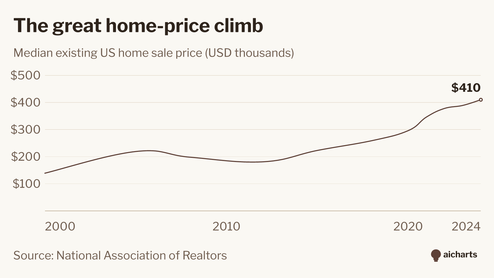](https://mcp-charts.vercel.app/chart?j=%7B%22chart%22%3A%22line%22%2C%22title%22%3A%22The%20great%20home-price%20climb%22%2C%22subtitle%22%3A%22Median%20existing%20US%20home%20sale%20price%20(USD%20thousands)%22%2C%22source%22%3A%22National%20Association%20of%20Realtors%22%2C%22palette%22%3A%22earth%22%2C%22size%22%3A%22share%22%2C%22x%22%3A%22year%22%2C%22y%22%3A%22price%22%2C%22interpolation%22%3A%22curved%22%2C%22showSymbols%22%3A%22last%22%2C%22showValueLabels%22%3A%22last%22%2C%22yFormat%22%3A%22currency%22%2C%22data%22%3A%5B%7B%22year%22%3A2000%2C%22price%22%3A139%7D%2C%7B%22year%22%3A2005%2C%22price%22%3A219%7D%2C%7B%22year%22%3A2008%2C%22price%22%3A198%7D%2C%7B%22year%22%3A2012%2C%22price%22%3A181%7D%2C%7B%22year%22%3A2015%2C%22price%22%3A223%7D%2C%7B%22year%22%3A2018%2C%22price%22%3A259%7D%2C%7B%22year%22%3A2020%2C%22price%22%3A296%7D%2C%7B%22year%22%3A2021%2C%22price%22%3A346%7D%2C%7B%22year%22%3A2022%2C%22price%22%3A378%7D%2C%7B%22year%22%3A2023%2C%22price%22%3A389%7D%2C%7B%22year%22%3A2024%2C%22price%22%3A410%7D%5D%7D)

Open rendered PNG: <https://mcp-charts.vercel.app/chart?j=%7B%22chart%22%3A%22line%22%2C%22title%22%3A%22The%20great%20home-price%20climb%22%2C%22subtitle%22%3A%22Median%20existing%20US%20home%20sale%20price%20(USD%20thousands)%22%2C%22source%22%3A%22National%20Association%20of%20Realtors%22%2C%22palette%22%3A%22earth%22%2C%22size%22%3A%22share%22%2C%22x%22%3A%22year%22%2C%22y%22%3A%22price%22%2C%22interpolation%22%3A%22curved%22%2C%22showSymbols%22%3A%22last%22%2C%22showValueLabels%22%3A%22last%22%2C%22yFormat%22%3A%22currency%22%2C%22data%22%3A%5B%7B%22year%22%3A2000%2C%22price%22%3A139%7D%2C%7B%22year%22%3A2005%2C%22price%22%3A219%7D%2C%7B%22year%22%3A2008%2C%22price%22%3A198%7D%2C%7B%22year%22%3A2012%2C%22price%22%3A181%7D%2C%7B%22year%22%3A2015%2C%22price%22%3A223%7D%2C%7B%22year%22%3A2018%2C%22price%22%3A259%7D%2C%7B%22year%22%3A2020%2C%22price%22%3A296%7D%2C%7B%22year%22%3A2021%2C%22price%22%3A346%7D%2C%7B%22year%22%3A2022%2C%22price%22%3A378%7D%2C%7B%22year%22%3A2023%2C%22price%22%3A389%7D%2C%7B%22year%22%3A2024%2C%22price%22%3A410%7D%5D%7D>

Source: National Association of Realtors

---

### Where the SaaS dollar goes
_Mid-market software spend by category, 2024_
Donut · palette: boardroom · size: share

[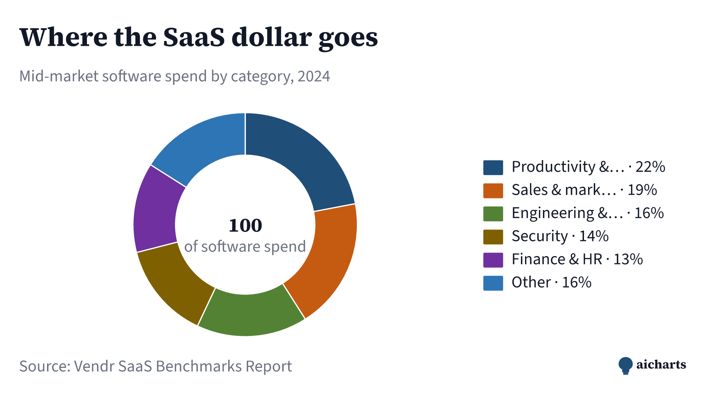](https://mcp-charts.vercel.app/chart?j=%7B%22chart%22%3A%22donut%22%2C%22title%22%3A%22Where%20the%20SaaS%20dollar%20goes%22%2C%22subtitle%22%3A%22Mid-market%20software%20spend%20by%20category%2C%202024%22%2C%22source%22%3A%22Vendr%20SaaS%20Benchmarks%20Report%22%2C%22palette%22%3A%22boardroom%22%2C%22size%22%3A%22share%22%2C%22label%22%3A%22category%22%2C%22value%22%3A%22share%22%2C%22sort%22%3A%22desc%22%2C%22centerValue%22%3A%22sum%22%2C%22centerLabel%22%3A%22of%20software%20spend%22%2C%22data%22%3A%5B%7B%22category%22%3A%22Productivity%20%26%20collaboration%22%2C%22share%22%3A22%7D%2C%7B%22category%22%3A%22Sales%20%26%20marketing%22%2C%22share%22%3A19%7D%2C%7B%22category%22%3A%22Engineering%20%26%20devtools%22%2C%22share%22%3A16%7D%2C%7B%22category%22%3A%22Security%22%2C%22share%22%3A14%7D%2C%7B%22category%22%3A%22Finance%20%26%20HR%22%2C%22share%22%3A13%7D%2C%7B%22category%22%3A%22Data%20%26%20analytics%22%2C%22share%22%3A10%7D%2C%7B%22category%22%3A%22Other%22%2C%22share%22%3A6%7D%5D%7D)

Open rendered PNG: <https://mcp-charts.vercel.app/chart?j=%7B%22chart%22%3A%22donut%22%2C%22title%22%3A%22Where%20the%20SaaS%20dollar%20goes%22%2C%22subtitle%22%3A%22Mid-market%20software%20spend%20by%20category%2C%202024%22%2C%22source%22%3A%22Vendr%20SaaS%20Benchmarks%20Report%22%2C%22palette%22%3A%22boardroom%22%2C%22size%22%3A%22share%22%2C%22label%22%3A%22category%22%2C%22value%22%3A%22share%22%2C%22sort%22%3A%22desc%22%2C%22centerValue%22%3A%22sum%22%2C%22centerLabel%22%3A%22of%20software%20spend%22%2C%22data%22%3A%5B%7B%22category%22%3A%22Productivity%20%26%20collaboration%22%2C%22share%22%3A22%7D%2C%7B%22category%22%3A%22Sales%20%26%20marketing%22%2C%22share%22%3A19%7D%2C%7B%22category%22%3A%22Engineering%20%26%20devtools%22%2C%22share%22%3A16%7D%2C%7B%22category%22%3A%22Security%22%2C%22share%22%3A14%7D%2C%7B%22category%22%3A%22Finance%20%26%20HR%22%2C%22share%22%3A13%7D%2C%7B%22category%22%3A%22Data%20%26%20analytics%22%2C%22share%22%3A10%7D%2C%7B%22category%22%3A%22Other%22%2C%22share%22%3A6%7D%5D%7D>

Source: Vendr SaaS Benchmarks Report

---

### The shifting cancer picture
_US cancer deaths by type (thousands)_
Stacked bar · palette: diverging-sunset · size: share

[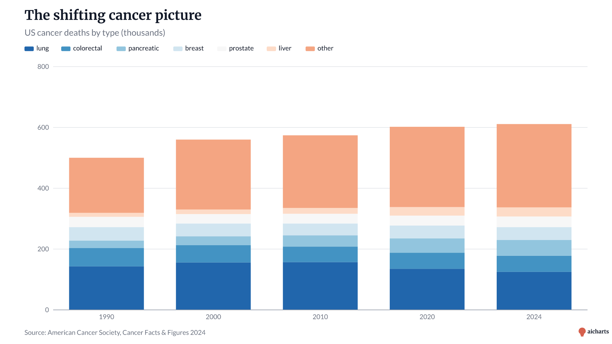](https://mcp-charts.vercel.app/chart?j=%7B%22chart%22%3A%22stacked-bar%22%2C%22title%22%3A%22The%20shifting%20cancer%20picture%22%2C%22subtitle%22%3A%22US%20cancer%20deaths%20by%20type%20(thousands)%22%2C%22source%22%3A%22American%20Cancer%20Society%2C%20Cancer%20Facts%20%26%20Figures%202024%22%2C%22palette%22%3A%22diverging-sunset%22%2C%22size%22%3A%22share%22%2C%22x%22%3A%22year%22%2C%22y%22%3A%5B%22lung%22%2C%22colorectal%22%2C%22pancreatic%22%2C%22breast%22%2C%22prostate%22%2C%22liver%22%2C%22other%22%5D%2C%22data%22%3A%5B%7B%22year%22%3A1990%2C%22lung%22%3A143%2C%22colorectal%22%3A60%2C%22pancreatic%22%3A25%2C%22breast%22%3A44%2C%22prostate%22%3A34%2C%22liver%22%3A13%2C%22other%22%3A181%7D%2C%7B%22year%22%3A2000%2C%22lung%22%3A156%2C%22colorectal%22%3A57%2C%22pancreatic%22%3A29%2C%22breast%22%3A42%2C%22prostate%22%3A31%2C%22liver%22%3A15%2C%22other%22%3A230%7D%2C%7B%22year%22%3A2010%2C%22lung%22%3A157%2C%22colorectal%22%3A51%2C%22pancreatic%22%3A37%2C%22breast%22%3A39%2C%22prostate%22%3A32%2C%22liver%22%3A19%2C%22other%22%3A239%7D%2C%7B%22year%22%3A2020%2C%22lung%22%3A135%2C%22colorectal%22%3A53%2C%22pancreatic%22%3A47%2C%22breast%22%3A42%2C%22prostate%22%3A33%2C%22liver%22%3A28%2C%22other%22%3A264%7D%2C%7B%22year%22%3A2024%2C%22lung%22%3A125%2C%22colorectal%22%3A53%2C%22pancreatic%22%3A52%2C%22breast%22%3A42%2C%22prostate%22%3A35%2C%22liver%22%3A30%2C%22other%22%3A274%7D%5D%7D)

Open rendered PNG: <https://mcp-charts.vercel.app/chart?j=%7B%22chart%22%3A%22stacked-bar%22%2C%22title%22%3A%22The%20shifting%20cancer%20picture%22%2C%22subtitle%22%3A%22US%20cancer%20deaths%20by%20type%20(thousands)%22%2C%22source%22%3A%22American%20Cancer%20Society%2C%20Cancer%20Facts%20%26%20Figures%202024%22%2C%22palette%22%3A%22diverging-sunset%22%2C%22size%22%3A%22share%22%2C%22x%22%3A%22year%22%2C%22y%22%3A%5B%22lung%22%2C%22colorectal%22%2C%22pancreatic%22%2C%22breast%22%2C%22prostate%22%2C%22liver%22%2C%22other%22%5D%2C%22data%22%3A%5B%7B%22year%22%3A1990%2C%22lung%22%3A143%2C%22colorectal%22%3A60%2C%22pancreatic%22%3A25%2C%22breast%22%3A44%2C%22prostate%22%3A34%2C%22liver%22%3A13%2C%22other%22%3A181%7D%2C%7B%22year%22%3A2000%2C%22lung%22%3A156%2C%22colorectal%22%3A57%2C%22pancreatic%22%3A29%2C%22breast%22%3A42%2C%22prostate%22%3A31%2C%22liver%22%3A15%2C%22other%22%3A230%7D%2C%7B%22year%22%3A2010%2C%22lung%22%3A157%2C%22colorectal%22%3A51%2C%22pancreatic%22%3A37%2C%22breast%22%3A39%2C%22prostate%22%3A32%2C%22liver%22%3A19%2C%22other%22%3A239%7D%2C%7B%22year%22%3A2020%2C%22lung%22%3A135%2C%22colorectal%22%3A53%2C%22pancreatic%22%3A47%2C%22breast%22%3A42%2C%22prostate%22%3A33%2C%22liver%22%3A28%2C%22other%22%3A264%7D%2C%7B%22year%22%3A2024%2C%22lung%22%3A125%2C%22colorectal%22%3A53%2C%22pancreatic%22%3A52%2C%22breast%22%3A42%2C%22prostate%22%3A35%2C%22liver%22%3A30%2C%22other%22%3A274%7D%5D%7D>

Source: American Cancer Society, Cancer Facts & Figures 2024

---

### The powertrain transition
_Global new passenger car sales by powertrain (million units)_
Small multiples (lines) · palette: viridis · size: share

[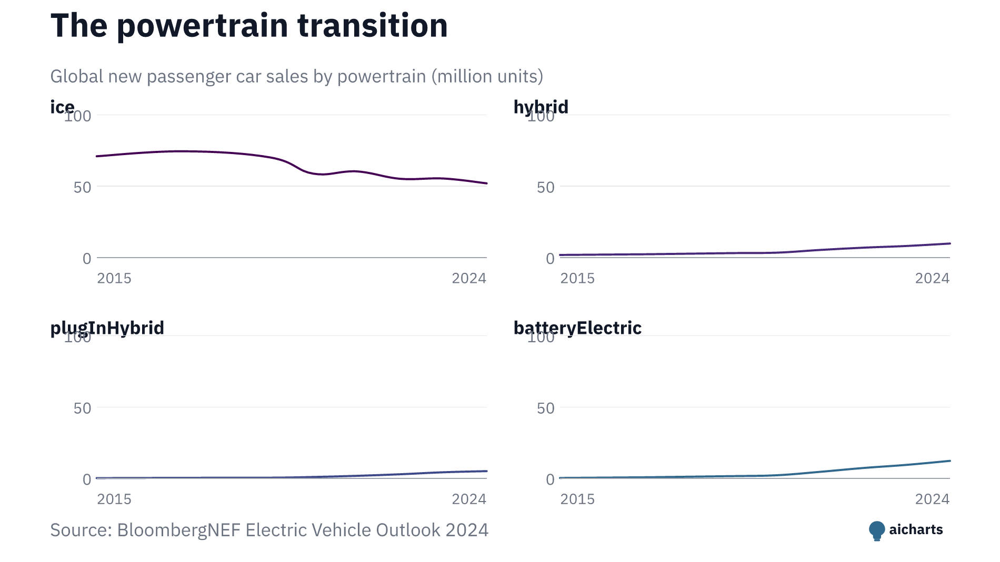](https://mcp-charts.vercel.app/chart?j=%7B%22chart%22%3A%22line-split%22%2C%22title%22%3A%22The%20powertrain%20transition%22%2C%22subtitle%22%3A%22Global%20new%20passenger%20car%20sales%20by%20powertrain%20(million%20units)%22%2C%22source%22%3A%22BloombergNEF%20Electric%20Vehicle%20Outlook%202024%22%2C%22palette%22%3A%22viridis%22%2C%22size%22%3A%22share%22%2C%22x%22%3A%22year%22%2C%22y%22%3A%5B%22ice%22%2C%22hybrid%22%2C%22plugInHybrid%22%2C%22batteryElectric%22%5D%2C%22columns%22%3A2%2C%22sharedScale%22%3Atrue%2C%22interpolation%22%3A%22curved%22%2C%22data%22%3A%5B%7B%22year%22%3A2015%2C%22ice%22%3A71%2C%22hybrid%22%3A1.8%2C%22plugInHybrid%22%3A0.2%2C%22batteryElectric%22%3A0.3%7D%2C%7B%22year%22%3A2017%2C%22ice%22%3A74.5%2C%22hybrid%22%3A2.3%2C%22plugInHybrid%22%3A0.4%2C%22batteryElectric%22%3A0.8%7D%2C%7B%22year%22%3A2019%2C%22ice%22%3A70.2%2C%22hybrid%22%3A3.1%2C%22plugInHybrid%22%3A0.5%2C%22batteryElectric%22%3A1.6%7D%2C%7B%22year%22%3A2020%2C%22ice%22%3A58.8%2C%22hybrid%22%3A3.4%2C%22plugInHybrid%22%3A1%2C%22batteryElectric%22%3A2.2%7D%2C%7B%22year%22%3A2021%2C%22ice%22%3A60.4%2C%22hybrid%22%3A5.3%2C%22plugInHybrid%22%3A1.8%2C%22batteryElectric%22%3A4.6%7D%2C%7B%22year%22%3A2022%2C%22ice%22%3A55.2%2C%22hybrid%22%3A6.9%2C%22plugInHybrid%22%3A2.9%2C%22batteryElectric%22%3A7.3%7D%2C%7B%22year%22%3A2023%2C%22ice%22%3A55.4%2C%22hybrid%22%3A8.1%2C%22plugInHybrid%22%3A4.3%2C%22batteryElectric%22%3A9.5%7D%2C%7B%22year%22%3A2024%2C%22ice%22%3A52%2C%22hybrid%22%3A9.8%2C%22plugInHybrid%22%3A5.1%2C%22batteryElectric%22%3A12.3%7D%5D%7D)

Open rendered PNG: <https://mcp-charts.vercel.app/chart?j=%7B%22chart%22%3A%22line-split%22%2C%22title%22%3A%22The%20powertrain%20transition%22%2C%22subtitle%22%3A%22Global%20new%20passenger%20car%20sales%20by%20powertrain%20(million%20units)%22%2C%22source%22%3A%22BloombergNEF%20Electric%20Vehicle%20Outlook%202024%22%2C%22palette%22%3A%22viridis%22%2C%22size%22%3A%22share%22%2C%22x%22%3A%22year%22%2C%22y%22%3A%5B%22ice%22%2C%22hybrid%22%2C%22plugInHybrid%22%2C%22batteryElectric%22%5D%2C%22columns%22%3A2%2C%22sharedScale%22%3Atrue%2C%22interpolation%22%3A%22curved%22%2C%22data%22%3A%5B%7B%22year%22%3A2015%2C%22ice%22%3A71%2C%22hybrid%22%3A1.8%2C%22plugInHybrid%22%3A0.2%2C%22batteryElectric%22%3A0.3%7D%2C%7B%22year%22%3A2017%2C%22ice%22%3A74.5%2C%22hybrid%22%3A2.3%2C%22plugInHybrid%22%3A0.4%2C%22batteryElectric%22%3A0.8%7D%2C%7B%22year%22%3A2019%2C%22ice%22%3A70.2%2C%22hybrid%22%3A3.1%2C%22plugInHybrid%22%3A0.5%2C%22batteryElectric%22%3A1.6%7D%2C%7B%22year%22%3A2020%2C%22ice%22%3A58.8%2C%22hybrid%22%3A3.4%2C%22plugInHybrid%22%3A1%2C%22batteryElectric%22%3A2.2%7D%2C%7B%22year%22%3A2021%2C%22ice%22%3A60.4%2C%22hybrid%22%3A5.3%2C%22plugInHybrid%22%3A1.8%2C%22batteryElectric%22%3A4.6%7D%2C%7B%22year%22%3A2022%2C%22ice%22%3A55.2%2C%22hybrid%22%3A6.9%2C%22plugInHybrid%22%3A2.9%2C%22batteryElectric%22%3A7.3%7D%2C%7B%22year%22%3A2023%2C%22ice%22%3A55.4%2C%22hybrid%22%3A8.1%2C%22plugInHybrid%22%3A4.3%2C%22batteryElectric%22%3A9.5%7D%2C%7B%22year%22%3A2024%2C%22ice%22%3A52%2C%22hybrid%22%3A9.8%2C%22plugInHybrid%22%3A5.1%2C%22batteryElectric%22%3A12.3%7D%5D%7D>

Source: BloombergNEF Electric Vehicle Outlook 2024

---

### Africa's young billion
_Population by country, 2024 (millions)_
Map · palette: earth · size: share

%22%2C%22source%22%3A%22UN%20World%20Population%20Prospects%22%2C%22palette%22%3A%22earth%22%2C%22size%22%3A%22share%22%2C%22basemap%22%3A%22africa%22%2C%22code%22%3A%22country%22%2C%22value%22%3A%22population%22%2C%22scale%22%3A%22linear%22%2C%22data%22%3A%5B%7B%22country%22%3A%22NGA%22%2C%22population%22%3A232%7D%2C%7B%22country%22%3A%22ETH%22%2C%22population%22%3A128%7D%2C%7B%22country%22%3A%22EGY%22%2C%22population%22%3A114%7D%2C%7B%22country%22%3A%22COD%22%2C%22population%22%3A109%7D%2C%7B%22country%22%3A%22TZA%22%2C%22population%22%3A68%7D%2C%7B%22country%22%3A%22ZAF%22%2C%22population%22%3A63%7D%2C%7B%22country%22%3A%22KEN%22%2C%22population%22%3A56%7D%2C%7B%22country%22%3A%22UGA%22%2C%22population%22%3A49%7D%2C%7B%22country%22%3A%22SDN%22%2C%22population%22%3A49%7D%2C%7B%22country%22%3A%22DZA%22%2C%22population%22%3A46%7D%2C%7B%22country%22%3A%22MAR%22%2C%22population%22%3A38%7D%2C%7B%22country%22%3A%22AGO%22%2C%22population%22%3A37%7D%2C%7B%22country%22%3A%22GHA%22%2C%22population%22%3A34%7D%2C%7B%22country%22%3A%22MOZ%22%2C%22population%22%3A34%7D%2C%7B%22country%22%3A%22MDG%22%2C%22population%22%3A31%7D%2C%7B%22country%22%3A%22CMR%22%2C%22population%22%3A29%7D%2C%7B%22country%22%3A%22CIV%22%2C%22population%22%3A29%7D%2C%7B%22country%22%3A%22NER%22%2C%22population%22%3A27%7D%2C%7B%22country%22%3A%22BFA%22%2C%22population%22%3A23%7D%2C%7B%22country%22%3A%22MLI%22%2C%22population%22%3A24%7D%2C%7B%22country%22%3A%22MWI%22%2C%22population%22%3A21%7D%2C%7B%22country%22%3A%22ZMB%22%2C%22population%22%3A21%7D%2C%7B%22country%22%3A%22SEN%22%2C%22population%22%3A18%7D%2C%7B%22country%22%3A%22TCD%22%2C%22population%22%3A18%7D%2C%7B%22country%22%3A%22SOM%22%2C%22population%22%3A18%7D%2C%7B%22country%22%3A%22ZWE%22%2C%22population%22%3A16%7D%2C%7B%22country%22%3A%22GIN%22%2C%22population%22%3A14%7D%2C%7B%22country%22%3A%22RWA%22%2C%22population%22%3A14%7D%2C%7B%22country%22%3A%22BEN%22%2C%22population%22%3A14%7D%2C%7B%22country%22%3A%22TUN%22%2C%22population%22%3A12%7D%2C%7B%22country%22%3A%22BDI%22%2C%22population%22%3A14%7D%2C%7B%22country%22%3A%22LBY%22%2C%22population%22%3A7%7D%2C%7B%22country%22%3A%22LBR%22%2C%22population%22%3A5%7D%2C%7B%22country%22%3A%22SLE%22%2C%22population%22%3A8%7D%2C%7B%22country%22%3A%22TGO%22%2C%22population%22%3A9%7D%2C%7B%22country%22%3A%22ERI%22%2C%22population%22%3A3%7D%2C%7B%22country%22%3A%22NAM%22%2C%22population%22%3A3%7D%2C%7B%22country%22%3A%22BWA%22%2C%22population%22%3A2%7D%2C%7B%22country%22%3A%22GAB%22%2C%22population%22%3A2%7D%2C%7B%22country%22%3A%22LSO%22%2C%22population%22%3A2%7D%2C%7B%22country%22%3A%22GNB%22%2C%22population%22%3A2%7D%2C%7B%22country%22%3A%22MRT%22%2C%22population%22%3A5%7D%5D%7D)

Open rendered PNG: <https://mcp-charts.vercel.app/chart?j=%7B%22chart%22%3A%22geo%22%2C%22title%22%3A%22Africa's%20young%20billion%22%2C%22subtitle%22%3A%22Population%20by%20country%2C%202024%20(millions)%22%2C%22source%22%3A%22UN%20World%20Population%20Prospects%22%2C%22palette%22%3A%22earth%22%2C%22size%22%3A%22share%22%2C%22basemap%22%3A%22africa%22%2C%22code%22%3A%22country%22%2C%22value%22%3A%22population%22%2C%22scale%22%3A%22linear%22%2C%22data%22%3A%5B%7B%22country%22%3A%22NGA%22%2C%22population%22%3A232%7D%2C%7B%22country%22%3A%22ETH%22%2C%22population%22%3A128%7D%2C%7B%22country%22%3A%22EGY%22%2C%22population%22%3A114%7D%2C%7B%22country%22%3A%22COD%22%2C%22population%22%3A109%7D%2C%7B%22country%22%3A%22TZA%22%2C%22population%22%3A68%7D%2C%7B%22country%22%3A%22ZAF%22%2C%22population%22%3A63%7D%2C%7B%22country%22%3A%22KEN%22%2C%22population%22%3A56%7D%2C%7B%22country%22%3A%22UGA%22%2C%22population%22%3A49%7D%2C%7B%22country%22%3A%22SDN%22%2C%22population%22%3A49%7D%2C%7B%22country%22%3A%22DZA%22%2C%22population%22%3A46%7D%2C%7B%22country%22%3A%22MAR%22%2C%22population%22%3A38%7D%2C%7B%22country%22%3A%22AGO%22%2C%22population%22%3A37%7D%2C%7B%22country%22%3A%22GHA%22%2C%22population%22%3A34%7D%2C%7B%22country%22%3A%22MOZ%22%2C%22population%22%3A34%7D%2C%7B%22country%22%3A%22MDG%22%2C%22population%22%3A31%7D%2C%7B%22country%22%3A%22CMR%22%2C%22population%22%3A29%7D%2C%7B%22country%22%3A%22CIV%22%2C%22population%22%3A29%7D%2C%7B%22country%22%3A%22NER%22%2C%22population%22%3A27%7D%2C%7B%22country%22%3A%22BFA%22%2C%22population%22%3A23%7D%2C%7B%22country%22%3A%22MLI%22%2C%22population%22%3A24%7D%2C%7B%22country%22%3A%22MWI%22%2C%22population%22%3A21%7D%2C%7B%22country%22%3A%22ZMB%22%2C%22population%22%3A21%7D%2C%7B%22country%22%3A%22SEN%22%2C%22population%22%3A18%7D%2C%7B%22country%22%3A%22TCD%22%2C%22population%22%3A18%7D%2C%7B%22country%22%3A%22SOM%22%2C%22population%22%3A18%7D%2C%7B%22country%22%3A%22ZWE%22%2C%22population%22%3A16%7D%2C%7B%22country%22%3A%22GIN%22%2C%22population%22%3A14%7D%2C%7B%22country%22%3A%22RWA%22%2C%22population%22%3A14%7D%2C%7B%22country%22%3A%22BEN%22%2C%22population%22%3A14%7D%2C%7B%22country%22%3A%22TUN%22%2C%22population%22%3A12%7D%2C%7B%22country%22%3A%22BDI%22%2C%22population%22%3A14%7D%2C%7B%22country%22%3A%22LBY%22%2C%22population%22%3A7%7D%2C%7B%22country%22%3A%22LBR%22%2C%22population%22%3A5%7D%2C%7B%22country%22%3A%22SLE%22%2C%22population%22%3A8%7D%2C%7B%22country%22%3A%22TGO%22%2C%22population%22%3A9%7D%2C%7B%22country%22%3A%22ERI%22%2C%22population%22%3A3%7D%2C%7B%22country%22%3A%22NAM%22%2C%22population%22%3A3%7D%2C%7B%22country%22%3A%22BWA%22%2C%22population%22%3A2%7D%2C%7B%22country%22%3A%22GAB%22%2C%22population%22%3A2%7D%2C%7B%22country%22%3A%22LSO%22%2C%22population%22%3A2%7D%2C%7B%22country%22%3A%22GNB%22%2C%22population%22%3A2%7D%2C%7B%22country%22%3A%22MRT%22%2C%22population%22%3A5%7D%5D%7D>

Source: UN World Population Prospects

---

### The ballooning national IOU
_Government debt as share of GDP, 2024 (percent)_
Bar · palette: carbon · size: share

[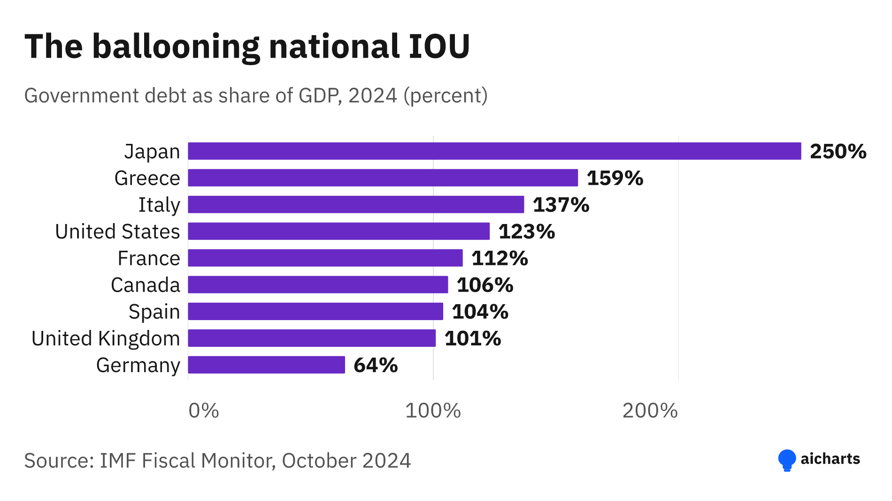](https://mcp-charts.vercel.app/chart?j=%7B%22chart%22%3A%22bar%22%2C%22title%22%3A%22The%20ballooning%20national%20IOU%22%2C%22subtitle%22%3A%22Government%20debt%20as%20share%20of%20GDP%2C%202024%20(percent)%22%2C%22source%22%3A%22IMF%20Fiscal%20Monitor%2C%20October%202024%22%2C%22palette%22%3A%22carbon%22%2C%22size%22%3A%22share%22%2C%22label%22%3A%22country%22%2C%22value%22%3A%22ratio%22%2C%22orientation%22%3A%22horizontal%22%2C%22sort%22%3A%22desc%22%2C%22showValueLabels%22%3Atrue%2C%22yFormat%22%3A%22percent%22%2C%22data%22%3A%5B%7B%22country%22%3A%22Japan%22%2C%22ratio%22%3A250%7D%2C%7B%22country%22%3A%22Greece%22%2C%22ratio%22%3A159%7D%2C%7B%22country%22%3A%22Italy%22%2C%22ratio%22%3A137%7D%2C%7B%22country%22%3A%22United%20States%22%2C%22ratio%22%3A123%7D%2C%7B%22country%22%3A%22France%22%2C%22ratio%22%3A112%7D%2C%7B%22country%22%3A%22Spain%22%2C%22ratio%22%3A104%7D%2C%7B%22country%22%3A%22United%20Kingdom%22%2C%22ratio%22%3A101%7D%2C%7B%22country%22%3A%22Canada%22%2C%22ratio%22%3A106%7D%2C%7B%22country%22%3A%22Germany%22%2C%22ratio%22%3A64%7D%5D%7D)

Open rendered PNG: <https://mcp-charts.vercel.app/chart?j=%7B%22chart%22%3A%22bar%22%2C%22title%22%3A%22The%20ballooning%20national%20IOU%22%2C%22subtitle%22%3A%22Government%20debt%20as%20share%20of%20GDP%2C%202024%20(percent)%22%2C%22source%22%3A%22IMF%20Fiscal%20Monitor%2C%20October%202024%22%2C%22palette%22%3A%22carbon%22%2C%22size%22%3A%22share%22%2C%22label%22%3A%22country%22%2C%22value%22%3A%22ratio%22%2C%22orientation%22%3A%22horizontal%22%2C%22sort%22%3A%22desc%22%2C%22showValueLabels%22%3Atrue%2C%22yFormat%22%3A%22percent%22%2C%22data%22%3A%5B%7B%22country%22%3A%22Japan%22%2C%22ratio%22%3A250%7D%2C%7B%22country%22%3A%22Greece%22%2C%22ratio%22%3A159%7D%2C%7B%22country%22%3A%22Italy%22%2C%22ratio%22%3A137%7D%2C%7B%22country%22%3A%22United%20States%22%2C%22ratio%22%3A123%7D%2C%7B%22country%22%3A%22France%22%2C%22ratio%22%3A112%7D%2C%7B%22country%22%3A%22Spain%22%2C%22ratio%22%3A104%7D%2C%7B%22country%22%3A%22United%20Kingdom%22%2C%22ratio%22%3A101%7D%2C%7B%22country%22%3A%22Canada%22%2C%22ratio%22%3A106%7D%2C%7B%22country%22%3A%22Germany%22%2C%22ratio%22%3A64%7D%5D%7D>

Source: IMF Fiscal Monitor, October 2024

---

### The attention budget
_Average daily minutes on top social platforms, US users 2024_
Small multiples (bars) · palette: vibrant · size: share

[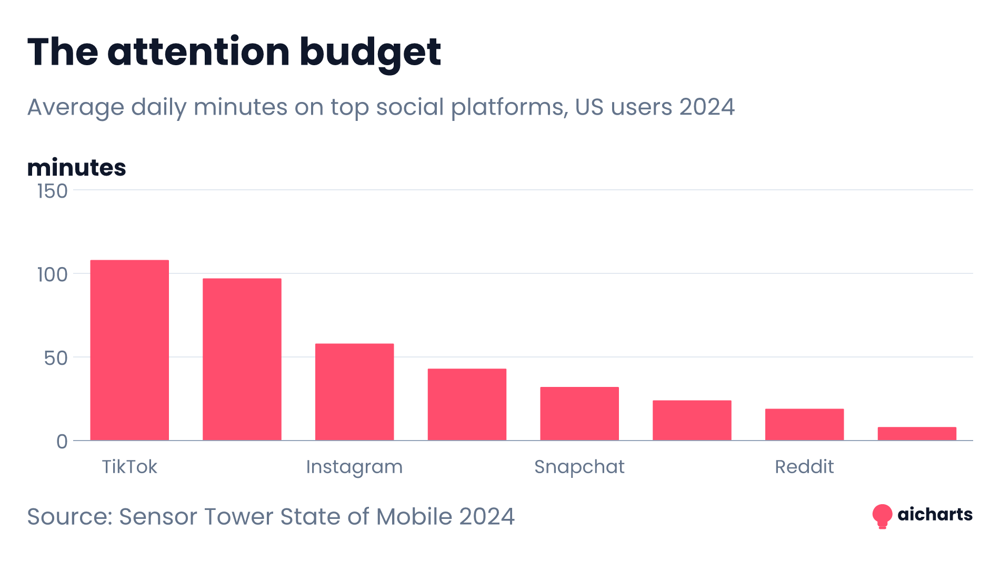](https://mcp-charts.vercel.app/chart?j=%7B%22chart%22%3A%22bar-split%22%2C%22title%22%3A%22The%20attention%20budget%22%2C%22subtitle%22%3A%22Average%20daily%20minutes%20on%20top%20social%20platforms%2C%20US%20users%202024%22%2C%22source%22%3A%22Sensor%20Tower%20State%20of%20Mobile%202024%22%2C%22palette%22%3A%22vibrant%22%2C%22size%22%3A%22share%22%2C%22x%22%3A%22platform%22%2C%22y%22%3A%5B%22minutes%22%5D%2C%22columns%22%3A1%2C%22data%22%3A%5B%7B%22platform%22%3A%22TikTok%22%2C%22minutes%22%3A108%7D%2C%7B%22platform%22%3A%22YouTube%22%2C%22minutes%22%3A97%7D%2C%7B%22platform%22%3A%22Instagram%22%2C%22minutes%22%3A58%7D%2C%7B%22platform%22%3A%22Facebook%22%2C%22minutes%22%3A43%7D%2C%7B%22platform%22%3A%22Snapchat%22%2C%22minutes%22%3A32%7D%2C%7B%22platform%22%3A%22X%20(Twitter)%22%2C%22minutes%22%3A24%7D%2C%7B%22platform%22%3A%22Reddit%22%2C%22minutes%22%3A19%7D%2C%7B%22platform%22%3A%22LinkedIn%22%2C%22minutes%22%3A8%7D%5D%7D)

Open rendered PNG: <https://mcp-charts.vercel.app/chart?j=%7B%22chart%22%3A%22bar-split%22%2C%22title%22%3A%22The%20attention%20budget%22%2C%22subtitle%22%3A%22Average%20daily%20minutes%20on%20top%20social%20platforms%2C%20US%20users%202024%22%2C%22source%22%3A%22Sensor%20Tower%20State%20of%20Mobile%202024%22%2C%22palette%22%3A%22vibrant%22%2C%22size%22%3A%22share%22%2C%22x%22%3A%22platform%22%2C%22y%22%3A%5B%22minutes%22%5D%2C%22columns%22%3A1%2C%22data%22%3A%5B%7B%22platform%22%3A%22TikTok%22%2C%22minutes%22%3A108%7D%2C%7B%22platform%22%3A%22YouTube%22%2C%22minutes%22%3A97%7D%2C%7B%22platform%22%3A%22Instagram%22%2C%22minutes%22%3A58%7D%2C%7B%22platform%22%3A%22Facebook%22%2C%22minutes%22%3A43%7D%2C%7B%22platform%22%3A%22Snapchat%22%2C%22minutes%22%3A32%7D%2C%7B%22platform%22%3A%22X%20(Twitter)%22%2C%22minutes%22%3A24%7D%2C%7B%22platform%22%3A%22Reddit%22%2C%22minutes%22%3A19%7D%2C%7B%22platform%22%3A%22LinkedIn%22%2C%22minutes%22%3A8%7D%5D%7D>

Source: Sensor Tower State of Mobile 2024

---

### The synchronized hiking cycle
_Policy interest rates, end of quarter (percent)_
Line · palette: editorial · size: share

[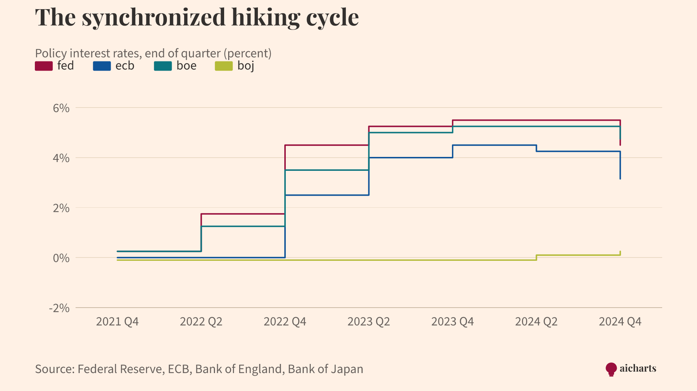](https://mcp-charts.vercel.app/chart?j=%7B%22chart%22%3A%22line%22%2C%22title%22%3A%22The%20synchronized%20hiking%20cycle%22%2C%22subtitle%22%3A%22Policy%20interest%20rates%2C%20end%20of%20quarter%20(percent)%22%2C%22source%22%3A%22Federal%20Reserve%2C%20ECB%2C%20Bank%20of%20England%2C%20Bank%20of%20Japan%22%2C%22palette%22%3A%22editorial%22%2C%22size%22%3A%22share%22%2C%22x%22%3A%22quarter%22%2C%22y%22%3A%5B%22fed%22%2C%22ecb%22%2C%22boe%22%2C%22boj%22%5D%2C%22interpolation%22%3A%22stepped%22%2C%22yFormat%22%3A%22percent%22%2C%22data%22%3A%5B%7B%22quarter%22%3A%222021%20Q4%22%2C%22fed%22%3A0.25%2C%22ecb%22%3A0%2C%22boe%22%3A0.25%2C%22boj%22%3A-0.1%7D%2C%7B%22quarter%22%3A%222022%20Q2%22%2C%22fed%22%3A1.75%2C%22ecb%22%3A0%2C%22boe%22%3A1.25%2C%22boj%22%3A-0.1%7D%2C%7B%22quarter%22%3A%222022%20Q4%22%2C%22fed%22%3A4.5%2C%22ecb%22%3A2.5%2C%22boe%22%3A3.5%2C%22boj%22%3A-0.1%7D%2C%7B%22quarter%22%3A%222023%20Q2%22%2C%22fed%22%3A5.25%2C%22ecb%22%3A4%2C%22boe%22%3A5%2C%22boj%22%3A-0.1%7D%2C%7B%22quarter%22%3A%222023%20Q4%22%2C%22fed%22%3A5.5%2C%22ecb%22%3A4.5%2C%22boe%22%3A5.25%2C%22boj%22%3A-0.1%7D%2C%7B%22quarter%22%3A%222024%20Q2%22%2C%22fed%22%3A5.5%2C%22ecb%22%3A4.25%2C%22boe%22%3A5.25%2C%22boj%22%3A0.1%7D%2C%7B%22quarter%22%3A%222024%20Q4%22%2C%22fed%22%3A4.5%2C%22ecb%22%3A3.15%2C%22boe%22%3A4.75%2C%22boj%22%3A0.25%7D%5D%7D)

Open rendered PNG: <https://mcp-charts.vercel.app/chart?j=%7B%22chart%22%3A%22line%22%2C%22title%22%3A%22The%20synchronized%20hiking%20cycle%22%2C%22subtitle%22%3A%22Policy%20interest%20rates%2C%20end%20of%20quarter%20(percent)%22%2C%22source%22%3A%22Federal%20Reserve%2C%20ECB%2C%20Bank%20of%20England%2C%20Bank%20of%20Japan%22%2C%22palette%22%3A%22editorial%22%2C%22size%22%3A%22share%22%2C%22x%22%3A%22quarter%22%2C%22y%22%3A%5B%22fed%22%2C%22ecb%22%2C%22boe%22%2C%22boj%22%5D%2C%22interpolation%22%3A%22stepped%22%2C%22yFormat%22%3A%22percent%22%2C%22data%22%3A%5B%7B%22quarter%22%3A%222021%20Q4%22%2C%22fed%22%3A0.25%2C%22ecb%22%3A0%2C%22boe%22%3A0.25%2C%22boj%22%3A-0.1%7D%2C%7B%22quarter%22%3A%222022%20Q2%22%2C%22fed%22%3A1.75%2C%22ecb%22%3A0%2C%22boe%22%3A1.25%2C%22boj%22%3A-0.1%7D%2C%7B%22quarter%22%3A%222022%20Q4%22%2C%22fed%22%3A4.5%2C%22ecb%22%3A2.5%2C%22boe%22%3A3.5%2C%22boj%22%3A-0.1%7D%2C%7B%22quarter%22%3A%222023%20Q2%22%2C%22fed%22%3A5.25%2C%22ecb%22%3A4%2C%22boe%22%3A5%2C%22boj%22%3A-0.1%7D%2C%7B%22quarter%22%3A%222023%20Q4%22%2C%22fed%22%3A5.5%2C%22ecb%22%3A4.5%2C%22boe%22%3A5.25%2C%22boj%22%3A-0.1%7D%2C%7B%22quarter%22%3A%222024%20Q2%22%2C%22fed%22%3A5.5%2C%22ecb%22%3A4.25%2C%22boe%22%3A5.25%2C%22boj%22%3A0.1%7D%2C%7B%22quarter%22%3A%222024%20Q4%22%2C%22fed%22%3A4.5%2C%22ecb%22%3A3.15%2C%22boe%22%3A4.75%2C%22boj%22%3A0.25%7D%5D%7D>

Source: Federal Reserve, ECB, Bank of England, Bank of Japan

---

### AWS: the profit engine
_Amazon Web Services revenue (bars, billion USD) and operating margin (line, percent)_
Bar + line · palette: clarity · size: share

[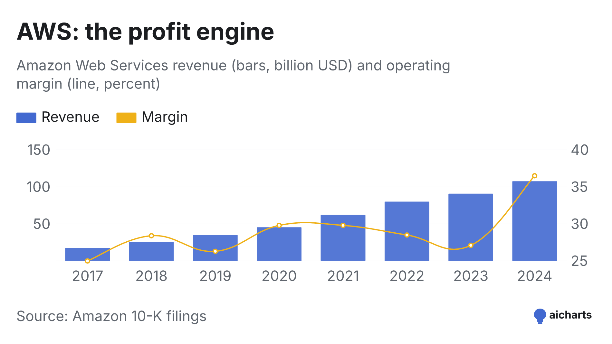](https://mcp-charts.vercel.app/chart?j=%7B%22chart%22%3A%22combo%22%2C%22title%22%3A%22AWS%3A%20the%20profit%20engine%22%2C%22subtitle%22%3A%22Amazon%20Web%20Services%20revenue%20(bars%2C%20billion%20USD)%20and%20operating%20margin%20(line%2C%20percent)%22%2C%22source%22%3A%22Amazon%2010-K%20filings%22%2C%22palette%22%3A%22clarity%22%2C%22size%22%3A%22share%22%2C%22x%22%3A%22year%22%2C%22bars%22%3A%22revenue%22%2C%22lines%22%3A%22margin%22%2C%22interpolation%22%3A%22curved%22%2C%22data%22%3A%5B%7B%22year%22%3A2017%2C%22revenue%22%3A17.5%2C%22margin%22%3A25%7D%2C%7B%22year%22%3A2018%2C%22revenue%22%3A25.7%2C%22margin%22%3A28.4%7D%2C%7B%22year%22%3A2019%2C%22revenue%22%3A35%2C%22margin%22%3A26.3%7D%2C%7B%22year%22%3A2020%2C%22revenue%22%3A45.4%2C%22margin%22%3A29.8%7D%2C%7B%22year%22%3A2021%2C%22revenue%22%3A62.2%2C%22margin%22%3A29.8%7D%2C%7B%22year%22%3A2022%2C%22revenue%22%3A80.1%2C%22margin%22%3A28.5%7D%2C%7B%22year%22%3A2023%2C%22revenue%22%3A90.8%2C%22margin%22%3A27.1%7D%2C%7B%22year%22%3A2024%2C%22revenue%22%3A107.6%2C%22margin%22%3A36.5%7D%5D%7D)

Open rendered PNG: <https://mcp-charts.vercel.app/chart?j=%7B%22chart%22%3A%22combo%22%2C%22title%22%3A%22AWS%3A%20the%20profit%20engine%22%2C%22subtitle%22%3A%22Amazon%20Web%20Services%20revenue%20(bars%2C%20billion%20USD)%20and%20operating%20margin%20(line%2C%20percent)%22%2C%22source%22%3A%22Amazon%2010-K%20filings%22%2C%22palette%22%3A%22clarity%22%2C%22size%22%3A%22share%22%2C%22x%22%3A%22year%22%2C%22bars%22%3A%22revenue%22%2C%22lines%22%3A%22margin%22%2C%22interpolation%22%3A%22curved%22%2C%22data%22%3A%5B%7B%22year%22%3A2017%2C%22revenue%22%3A17.5%2C%22margin%22%3A25%7D%2C%7B%22year%22%3A2018%2C%22revenue%22%3A25.7%2C%22margin%22%3A28.4%7D%2C%7B%22year%22%3A2019%2C%22revenue%22%3A35%2C%22margin%22%3A26.3%7D%2C%7B%22year%22%3A2020%2C%22revenue%22%3A45.4%2C%22margin%22%3A29.8%7D%2C%7B%22year%22%3A2021%2C%22revenue%22%3A62.2%2C%22margin%22%3A29.8%7D%2C%7B%22year%22%3A2022%2C%22revenue%22%3A80.1%2C%22margin%22%3A28.5%7D%2C%7B%22year%22%3A2023%2C%22revenue%22%3A90.8%2C%22margin%22%3A27.1%7D%2C%7B%22year%22%3A2024%2C%22revenue%22%3A107.6%2C%22margin%22%3A36.5%7D%5D%7D>

Source: Amazon 10-K filings

---

### The London premium
_Gross Value Added per capita, UK ceremonial counties, index (UK=100)_
Map · palette: mono-blue · size: share

[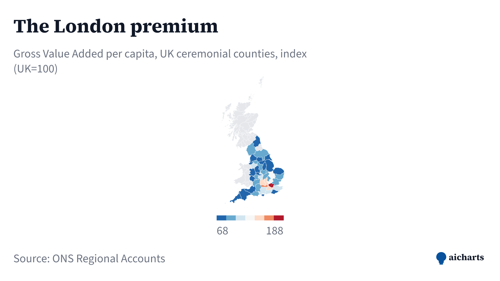](https://mcp-charts.vercel.app/chart?j=%7B%22chart%22%3A%22geo%22%2C%22title%22%3A%22The%20London%20premium%22%2C%22subtitle%22%3A%22Gross%20Value%20Added%20per%20capita%2C%20UK%20ceremonial%20counties%2C%20index%20(UK%3D100)%22%2C%22source%22%3A%22ONS%20Regional%20Accounts%22%2C%22palette%22%3A%22mono-blue%22%2C%22size%22%3A%22share%22%2C%22basemap%22%3A%22united-kingdom%22%2C%22code%22%3A%22county%22%2C%22value%22%3A%22gva%22%2C%22scale%22%3A%22diverging%22%2C%22steps%22%3A7%2C%22data%22%3A%5B%7B%22county%22%3A%22Greater%20London%22%2C%22gva%22%3A188%7D%2C%7B%22county%22%3A%22Berkshire%22%2C%22gva%22%3A155%7D%2C%7B%22county%22%3A%22Surrey%22%2C%22gva%22%3A148%7D%2C%7B%22county%22%3A%22Buckinghamshire%22%2C%22gva%22%3A142%7D%2C%7B%22county%22%3A%22Oxfordshire%22%2C%22gva%22%3A138%7D%2C%7B%22county%22%3A%22Hertfordshire%22%2C%22gva%22%3A128%7D%2C%7B%22county%22%3A%22Cambridgeshire%22%2C%22gva%22%3A124%7D%2C%7B%22county%22%3A%22West%20Sussex%22%2C%22gva%22%3A114%7D%2C%7B%22county%22%3A%22Kent%22%2C%22gva%22%3A106%7D%2C%7B%22county%22%3A%22Bristol%22%2C%22gva%22%3A118%7D%2C%7B%22county%22%3A%22Hampshire%22%2C%22gva%22%3A104%7D%2C%7B%22county%22%3A%22Essex%22%2C%22gva%22%3A97%7D%2C%7B%22county%22%3A%22Warwickshire%22%2C%22gva%22%3A112%7D%2C%7B%22county%22%3A%22Leicestershire%22%2C%22gva%22%3A92%7D%2C%7B%22county%22%3A%22Derbyshire%22%2C%22gva%22%3A86%7D%2C%7B%22county%22%3A%22Cheshire%22%2C%22gva%22%3A108%7D%2C%7B%22county%22%3A%22West%20Midlands%22%2C%22gva%22%3A84%7D%2C%7B%22county%22%3A%22Greater%20Manchester%22%2C%22gva%22%3A88%7D%2C%7B%22county%22%3A%22Merseyside%22%2C%22gva%22%3A78%7D%2C%7B%22county%22%3A%22South%20Yorkshire%22%2C%22gva%22%3A74%7D%2C%7B%22county%22%3A%22West%20Yorkshire%22%2C%22gva%22%3A83%7D%2C%7B%22county%22%3A%22Tyne%20and%20Wear%22%2C%22gva%22%3A77%7D%2C%7B%22county%22%3A%22County%20Durham%22%2C%22gva%22%3A69%7D%2C%7B%22county%22%3A%22Cumbria%22%2C%22gva%22%3A88%7D%2C%7B%22county%22%3A%22Lancashire%22%2C%22gva%22%3A82%7D%2C%7B%22county%22%3A%22Norfolk%22%2C%22gva%22%3A85%7D%2C%7B%22county%22%3A%22Suffolk%22%2C%22gva%22%3A90%7D%2C%7B%22county%22%3A%22Devon%22%2C%22gva%22%3A80%7D%2C%7B%22county%22%3A%22Cornwall%22%2C%22gva%22%3A70%7D%2C%7B%22county%22%3A%22Somerset%22%2C%22gva%22%3A82%7D%2C%7B%22county%22%3A%22Dorset%22%2C%22gva%22%3A89%7D%2C%7B%22county%22%3A%22Wiltshire%22%2C%22gva%22%3A96%7D%2C%7B%22county%22%3A%22Gloucestershire%22%2C%22gva%22%3A99%7D%2C%7B%22county%22%3A%22Shropshire%22%2C%22gva%22%3A78%7D%2C%7B%22county%22%3A%22Staffordshire%22%2C%22gva%22%3A84%7D%2C%7B%22county%22%3A%22Nottinghamshire%22%2C%22gva%22%3A80%7D%2C%7B%22county%22%3A%22Lincolnshire%22%2C%22gva%22%3A72%7D%2C%7B%22county%22%3A%22Northamptonshire%22%2C%22gva%22%3A93%7D%2C%7B%22county%22%3A%22Bedfordshire%22%2C%22gva%22%3A96%7D%2C%7B%22county%22%3A%22East%20Sussex%22%2C%22gva%22%3A81%7D%2C%7B%22county%22%3A%22Isle%20of%20Wight%22%2C%22gva%22%3A68%7D%2C%7B%22county%22%3A%22North%20Yorkshire%22%2C%22gva%22%3A86%7D%2C%7B%22county%22%3A%22East%20Riding%20of%20Yorkshire%22%2C%22gva%22%3A79%7D%2C%7B%22county%22%3A%22Rutland%22%2C%22gva%22%3A91%7D%2C%7B%22county%22%3A%22Herefordshire%22%2C%22gva%22%3A74%7D%2C%7B%22county%22%3A%22Worcestershire%22%2C%22gva%22%3A89%7D%2C%7B%22county%22%3A%22Northumberland%22%2C%22gva%22%3A75%7D%5D%7D)

Open rendered PNG: <https://mcp-charts.vercel.app/chart?j=%7B%22chart%22%3A%22geo%22%2C%22title%22%3A%22The%20London%20premium%22%2C%22subtitle%22%3A%22Gross%20Value%20Added%20per%20capita%2C%20UK%20ceremonial%20counties%2C%20index%20(UK%3D100)%22%2C%22source%22%3A%22ONS%20Regional%20Accounts%22%2C%22palette%22%3A%22mono-blue%22%2C%22size%22%3A%22share%22%2C%22basemap%22%3A%22united-kingdom%22%2C%22code%22%3A%22county%22%2C%22value%22%3A%22gva%22%2C%22scale%22%3A%22diverging%22%2C%22steps%22%3A7%2C%22data%22%3A%5B%7B%22county%22%3A%22Greater%20London%22%2C%22gva%22%3A188%7D%2C%7B%22county%22%3A%22Berkshire%22%2C%22gva%22%3A155%7D%2C%7B%22county%22%3A%22Surrey%22%2C%22gva%22%3A148%7D%2C%7B%22county%22%3A%22Buckinghamshire%22%2C%22gva%22%3A142%7D%2C%7B%22county%22%3A%22Oxfordshire%22%2C%22gva%22%3A138%7D%2C%7B%22county%22%3A%22Hertfordshire%22%2C%22gva%22%3A128%7D%2C%7B%22county%22%3A%22Cambridgeshire%22%2C%22gva%22%3A124%7D%2C%7B%22county%22%3A%22West%20Sussex%22%2C%22gva%22%3A114%7D%2C%7B%22county%22%3A%22Kent%22%2C%22gva%22%3A106%7D%2C%7B%22county%22%3A%22Bristol%22%2C%22gva%22%3A118%7D%2C%7B%22county%22%3A%22Hampshire%22%2C%22gva%22%3A104%7D%2C%7B%22county%22%3A%22Essex%22%2C%22gva%22%3A97%7D%2C%7B%22county%22%3A%22Warwickshire%22%2C%22gva%22%3A112%7D%2C%7B%22county%22%3A%22Leicestershire%22%2C%22gva%22%3A92%7D%2C%7B%22county%22%3A%22Derbyshire%22%2C%22gva%22%3A86%7D%2C%7B%22county%22%3A%22Cheshire%22%2C%22gva%22%3A108%7D%2C%7B%22county%22%3A%22West%20Midlands%22%2C%22gva%22%3A84%7D%2C%7B%22county%22%3A%22Greater%20Manchester%22%2C%22gva%22%3A88%7D%2C%7B%22county%22%3A%22Merseyside%22%2C%22gva%22%3A78%7D%2C%7B%22county%22%3A%22South%20Yorkshire%22%2C%22gva%22%3A74%7D%2C%7B%22county%22%3A%22West%20Yorkshire%22%2C%22gva%22%3A83%7D%2C%7B%22county%22%3A%22Tyne%20and%20Wear%22%2C%22gva%22%3A77%7D%2C%7B%22county%22%3A%22County%20Durham%22%2C%22gva%22%3A69%7D%2C%7B%22county%22%3A%22Cumbria%22%2C%22gva%22%3A88%7D%2C%7B%22county%22%3A%22Lancashire%22%2C%22gva%22%3A82%7D%2C%7B%22county%22%3A%22Norfolk%22%2C%22gva%22%3A85%7D%2C%7B%22county%22%3A%22Suffolk%22%2C%22gva%22%3A90%7D%2C%7B%22county%22%3A%22Devon%22%2C%22gva%22%3A80%7D%2C%7B%22county%22%3A%22Cornwall%22%2C%22gva%22%3A70%7D%2C%7B%22county%22%3A%22Somerset%22%2C%22gva%22%3A82%7D%2C%7B%22county%22%3A%22Dorset%22%2C%22gva%22%3A89%7D%2C%7B%22county%22%3A%22Wiltshire%22%2C%22gva%22%3A96%7D%2C%7B%22county%22%3A%22Gloucestershire%22%2C%22gva%22%3A99%7D%2C%7B%22county%22%3A%22Shropshire%22%2C%22gva%22%3A78%7D%2C%7B%22county%22%3A%22Staffordshire%22%2C%22gva%22%3A84%7D%2C%7B%22county%22%3A%22Nottinghamshire%22%2C%22gva%22%3A80%7D%2C%7B%22county%22%3A%22Lincolnshire%22%2C%22gva%22%3A72%7D%2C%7B%22county%22%3A%22Northamptonshire%22%2C%22gva%22%3A93%7D%2C%7B%22county%22%3A%22Bedfordshire%22%2C%22gva%22%3A96%7D%2C%7B%22county%22%3A%22East%20Sussex%22%2C%22gva%22%3A81%7D%2C%7B%22county%22%3A%22Isle%20of%20Wight%22%2C%22gva%22%3A68%7D%2C%7B%22county%22%3A%22North%20Yorkshire%22%2C%22gva%22%3A86%7D%2C%7B%22county%22%3A%22East%20Riding%20of%20Yorkshire%22%2C%22gva%22%3A79%7D%2C%7B%22county%22%3A%22Rutland%22%2C%22gva%22%3A91%7D%2C%7B%22county%22%3A%22Herefordshire%22%2C%22gva%22%3A74%7D%2C%7B%22county%22%3A%22Worcestershire%22%2C%22gva%22%3A89%7D%2C%7B%22county%22%3A%22Northumberland%22%2C%22gva%22%3A75%7D%5D%7D>

Source: ONS Regional Accounts

---

### The end of easy money
_10-year government bond yield, end of month (percent)_
Line · palette: editorial · size: share

[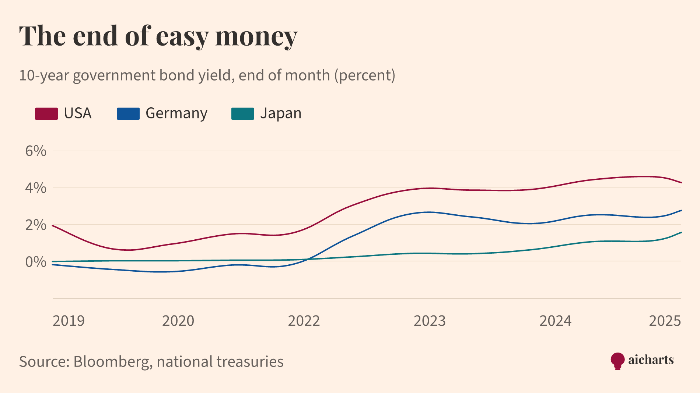](https://mcp-charts.vercel.app/chart?j=%7B%22chart%22%3A%22line%22%2C%22title%22%3A%22The%20end%20of%20easy%20money%22%2C%22subtitle%22%3A%2210-year%20government%20bond%20yield%2C%20end%20of%20month%20(percent)%22%2C%22source%22%3A%22Bloomberg%2C%20national%20treasuries%22%2C%22palette%22%3A%22editorial%22%2C%22size%22%3A%22share%22%2C%22x%22%3A%22month%22%2C%22y%22%3A%5B%22usa%22%2C%22germany%22%2C%22japan%22%5D%2C%22interpolation%22%3A%22curved%22%2C%22yFormat%22%3A%22percent%22%2C%22data%22%3A%5B%7B%22month%22%3A%222019-12%22%2C%22usa%22%3A1.92%2C%22germany%22%3A-0.19%2C%22japan%22%3A-0.02%7D%2C%7B%22month%22%3A%222020-06%22%2C%22usa%22%3A0.66%2C%22germany%22%3A-0.45%2C%22japan%22%3A0.02%7D%2C%7B%22month%22%3A%222020-12%22%2C%22usa%22%3A0.93%2C%22germany%22%3A-0.57%2C%22japan%22%3A0.02%7D%2C%7B%22month%22%3A%222021-06%22%2C%22usa%22%3A1.47%2C%22germany%22%3A-0.21%2C%22japan%22%3A0.05%7D%2C%7B%22month%22%3A%222021-12%22%2C%22usa%22%3A1.52%2C%22germany%22%3A-0.18%2C%22japan%22%3A0.07%7D%2C%7B%22month%22%3A%222022-06%22%2C%22usa%22%3A3.01%2C%22germany%22%3A1.34%2C%22japan%22%3A0.23%7D%2C%7B%22month%22%3A%222022-12%22%2C%22usa%22%3A3.88%2C%22germany%22%3A2.57%2C%22japan%22%3A0.42%7D%2C%7B%22month%22%3A%222023-06%22%2C%22usa%22%3A3.84%2C%22germany%22%3A2.39%2C%22japan%22%3A0.4%7D%2C%7B%22month%22%3A%222023-12%22%2C%22usa%22%3A3.88%2C%22germany%22%3A2.03%2C%22japan%22%3A0.62%7D%2C%7B%22month%22%3A%222024-06%22%2C%22usa%22%3A4.4%2C%22germany%22%3A2.5%2C%22japan%22%3A1.05%7D%2C%7B%22month%22%3A%222024-12%22%2C%22usa%22%3A4.57%2C%22germany%22%3A2.37%2C%22japan%22%3A1.1%7D%2C%7B%22month%22%3A%222025-03%22%2C%22usa%22%3A4.25%2C%22germany%22%3A2.74%2C%22japan%22%3A1.55%7D%5D%7D)

Open rendered PNG: <https://mcp-charts.vercel.app/chart?j=%7B%22chart%22%3A%22line%22%2C%22title%22%3A%22The%20end%20of%20easy%20money%22%2C%22subtitle%22%3A%2210-year%20government%20bond%20yield%2C%20end%20of%20month%20(percent)%22%2C%22source%22%3A%22Bloomberg%2C%20national%20treasuries%22%2C%22palette%22%3A%22editorial%22%2C%22size%22%3A%22share%22%2C%22x%22%3A%22month%22%2C%22y%22%3A%5B%22usa%22%2C%22germany%22%2C%22japan%22%5D%2C%22interpolation%22%3A%22curved%22%2C%22yFormat%22%3A%22percent%22%2C%22data%22%3A%5B%7B%22month%22%3A%222019-12%22%2C%22usa%22%3A1.92%2C%22germany%22%3A-0.19%2C%22japan%22%3A-0.02%7D%2C%7B%22month%22%3A%222020-06%22%2C%22usa%22%3A0.66%2C%22germany%22%3A-0.45%2C%22japan%22%3A0.02%7D%2C%7B%22month%22%3A%222020-12%22%2C%22usa%22%3A0.93%2C%22germany%22%3A-0.57%2C%22japan%22%3A0.02%7D%2C%7B%22month%22%3A%222021-06%22%2C%22usa%22%3A1.47%2C%22germany%22%3A-0.21%2C%22japan%22%3A0.05%7D%2C%7B%22month%22%3A%222021-12%22%2C%22usa%22%3A1.52%2C%22germany%22%3A-0.18%2C%22japan%22%3A0.07%7D%2C%7B%22month%22%3A%222022-06%22%2C%22usa%22%3A3.01%2C%22germany%22%3A1.34%2C%22japan%22%3A0.23%7D%2C%7B%22month%22%3A%222022-12%22%2C%22usa%22%3A3.88%2C%22germany%22%3A2.57%2C%22japan%22%3A0.42%7D%2C%7B%22month%22%3A%222023-06%22%2C%22usa%22%3A3.84%2C%22germany%22%3A2.39%2C%22japan%22%3A0.4%7D%2C%7B%22month%22%3A%222023-12%22%2C%22usa%22%3A3.88%2C%22germany%22%3A2.03%2C%22japan%22%3A0.62%7D%2C%7B%22month%22%3A%222024-06%22%2C%22usa%22%3A4.4%2C%22germany%22%3A2.5%2C%22japan%22%3A1.05%7D%2C%7B%22month%22%3A%222024-12%22%2C%22usa%22%3A4.57%2C%22germany%22%3A2.37%2C%22japan%22%3A1.1%7D%2C%7B%22month%22%3A%222025-03%22%2C%22usa%22%3A4.25%2C%22germany%22%3A2.74%2C%22japan%22%3A1.55%7D%5D%7D>

Source: Bloomberg, national treasuries

---

### The oceans are absorbing the heat
_Global ocean heat content anomaly, 0-2000m (zettajoules)_
Line · palette: twilight · size: share

%22%2C%22source%22%3A%22NOAA%20National%20Centers%20for%20Environmental%20Information%22%2C%22palette%22%3A%22twilight%22%2C%22size%22%3A%22share%22%2C%22x%22%3A%22year%22%2C%22y%22%3A%22heat%22%2C%22interpolation%22%3A%22curved%22%2C%22areaFill%22%3Atrue%2C%22showSymbols%22%3A%22none%22%2C%22data%22%3A%5B%7B%22year%22%3A1960%2C%22heat%22%3A-40%7D%2C%7B%22year%22%3A1970%2C%22heat%22%3A-25%7D%2C%7B%22year%22%3A1980%2C%22heat%22%3A0%7D%2C%7B%22year%22%3A1990%2C%22heat%22%3A25%7D%2C%7B%22year%22%3A2000%2C%22heat%22%3A70%7D%2C%7B%22year%22%3A2005%2C%22heat%22%3A110%7D%2C%7B%22year%22%3A2010%2C%22heat%22%3A160%7D%2C%7B%22year%22%3A2015%2C%22heat%22%3A230%7D%2C%7B%22year%22%3A2020%2C%22heat%22%3A315%7D%2C%7B%22year%22%3A2022%2C%22heat%22%3A355%7D%2C%7B%22year%22%3A2024%2C%22heat%22%3A405%7D%5D%7D)

Open rendered PNG: <https://mcp-charts.vercel.app/chart?j=%7B%22chart%22%3A%22line%22%2C%22title%22%3A%22The%20oceans%20are%20absorbing%20the%20heat%22%2C%22subtitle%22%3A%22Global%20ocean%20heat%20content%20anomaly%2C%200-2000m%20(zettajoules)%22%2C%22source%22%3A%22NOAA%20National%20Centers%20for%20Environmental%20Information%22%2C%22palette%22%3A%22twilight%22%2C%22size%22%3A%22share%22%2C%22x%22%3A%22year%22%2C%22y%22%3A%22heat%22%2C%22interpolation%22%3A%22curved%22%2C%22areaFill%22%3Atrue%2C%22showSymbols%22%3A%22none%22%2C%22data%22%3A%5B%7B%22year%22%3A1960%2C%22heat%22%3A-40%7D%2C%7B%22year%22%3A1970%2C%22heat%22%3A-25%7D%2C%7B%22year%22%3A1980%2C%22heat%22%3A0%7D%2C%7B%22year%22%3A1990%2C%22heat%22%3A25%7D%2C%7B%22year%22%3A2000%2C%22heat%22%3A70%7D%2C%7B%22year%22%3A2005%2C%22heat%22%3A110%7D%2C%7B%22year%22%3A2010%2C%22heat%22%3A160%7D%2C%7B%22year%22%3A2015%2C%22heat%22%3A230%7D%2C%7B%22year%22%3A2020%2C%22heat%22%3A315%7D%2C%7B%22year%22%3A2022%2C%22heat%22%3A355%7D%2C%7B%22year%22%3A2024%2C%22heat%22%3A405%7D%5D%7D>

Source: NOAA National Centers for Environmental Information

---

### Winners and losers of the degree shuffle
_Change in US bachelor's degrees awarded, 2012-2022 (percent)_
Small multiples (bars) · palette: diverging-sunset · size: share

[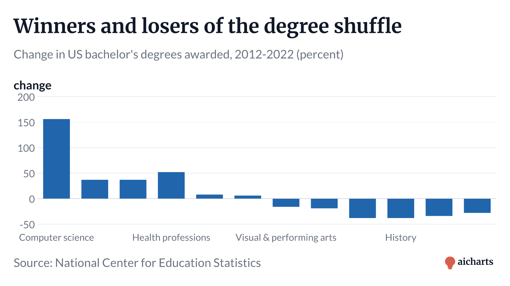](https://mcp-charts.vercel.app/chart?j=%7B%22chart%22%3A%22bar-split%22%2C%22title%22%3A%22Winners%20and%20losers%20of%20the%20degree%20shuffle%22%2C%22subtitle%22%3A%22Change%20in%20US%20bachelor's%20degrees%20awarded%2C%202012-2022%20(percent)%22%2C%22source%22%3A%22National%20Center%20for%20Education%20Statistics%22%2C%22palette%22%3A%22diverging-sunset%22%2C%22size%22%3A%22share%22%2C%22x%22%3A%22field%22%2C%22y%22%3A%5B%22change%22%5D%2C%22columns%22%3A1%2C%22yFormat%22%3A%22percent%22%2C%22data%22%3A%5B%7B%22field%22%3A%22Computer%20science%22%2C%22change%22%3A156%7D%2C%7B%22field%22%3A%22Engineering%22%2C%22change%22%3A37%7D%2C%7B%22field%22%3A%22Biological%20sciences%22%2C%22change%22%3A37%7D%2C%7B%22field%22%3A%22Health%20professions%22%2C%22change%22%3A52%7D%2C%7B%22field%22%3A%22Psychology%22%2C%22change%22%3A8%7D%2C%7B%22field%22%3A%22Business%22%2C%22change%22%3A6%7D%2C%7B%22field%22%3A%22Visual%20%26%20performing%20arts%22%2C%22change%22%3A-16%7D%2C%7B%22field%22%3A%22Education%22%2C%22change%22%3A-19%7D%2C%7B%22field%22%3A%22English%20language%22%2C%22change%22%3A-38%7D%2C%7B%22field%22%3A%22History%22%2C%22change%22%3A-38%7D%2C%7B%22field%22%3A%22Foreign%20languages%22%2C%22change%22%3A-34%7D%2C%7B%22field%22%3A%22Philosophy%20%26%20religion%22%2C%22change%22%3A-28%7D%5D%7D)

Open rendered PNG: <https://mcp-charts.vercel.app/chart?j=%7B%22chart%22%3A%22bar-split%22%2C%22title%22%3A%22Winners%20and%20losers%20of%20the%20degree%20shuffle%22%2C%22subtitle%22%3A%22Change%20in%20US%20bachelor's%20degrees%20awarded%2C%202012-2022%20(percent)%22%2C%22source%22%3A%22National%20Center%20for%20Education%20Statistics%22%2C%22palette%22%3A%22diverging-sunset%22%2C%22size%22%3A%22share%22%2C%22x%22%3A%22field%22%2C%22y%22%3A%5B%22change%22%5D%2C%22columns%22%3A1%2C%22yFormat%22%3A%22percent%22%2C%22data%22%3A%5B%7B%22field%22%3A%22Computer%20science%22%2C%22change%22%3A156%7D%2C%7B%22field%22%3A%22Engineering%22%2C%22change%22%3A37%7D%2C%7B%22field%22%3A%22Biological%20sciences%22%2C%22change%22%3A37%7D%2C%7B%22field%22%3A%22Health%20professions%22%2C%22change%22%3A52%7D%2C%7B%22field%22%3A%22Psychology%22%2C%22change%22%3A8%7D%2C%7B%22field%22%3A%22Business%22%2C%22change%22%3A6%7D%2C%7B%22field%22%3A%22Visual%20%26%20performing%20arts%22%2C%22change%22%3A-16%7D%2C%7B%22field%22%3A%22Education%22%2C%22change%22%3A-19%7D%2C%7B%22field%22%3A%22English%20language%22%2C%22change%22%3A-38%7D%2C%7B%22field%22%3A%22History%22%2C%22change%22%3A-38%7D%2C%7B%22field%22%3A%22Foreign%20languages%22%2C%22change%22%3A-34%7D%2C%7B%22field%22%3A%22Philosophy%20%26%20religion%22%2C%22change%22%3A-28%7D%5D%7D>

Source: National Center for Education Statistics

---

### The great browser shuffle
_Desktop browser market share (percent)_
Stacked area · palette: viridis · size: share

[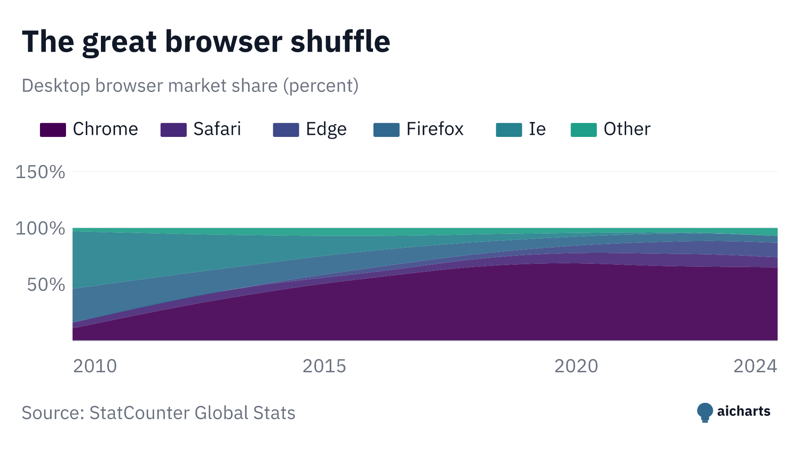](https://mcp-charts.vercel.app/chart?j=%7B%22chart%22%3A%22stacked-area%22%2C%22title%22%3A%22The%20great%20browser%20shuffle%22%2C%22subtitle%22%3A%22Desktop%20browser%20market%20share%20(percent)%22%2C%22source%22%3A%22StatCounter%20Global%20Stats%22%2C%22palette%22%3A%22viridis%22%2C%22size%22%3A%22share%22%2C%22x%22%3A%22year%22%2C%22y%22%3A%5B%22chrome%22%2C%22safari%22%2C%22edge%22%2C%22firefox%22%2C%22ie%22%2C%22other%22%5D%2C%22normalize%22%3Atrue%2C%22interpolation%22%3A%22curved%22%2C%22data%22%3A%5B%7B%22year%22%3A2010%2C%22chrome%22%3A11%2C%22safari%22%3A5%2C%22edge%22%3A0%2C%22firefox%22%3A30%2C%22ie%22%3A51%2C%22other%22%3A3%7D%2C%7B%22year%22%3A2013%2C%22chrome%22%3A37%2C%22safari%22%3A7%2C%22edge%22%3A0%2C%22firefox%22%3A20%2C%22ie%22%3A30%2C%22other%22%3A6%7D%2C%7B%22year%22%3A2016%2C%22chrome%22%3A56%2C%22safari%22%3A5%2C%22edge%22%3A4%2C%22firefox%22%3A15%2C%22ie%22%3A13%2C%22other%22%3A7%7D%2C%7B%22year%22%3A2019%2C%22chrome%22%3A68%2C%22safari%22%3A8%2C%22edge%22%3A5%2C%22firefox%22%3A9%2C%22ie%22%3A5%2C%22other%22%3A5%7D%2C%7B%22year%22%3A2022%2C%22chrome%22%3A66%2C%22safari%22%3A11%2C%22edge%22%3A11%2C%22firefox%22%3A7%2C%22ie%22%3A1%2C%22other%22%3A4%7D%2C%7B%22year%22%3A2024%2C%22chrome%22%3A65%2C%22safari%22%3A9%2C%22edge%22%3A13%2C%22firefox%22%3A6%2C%22ie%22%3A0%2C%22other%22%3A7%7D%5D%7D)

Open rendered PNG: <https://mcp-charts.vercel.app/chart?j=%7B%22chart%22%3A%22stacked-area%22%2C%22title%22%3A%22The%20great%20browser%20shuffle%22%2C%22subtitle%22%3A%22Desktop%20browser%20market%20share%20(percent)%22%2C%22source%22%3A%22StatCounter%20Global%20Stats%22%2C%22palette%22%3A%22viridis%22%2C%22size%22%3A%22share%22%2C%22x%22%3A%22year%22%2C%22y%22%3A%5B%22chrome%22%2C%22safari%22%2C%22edge%22%2C%22firefox%22%2C%22ie%22%2C%22other%22%5D%2C%22normalize%22%3Atrue%2C%22interpolation%22%3A%22curved%22%2C%22data%22%3A%5B%7B%22year%22%3A2010%2C%22chrome%22%3A11%2C%22safari%22%3A5%2C%22edge%22%3A0%2C%22firefox%22%3A30%2C%22ie%22%3A51%2C%22other%22%3A3%7D%2C%7B%22year%22%3A2013%2C%22chrome%22%3A37%2C%22safari%22%3A7%2C%22edge%22%3A0%2C%22firefox%22%3A20%2C%22ie%22%3A30%2C%22other%22%3A6%7D%2C%7B%22year%22%3A2016%2C%22chrome%22%3A56%2C%22safari%22%3A5%2C%22edge%22%3A4%2C%22firefox%22%3A15%2C%22ie%22%3A13%2C%22other%22%3A7%7D%2C%7B%22year%22%3A2019%2C%22chrome%22%3A68%2C%22safari%22%3A8%2C%22edge%22%3A5%2C%22firefox%22%3A9%2C%22ie%22%3A5%2C%22other%22%3A5%7D%2C%7B%22year%22%3A2022%2C%22chrome%22%3A66%2C%22safari%22%3A11%2C%22edge%22%3A11%2C%22firefox%22%3A7%2C%22ie%22%3A1%2C%22other%22%3A4%7D%2C%7B%22year%22%3A2024%2C%22chrome%22%3A65%2C%22safari%22%3A9%2C%22edge%22%3A13%2C%22firefox%22%3A6%2C%22ie%22%3A0%2C%22other%22%3A7%7D%5D%7D>

Source: StatCounter Global Stats

---

### The world's mother tongues
_Top languages by number of native speakers (millions)_
Donut · palette: earth · size: share

[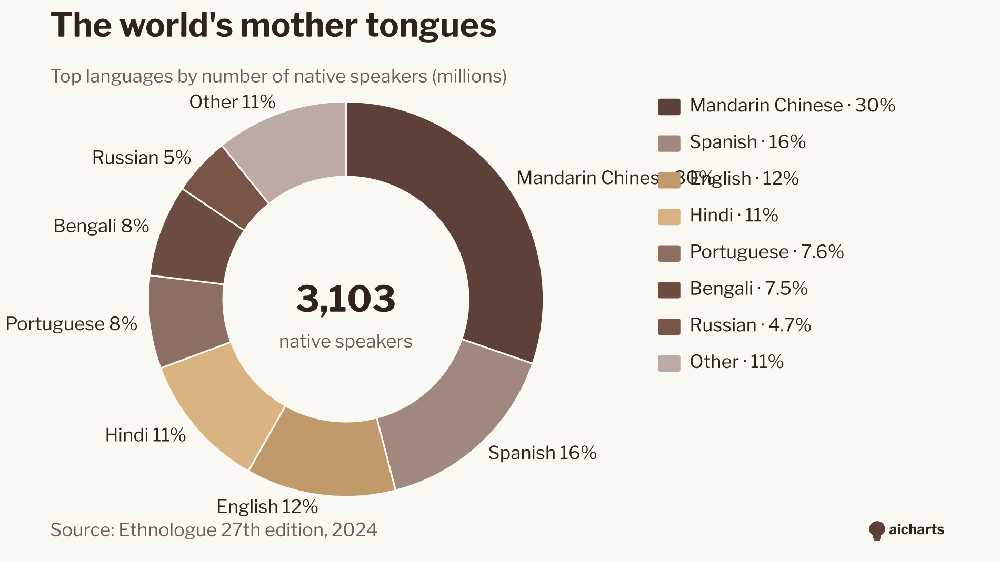](https://mcp-charts.vercel.app/chart?j=%7B%22chart%22%3A%22donut%22%2C%22title%22%3A%22The%20world's%20mother%20tongues%22%2C%22subtitle%22%3A%22Top%20languages%20by%20number%20of%20native%20speakers%20(millions)%22%2C%22source%22%3A%22Ethnologue%2027th%20edition%2C%202024%22%2C%22palette%22%3A%22earth%22%2C%22size%22%3A%22share%22%2C%22label%22%3A%22language%22%2C%22value%22%3A%22speakers%22%2C%22sort%22%3A%22desc%22%2C%22centerValue%22%3A%22sum%22%2C%22centerLabel%22%3A%22native%20speakers%22%2C%22data%22%3A%5B%7B%22language%22%3A%22Mandarin%20Chinese%22%2C%22speakers%22%3A940%7D%2C%7B%22language%22%3A%22Spanish%22%2C%22speakers%22%3A486%7D%2C%7B%22language%22%3A%22English%22%2C%22speakers%22%3A380%7D%2C%7B%22language%22%3A%22Hindi%22%2C%22speakers%22%3A345%7D%2C%7B%22language%22%3A%22Portuguese%22%2C%22speakers%22%3A236%7D%2C%7B%22language%22%3A%22Bengali%22%2C%22speakers%22%3A234%7D%2C%7B%22language%22%3A%22Russian%22%2C%22speakers%22%3A147%7D%2C%7B%22language%22%3A%22Japanese%22%2C%22speakers%22%3A123%7D%2C%7B%22language%22%3A%22Punjabi%22%2C%22speakers%22%3A113%7D%2C%7B%22language%22%3A%22Marathi%22%2C%22speakers%22%3A99%7D%5D%7D)

Open rendered PNG: <https://mcp-charts.vercel.app/chart?j=%7B%22chart%22%3A%22donut%22%2C%22title%22%3A%22The%20world's%20mother%20tongues%22%2C%22subtitle%22%3A%22Top%20languages%20by%20number%20of%20native%20speakers%20(millions)%22%2C%22source%22%3A%22Ethnologue%2027th%20edition%2C%202024%22%2C%22palette%22%3A%22earth%22%2C%22size%22%3A%22share%22%2C%22label%22%3A%22language%22%2C%22value%22%3A%22speakers%22%2C%22sort%22%3A%22desc%22%2C%22centerValue%22%3A%22sum%22%2C%22centerLabel%22%3A%22native%20speakers%22%2C%22data%22%3A%5B%7B%22language%22%3A%22Mandarin%20Chinese%22%2C%22speakers%22%3A940%7D%2C%7B%22language%22%3A%22Spanish%22%2C%22speakers%22%3A486%7D%2C%7B%22language%22%3A%22English%22%2C%22speakers%22%3A380%7D%2C%7B%22language%22%3A%22Hindi%22%2C%22speakers%22%3A345%7D%2C%7B%22language%22%3A%22Portuguese%22%2C%22speakers%22%3A236%7D%2C%7B%22language%22%3A%22Bengali%22%2C%22speakers%22%3A234%7D%2C%7B%22language%22%3A%22Russian%22%2C%22speakers%22%3A147%7D%2C%7B%22language%22%3A%22Japanese%22%2C%22speakers%22%3A123%7D%2C%7B%22language%22%3A%22Punjabi%22%2C%22speakers%22%3A113%7D%2C%7B%22language%22%3A%22Marathi%22%2C%22speakers%22%3A99%7D%5D%7D>

Source: Ethnologue 27th edition, 2024

---

### The uneven rebound
_Real GDP growth, selected economies (percent)_
Grouped bar · palette: boardroom · size: share

[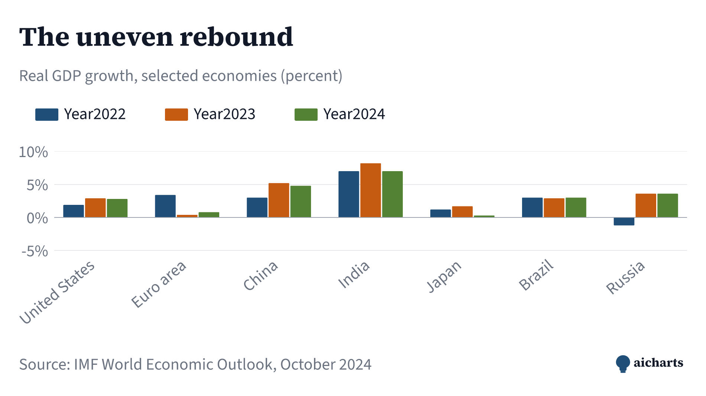](https://mcp-charts.vercel.app/chart?j=%7B%22chart%22%3A%22grouped-bar%22%2C%22title%22%3A%22The%20uneven%20rebound%22%2C%22subtitle%22%3A%22Real%20GDP%20growth%2C%20selected%20economies%20(percent)%22%2C%22source%22%3A%22IMF%20World%20Economic%20Outlook%2C%20October%202024%22%2C%22palette%22%3A%22boardroom%22%2C%22size%22%3A%22share%22%2C%22x%22%3A%22country%22%2C%22y%22%3A%5B%22year2022%22%2C%22year2023%22%2C%22year2024%22%5D%2C%22showValueLabels%22%3Afalse%2C%22yFormat%22%3A%22percent%22%2C%22data%22%3A%5B%7B%22country%22%3A%22United%20States%22%2C%22year2022%22%3A1.9%2C%22year2023%22%3A2.9%2C%22year2024%22%3A2.8%7D%2C%7B%22country%22%3A%22Euro%20area%22%2C%22year2022%22%3A3.4%2C%22year2023%22%3A0.4%2C%22year2024%22%3A0.8%7D%2C%7B%22country%22%3A%22China%22%2C%22year2022%22%3A3%2C%22year2023%22%3A5.2%2C%22year2024%22%3A4.8%7D%2C%7B%22country%22%3A%22India%22%2C%22year2022%22%3A7%2C%22year2023%22%3A8.2%2C%22year2024%22%3A7%7D%2C%7B%22country%22%3A%22Japan%22%2C%22year2022%22%3A1.2%2C%22year2023%22%3A1.7%2C%22year2024%22%3A0.3%7D%2C%7B%22country%22%3A%22Brazil%22%2C%22year2022%22%3A3%2C%22year2023%22%3A2.9%2C%22year2024%22%3A3%7D%2C%7B%22country%22%3A%22Russia%22%2C%22year2022%22%3A-1.2%2C%22year2023%22%3A3.6%2C%22year2024%22%3A3.6%7D%5D%7D)

Open rendered PNG: <https://mcp-charts.vercel.app/chart?j=%7B%22chart%22%3A%22grouped-bar%22%2C%22title%22%3A%22The%20uneven%20rebound%22%2C%22subtitle%22%3A%22Real%20GDP%20growth%2C%20selected%20economies%20(percent)%22%2C%22source%22%3A%22IMF%20World%20Economic%20Outlook%2C%20October%202024%22%2C%22palette%22%3A%22boardroom%22%2C%22size%22%3A%22share%22%2C%22x%22%3A%22country%22%2C%22y%22%3A%5B%22year2022%22%2C%22year2023%22%2C%22year2024%22%5D%2C%22showValueLabels%22%3Afalse%2C%22yFormat%22%3A%22percent%22%2C%22data%22%3A%5B%7B%22country%22%3A%22United%20States%22%2C%22year2022%22%3A1.9%2C%22year2023%22%3A2.9%2C%22year2024%22%3A2.8%7D%2C%7B%22country%22%3A%22Euro%20area%22%2C%22year2022%22%3A3.4%2C%22year2023%22%3A0.4%2C%22year2024%22%3A0.8%7D%2C%7B%22country%22%3A%22China%22%2C%22year2022%22%3A3%2C%22year2023%22%3A5.2%2C%22year2024%22%3A4.8%7D%2C%7B%22country%22%3A%22India%22%2C%22year2022%22%3A7%2C%22year2023%22%3A8.2%2C%22year2024%22%3A7%7D%2C%7B%22country%22%3A%22Japan%22%2C%22year2022%22%3A1.2%2C%22year2023%22%3A1.7%2C%22year2024%22%3A0.3%7D%2C%7B%22country%22%3A%22Brazil%22%2C%22year2022%22%3A3%2C%22year2023%22%3A2.9%2C%22year2024%22%3A3%7D%2C%7B%22country%22%3A%22Russia%22%2C%22year2022%22%3A-1.2%2C%22year2023%22%3A3.6%2C%22year2024%22%3A3.6%7D%5D%7D>

Source: IMF World Economic Outlook, October 2024

---

### Frontier models keep getting bigger
_Parameter counts for notable large language models (billions)_
Bar · palette: twilight · size: share

%22%2C%22source%22%3A%22Model%20cards%2C%20company%20announcements%20(parameter%20counts%20approximate)%22%2C%22palette%22%3A%22twilight%22%2C%22size%22%3A%22share%22%2C%22label%22%3A%22model%22%2C%22value%22%3A%22params%22%2C%22orientation%22%3A%22horizontal%22%2C%22sort%22%3A%22desc%22%2C%22showValueLabels%22%3Atrue%2C%22data%22%3A%5B%7B%22model%22%3A%22GPT-4%22%2C%22params%22%3A1800%7D%2C%7B%22model%22%3A%22Gemini%201.5%20Ultra%22%2C%22params%22%3A1600%7D%2C%7B%22model%22%3A%22Claude%203.5%20Opus%22%2C%22params%22%3A1400%7D%2C%7B%22model%22%3A%22GPT-4%20Turbo%22%2C%22params%22%3A900%7D%2C%7B%22model%22%3A%22PaLM%202%22%2C%22params%22%3A540%7D%2C%7B%22model%22%3A%22Llama%203%20405B%22%2C%22params%22%3A405%7D%2C%7B%22model%22%3A%22Mistral%20Large%22%2C%22params%22%3A220%7D%2C%7B%22model%22%3A%22GPT-3.5%22%2C%22params%22%3A175%7D%2C%7B%22model%22%3A%22Llama%203%2070B%22%2C%22params%22%3A70%7D%2C%7B%22model%22%3A%22Mixtral%208x7B%22%2C%22params%22%3A47%7D%2C%7B%22model%22%3A%22Llama%203%208B%22%2C%22params%22%3A8%7D%2C%7B%22model%22%3A%22GPT-2%22%2C%22params%22%3A1.5%7D%5D%7D)

Open rendered PNG: <https://mcp-charts.vercel.app/chart?j=%7B%22chart%22%3A%22bar%22%2C%22title%22%3A%22Frontier%20models%20keep%20getting%20bigger%22%2C%22subtitle%22%3A%22Parameter%20counts%20for%20notable%20large%20language%20models%20(billions)%22%2C%22source%22%3A%22Model%20cards%2C%20company%20announcements%20(parameter%20counts%20approximate)%22%2C%22palette%22%3A%22twilight%22%2C%22size%22%3A%22share%22%2C%22label%22%3A%22model%22%2C%22value%22%3A%22params%22%2C%22orientation%22%3A%22horizontal%22%2C%22sort%22%3A%22desc%22%2C%22showValueLabels%22%3Atrue%2C%22data%22%3A%5B%7B%22model%22%3A%22GPT-4%22%2C%22params%22%3A1800%7D%2C%7B%22model%22%3A%22Gemini%201.5%20Ultra%22%2C%22params%22%3A1600%7D%2C%7B%22model%22%3A%22Claude%203.5%20Opus%22%2C%22params%22%3A1400%7D%2C%7B%22model%22%3A%22GPT-4%20Turbo%22%2C%22params%22%3A900%7D%2C%7B%22model%22%3A%22PaLM%202%22%2C%22params%22%3A540%7D%2C%7B%22model%22%3A%22Llama%203%20405B%22%2C%22params%22%3A405%7D%2C%7B%22model%22%3A%22Mistral%20Large%22%2C%22params%22%3A220%7D%2C%7B%22model%22%3A%22GPT-3.5%22%2C%22params%22%3A175%7D%2C%7B%22model%22%3A%22Llama%203%2070B%22%2C%22params%22%3A70%7D%2C%7B%22model%22%3A%22Mixtral%208x7B%22%2C%22params%22%3A47%7D%2C%7B%22model%22%3A%22Llama%203%208B%22%2C%22params%22%3A8%7D%2C%7B%22model%22%3A%22GPT-2%22%2C%22params%22%3A1.5%7D%5D%7D>

Source: Model cards, company announcements (parameter counts approximate)

---

## Want something like this in your chat?

Open the [main README](../README.md), copy the ChatGPT prompt into any AI chat, then ask for the chart you want. The assistant will reply with a Markdown image that renders inline.

Full JSON for every chart on this page lives in [`specs.json`](./specs.json). Regenerate all PNGs with `npm run zoo:all` from the repo root.
