# Edge-case zoo: Portrait (poster 1600x2000)

These are deliberately hostile inputs — long titles, single data points, extreme values, huge labels. The library still renders a reasonable PNG for every one. Click any chart to open the live rendered URL.

Other aspect ratios for the same zoo:
- [landscape](README.landscape-edge-cases.md)
- [square](README.square-edge-cases.md)

---

### This is a deliberately long headline that any real assistant might produce and it must still fit inside the plot without swallowing the data
_And a subtitle that continues describing the dataset across many words to pressure-test wrapping behaviour_
Line · palette: editorial · size: poster

[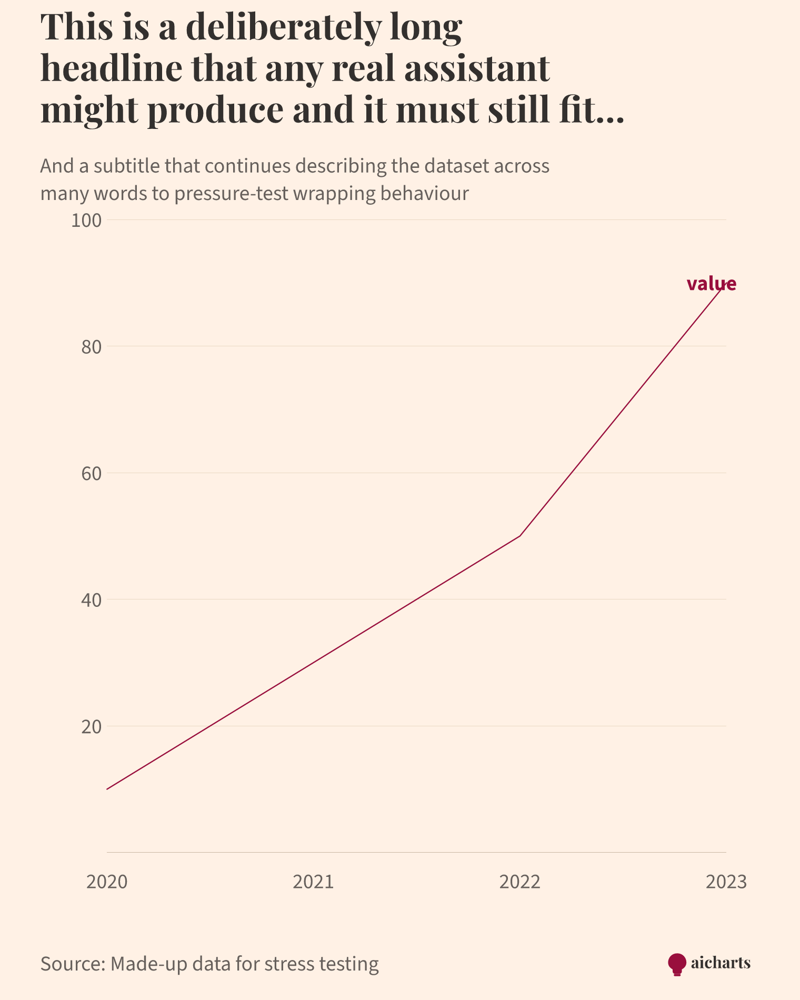](https://mcp-charts.vercel.app/chart?j=%7B%22chart%22%3A%22line%22%2C%22title%22%3A%22This%20is%20a%20deliberately%20long%20headline%20that%20any%20real%20assistant%20might%20produce%20and%20it%20must%20still%20fit%20inside%20the%20plot%20without%20swallowing%20the%20data%22%2C%22subtitle%22%3A%22And%20a%20subtitle%20that%20continues%20describing%20the%20dataset%20across%20many%20words%20to%20pressure-test%20wrapping%20behaviour%22%2C%22source%22%3A%22Made-up%20data%20for%20stress%20testing%22%2C%22palette%22%3A%22editorial%22%2C%22x%22%3A%22year%22%2C%22y%22%3A%22value%22%2C%22data%22%3A%5B%7B%22year%22%3A2020%2C%22value%22%3A10%7D%2C%7B%22year%22%3A2021%2C%22value%22%3A30%7D%2C%7B%22year%22%3A2022%2C%22value%22%3A50%7D%2C%7B%22year%22%3A2023%2C%22value%22%3A90%7D%5D%2C%22size%22%3A%22poster%22%7D)

Open rendered PNG: <https://mcp-charts.vercel.app/chart?j=%7B%22chart%22%3A%22line%22%2C%22title%22%3A%22This%20is%20a%20deliberately%20long%20headline%20that%20any%20real%20assistant%20might%20produce%20and%20it%20must%20still%20fit%20inside%20the%20plot%20without%20swallowing%20the%20data%22%2C%22subtitle%22%3A%22And%20a%20subtitle%20that%20continues%20describing%20the%20dataset%20across%20many%20words%20to%20pressure-test%20wrapping%20behaviour%22%2C%22source%22%3A%22Made-up%20data%20for%20stress%20testing%22%2C%22palette%22%3A%22editorial%22%2C%22x%22%3A%22year%22%2C%22y%22%3A%22value%22%2C%22data%22%3A%5B%7B%22year%22%3A2020%2C%22value%22%3A10%7D%2C%7B%22year%22%3A2021%2C%22value%22%3A30%7D%2C%7B%22year%22%3A2022%2C%22value%22%3A50%7D%2C%7B%22year%22%3A2023%2C%22value%22%3A90%7D%5D%2C%22size%22%3A%22poster%22%7D>

Source: Made-up data for stress testing

---

### Single point
_Only one observation in the whole series_
Line · palette: clarity · size: poster

[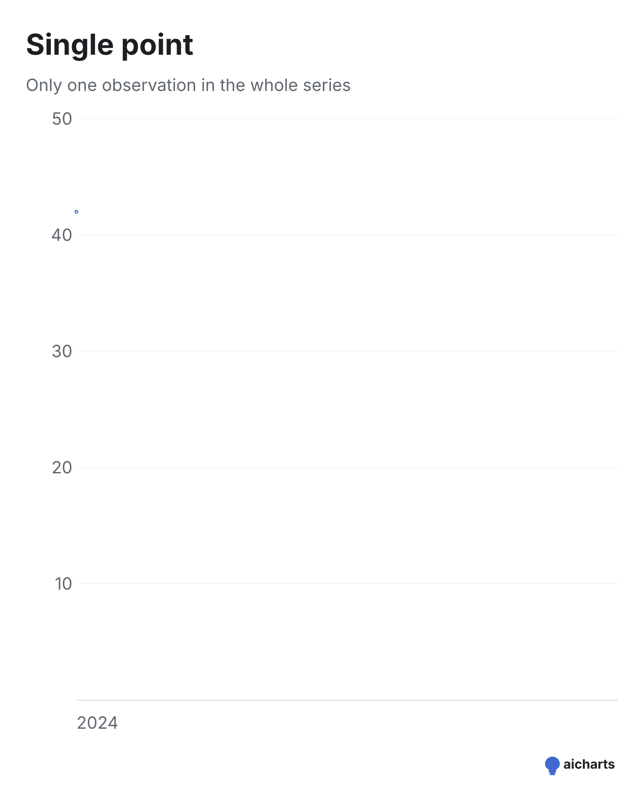](https://mcp-charts.vercel.app/chart?j=%7B%22chart%22%3A%22line%22%2C%22title%22%3A%22Single%20point%22%2C%22subtitle%22%3A%22Only%20one%20observation%20in%20the%20whole%20series%22%2C%22palette%22%3A%22clarity%22%2C%22x%22%3A%22year%22%2C%22y%22%3A%22value%22%2C%22showSymbols%22%3A%22all%22%2C%22data%22%3A%5B%7B%22year%22%3A2024%2C%22value%22%3A42%7D%5D%2C%22size%22%3A%22poster%22%7D)

Open rendered PNG: <https://mcp-charts.vercel.app/chart?j=%7B%22chart%22%3A%22line%22%2C%22title%22%3A%22Single%20point%22%2C%22subtitle%22%3A%22Only%20one%20observation%20in%20the%20whole%20series%22%2C%22palette%22%3A%22clarity%22%2C%22x%22%3A%22year%22%2C%22y%22%3A%22value%22%2C%22showSymbols%22%3A%22all%22%2C%22data%22%3A%5B%7B%22year%22%3A2024%2C%22value%22%3A42%7D%5D%2C%22size%22%3A%22poster%22%7D>

---

### No data at all
_The render must not crash or show garbage_
Bar · palette: mono-blue · size: poster

[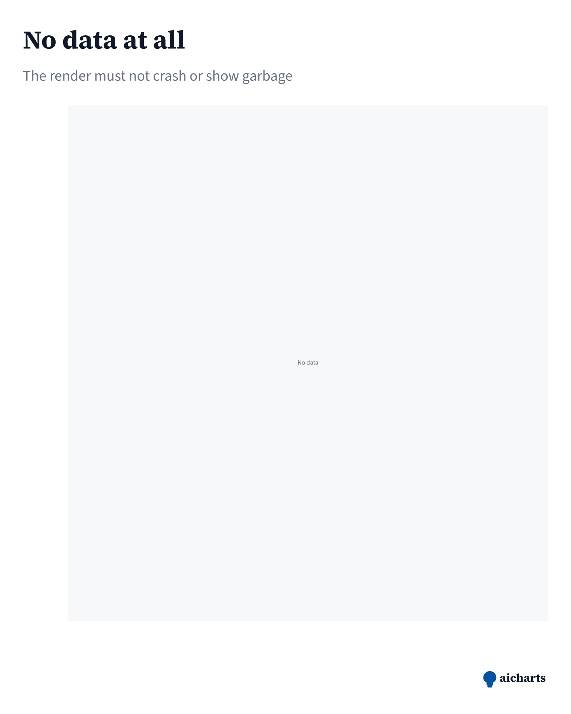](https://mcp-charts.vercel.app/chart?j=%7B%22chart%22%3A%22bar%22%2C%22title%22%3A%22No%20data%20at%20all%22%2C%22subtitle%22%3A%22The%20render%20must%20not%20crash%20or%20show%20garbage%22%2C%22palette%22%3A%22mono-blue%22%2C%22label%22%3A%22name%22%2C%22value%22%3A%22count%22%2C%22data%22%3A%5B%5D%2C%22size%22%3A%22poster%22%7D)

Open rendered PNG: <https://mcp-charts.vercel.app/chart?j=%7B%22chart%22%3A%22bar%22%2C%22title%22%3A%22No%20data%20at%20all%22%2C%22subtitle%22%3A%22The%20render%20must%20not%20crash%20or%20show%20garbage%22%2C%22palette%22%3A%22mono-blue%22%2C%22label%22%3A%22name%22%2C%22value%22%3A%22count%22%2C%22data%22%3A%5B%5D%2C%22size%22%3A%22poster%22%7D>

---

### One bar
_Only a single category_
Bar · palette: boardroom · size: poster

[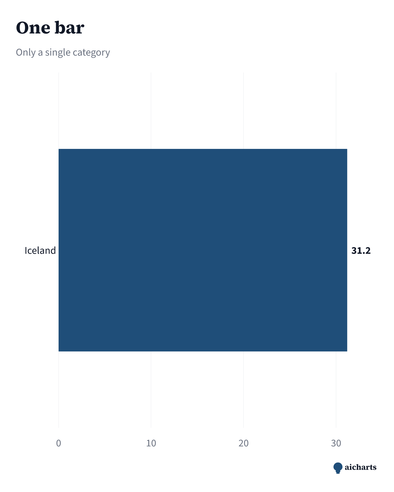](https://mcp-charts.vercel.app/chart?j=%7B%22chart%22%3A%22bar%22%2C%22title%22%3A%22One%20bar%22%2C%22subtitle%22%3A%22Only%20a%20single%20category%22%2C%22palette%22%3A%22boardroom%22%2C%22label%22%3A%22country%22%2C%22value%22%3A%22gdp%22%2C%22orientation%22%3A%22horizontal%22%2C%22showValueLabels%22%3Atrue%2C%22data%22%3A%5B%7B%22country%22%3A%22Iceland%22%2C%22gdp%22%3A31.2%7D%5D%2C%22size%22%3A%22poster%22%7D)

Open rendered PNG: <https://mcp-charts.vercel.app/chart?j=%7B%22chart%22%3A%22bar%22%2C%22title%22%3A%22One%20bar%22%2C%22subtitle%22%3A%22Only%20a%20single%20category%22%2C%22palette%22%3A%22boardroom%22%2C%22label%22%3A%22country%22%2C%22value%22%3A%22gdp%22%2C%22orientation%22%3A%22horizontal%22%2C%22showValueLabels%22%3Atrue%2C%22data%22%3A%5B%7B%22country%22%3A%22Iceland%22%2C%22gdp%22%3A31.2%7D%5D%2C%22size%22%3A%22poster%22%7D>

---

### Huge category names
_Labels longer than the bar itself_
Bar · palette: vibrant · size: poster

[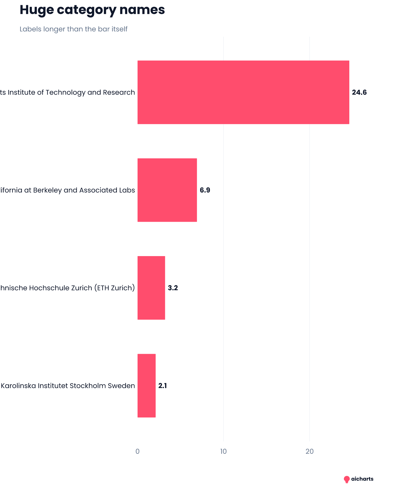](https://mcp-charts.vercel.app/chart?j=%7B%22chart%22%3A%22bar%22%2C%22title%22%3A%22Huge%20category%20names%22%2C%22subtitle%22%3A%22Labels%20longer%20than%20the%20bar%20itself%22%2C%22palette%22%3A%22vibrant%22%2C%22label%22%3A%22institution%22%2C%22value%22%3A%22endowment%22%2C%22orientation%22%3A%22horizontal%22%2C%22sort%22%3A%22desc%22%2C%22showValueLabels%22%3Atrue%2C%22data%22%3A%5B%7B%22institution%22%3A%22The%20Massachusetts%20Institute%20of%20Technology%20and%20Research%22%2C%22endowment%22%3A24.6%7D%2C%7B%22institution%22%3A%22University%20of%20California%20at%20Berkeley%20and%20Associated%20Labs%22%2C%22endowment%22%3A6.9%7D%2C%7B%22institution%22%3A%22Eidgenossische%20Technische%20Hochschule%20Zurich%20(ETH%20Zurich)%22%2C%22endowment%22%3A3.2%7D%2C%7B%22institution%22%3A%22Karolinska%20Institutet%20Stockholm%20Sweden%22%2C%22endowment%22%3A2.1%7D%5D%2C%22size%22%3A%22poster%22%7D)

Open rendered PNG: <https://mcp-charts.vercel.app/chart?j=%7B%22chart%22%3A%22bar%22%2C%22title%22%3A%22Huge%20category%20names%22%2C%22subtitle%22%3A%22Labels%20longer%20than%20the%20bar%20itself%22%2C%22palette%22%3A%22vibrant%22%2C%22label%22%3A%22institution%22%2C%22value%22%3A%22endowment%22%2C%22orientation%22%3A%22horizontal%22%2C%22sort%22%3A%22desc%22%2C%22showValueLabels%22%3Atrue%2C%22data%22%3A%5B%7B%22institution%22%3A%22The%20Massachusetts%20Institute%20of%20Technology%20and%20Research%22%2C%22endowment%22%3A24.6%7D%2C%7B%22institution%22%3A%22University%20of%20California%20at%20Berkeley%20and%20Associated%20Labs%22%2C%22endowment%22%3A6.9%7D%2C%7B%22institution%22%3A%22Eidgenossische%20Technische%20Hochschule%20Zurich%20(ETH%20Zurich)%22%2C%22endowment%22%3A3.2%7D%2C%7B%22institution%22%3A%22Karolinska%20Institutet%20Stockholm%20Sweden%22%2C%22endowment%22%3A2.1%7D%5D%2C%22size%22%3A%22poster%22%7D>

---

### Too many bars
_Forty categories, density stress test_
Bar · palette: clarity · size: poster

[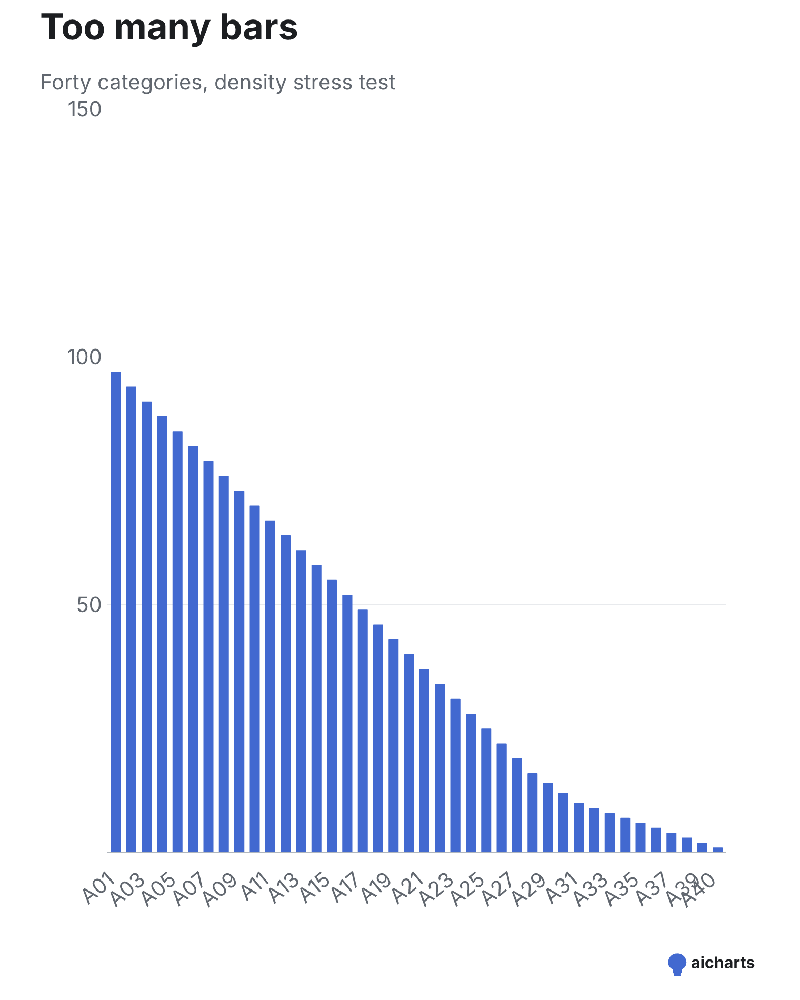](https://mcp-charts.vercel.app/chart?j=%7B%22chart%22%3A%22bar%22%2C%22title%22%3A%22Too%20many%20bars%22%2C%22subtitle%22%3A%22Forty%20categories%2C%20density%20stress%20test%22%2C%22palette%22%3A%22clarity%22%2C%22label%22%3A%22code%22%2C%22value%22%3A%22v%22%2C%22orientation%22%3A%22vertical%22%2C%22sort%22%3A%22desc%22%2C%22data%22%3A%5B%7B%22code%22%3A%22A01%22%2C%22v%22%3A97%7D%2C%7B%22code%22%3A%22A02%22%2C%22v%22%3A94%7D%2C%7B%22code%22%3A%22A03%22%2C%22v%22%3A91%7D%2C%7B%22code%22%3A%22A04%22%2C%22v%22%3A88%7D%2C%7B%22code%22%3A%22A05%22%2C%22v%22%3A85%7D%2C%7B%22code%22%3A%22A06%22%2C%22v%22%3A82%7D%2C%7B%22code%22%3A%22A07%22%2C%22v%22%3A79%7D%2C%7B%22code%22%3A%22A08%22%2C%22v%22%3A76%7D%2C%7B%22code%22%3A%22A09%22%2C%22v%22%3A73%7D%2C%7B%22code%22%3A%22A10%22%2C%22v%22%3A70%7D%2C%7B%22code%22%3A%22A11%22%2C%22v%22%3A67%7D%2C%7B%22code%22%3A%22A12%22%2C%22v%22%3A64%7D%2C%7B%22code%22%3A%22A13%22%2C%22v%22%3A61%7D%2C%7B%22code%22%3A%22A14%22%2C%22v%22%3A58%7D%2C%7B%22code%22%3A%22A15%22%2C%22v%22%3A55%7D%2C%7B%22code%22%3A%22A16%22%2C%22v%22%3A52%7D%2C%7B%22code%22%3A%22A17%22%2C%22v%22%3A49%7D%2C%7B%22code%22%3A%22A18%22%2C%22v%22%3A46%7D%2C%7B%22code%22%3A%22A19%22%2C%22v%22%3A43%7D%2C%7B%22code%22%3A%22A20%22%2C%22v%22%3A40%7D%2C%7B%22code%22%3A%22A21%22%2C%22v%22%3A37%7D%2C%7B%22code%22%3A%22A22%22%2C%22v%22%3A34%7D%2C%7B%22code%22%3A%22A23%22%2C%22v%22%3A31%7D%2C%7B%22code%22%3A%22A24%22%2C%22v%22%3A28%7D%2C%7B%22code%22%3A%22A25%22%2C%22v%22%3A25%7D%2C%7B%22code%22%3A%22A26%22%2C%22v%22%3A22%7D%2C%7B%22code%22%3A%22A27%22%2C%22v%22%3A19%7D%2C%7B%22code%22%3A%22A28%22%2C%22v%22%3A16%7D%2C%7B%22code%22%3A%22A29%22%2C%22v%22%3A14%7D%2C%7B%22code%22%3A%22A30%22%2C%22v%22%3A12%7D%2C%7B%22code%22%3A%22A31%22%2C%22v%22%3A10%7D%2C%7B%22code%22%3A%22A32%22%2C%22v%22%3A9%7D%2C%7B%22code%22%3A%22A33%22%2C%22v%22%3A8%7D%2C%7B%22code%22%3A%22A34%22%2C%22v%22%3A7%7D%2C%7B%22code%22%3A%22A35%22%2C%22v%22%3A6%7D%2C%7B%22code%22%3A%22A36%22%2C%22v%22%3A5%7D%2C%7B%22code%22%3A%22A37%22%2C%22v%22%3A4%7D%2C%7B%22code%22%3A%22A38%22%2C%22v%22%3A3%7D%2C%7B%22code%22%3A%22A39%22%2C%22v%22%3A2%7D%2C%7B%22code%22%3A%22A40%22%2C%22v%22%3A1%7D%5D%2C%22size%22%3A%22poster%22%7D)

Open rendered PNG: <https://mcp-charts.vercel.app/chart?j=%7B%22chart%22%3A%22bar%22%2C%22title%22%3A%22Too%20many%20bars%22%2C%22subtitle%22%3A%22Forty%20categories%2C%20density%20stress%20test%22%2C%22palette%22%3A%22clarity%22%2C%22label%22%3A%22code%22%2C%22value%22%3A%22v%22%2C%22orientation%22%3A%22vertical%22%2C%22sort%22%3A%22desc%22%2C%22data%22%3A%5B%7B%22code%22%3A%22A01%22%2C%22v%22%3A97%7D%2C%7B%22code%22%3A%22A02%22%2C%22v%22%3A94%7D%2C%7B%22code%22%3A%22A03%22%2C%22v%22%3A91%7D%2C%7B%22code%22%3A%22A04%22%2C%22v%22%3A88%7D%2C%7B%22code%22%3A%22A05%22%2C%22v%22%3A85%7D%2C%7B%22code%22%3A%22A06%22%2C%22v%22%3A82%7D%2C%7B%22code%22%3A%22A07%22%2C%22v%22%3A79%7D%2C%7B%22code%22%3A%22A08%22%2C%22v%22%3A76%7D%2C%7B%22code%22%3A%22A09%22%2C%22v%22%3A73%7D%2C%7B%22code%22%3A%22A10%22%2C%22v%22%3A70%7D%2C%7B%22code%22%3A%22A11%22%2C%22v%22%3A67%7D%2C%7B%22code%22%3A%22A12%22%2C%22v%22%3A64%7D%2C%7B%22code%22%3A%22A13%22%2C%22v%22%3A61%7D%2C%7B%22code%22%3A%22A14%22%2C%22v%22%3A58%7D%2C%7B%22code%22%3A%22A15%22%2C%22v%22%3A55%7D%2C%7B%22code%22%3A%22A16%22%2C%22v%22%3A52%7D%2C%7B%22code%22%3A%22A17%22%2C%22v%22%3A49%7D%2C%7B%22code%22%3A%22A18%22%2C%22v%22%3A46%7D%2C%7B%22code%22%3A%22A19%22%2C%22v%22%3A43%7D%2C%7B%22code%22%3A%22A20%22%2C%22v%22%3A40%7D%2C%7B%22code%22%3A%22A21%22%2C%22v%22%3A37%7D%2C%7B%22code%22%3A%22A22%22%2C%22v%22%3A34%7D%2C%7B%22code%22%3A%22A23%22%2C%22v%22%3A31%7D%2C%7B%22code%22%3A%22A24%22%2C%22v%22%3A28%7D%2C%7B%22code%22%3A%22A25%22%2C%22v%22%3A25%7D%2C%7B%22code%22%3A%22A26%22%2C%22v%22%3A22%7D%2C%7B%22code%22%3A%22A27%22%2C%22v%22%3A19%7D%2C%7B%22code%22%3A%22A28%22%2C%22v%22%3A16%7D%2C%7B%22code%22%3A%22A29%22%2C%22v%22%3A14%7D%2C%7B%22code%22%3A%22A30%22%2C%22v%22%3A12%7D%2C%7B%22code%22%3A%22A31%22%2C%22v%22%3A10%7D%2C%7B%22code%22%3A%22A32%22%2C%22v%22%3A9%7D%2C%7B%22code%22%3A%22A33%22%2C%22v%22%3A8%7D%2C%7B%22code%22%3A%22A34%22%2C%22v%22%3A7%7D%2C%7B%22code%22%3A%22A35%22%2C%22v%22%3A6%7D%2C%7B%22code%22%3A%22A36%22%2C%22v%22%3A5%7D%2C%7B%22code%22%3A%22A37%22%2C%22v%22%3A4%7D%2C%7B%22code%22%3A%22A38%22%2C%22v%22%3A3%7D%2C%7B%22code%22%3A%22A39%22%2C%22v%22%3A2%7D%2C%7B%22code%22%3A%22A40%22%2C%22v%22%3A1%7D%5D%2C%22size%22%3A%22poster%22%7D>

---

### All bars same value
_Y-axis has zero range — must still render_
Bar · palette: earth · size: poster

[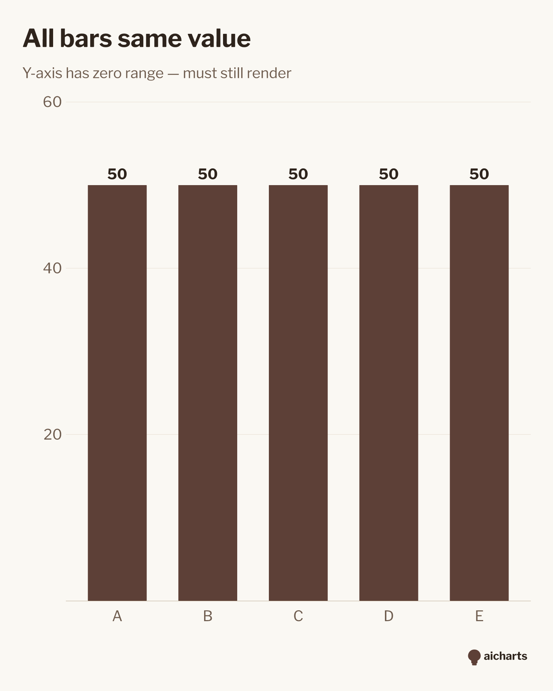](https://mcp-charts.vercel.app/chart?j=%7B%22chart%22%3A%22bar%22%2C%22title%22%3A%22All%20bars%20same%20value%22%2C%22subtitle%22%3A%22Y-axis%20has%20zero%20range%20%E2%80%94%20must%20still%20render%22%2C%22palette%22%3A%22earth%22%2C%22label%22%3A%22team%22%2C%22value%22%3A%22score%22%2C%22showValueLabels%22%3Atrue%2C%22data%22%3A%5B%7B%22team%22%3A%22A%22%2C%22score%22%3A50%7D%2C%7B%22team%22%3A%22B%22%2C%22score%22%3A50%7D%2C%7B%22team%22%3A%22C%22%2C%22score%22%3A50%7D%2C%7B%22team%22%3A%22D%22%2C%22score%22%3A50%7D%2C%7B%22team%22%3A%22E%22%2C%22score%22%3A50%7D%5D%2C%22size%22%3A%22poster%22%7D)

Open rendered PNG: <https://mcp-charts.vercel.app/chart?j=%7B%22chart%22%3A%22bar%22%2C%22title%22%3A%22All%20bars%20same%20value%22%2C%22subtitle%22%3A%22Y-axis%20has%20zero%20range%20%E2%80%94%20must%20still%20render%22%2C%22palette%22%3A%22earth%22%2C%22label%22%3A%22team%22%2C%22value%22%3A%22score%22%2C%22showValueLabels%22%3Atrue%2C%22data%22%3A%5B%7B%22team%22%3A%22A%22%2C%22score%22%3A50%7D%2C%7B%22team%22%3A%22B%22%2C%22score%22%3A50%7D%2C%7B%22team%22%3A%22C%22%2C%22score%22%3A50%7D%2C%7B%22team%22%3A%22D%22%2C%22score%22%3A50%7D%2C%7B%22team%22%3A%22E%22%2C%22score%22%3A50%7D%5D%2C%22size%22%3A%22poster%22%7D>

---

### Extreme dynamic range
_One value is a billion times another_
Line · palette: twilight · size: poster

[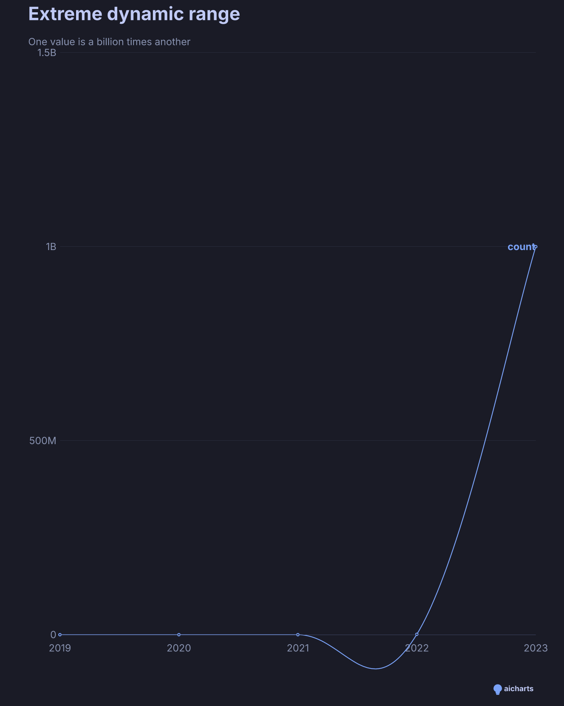](https://mcp-charts.vercel.app/chart?j=%7B%22chart%22%3A%22line%22%2C%22title%22%3A%22Extreme%20dynamic%20range%22%2C%22subtitle%22%3A%22One%20value%20is%20a%20billion%20times%20another%22%2C%22palette%22%3A%22twilight%22%2C%22x%22%3A%22year%22%2C%22y%22%3A%22count%22%2C%22interpolation%22%3A%22curved%22%2C%22showSymbols%22%3A%22all%22%2C%22data%22%3A%5B%7B%22year%22%3A2019%2C%22count%22%3A0.001%7D%2C%7B%22year%22%3A2020%2C%22count%22%3A1%7D%2C%7B%22year%22%3A2021%2C%22count%22%3A1000%7D%2C%7B%22year%22%3A2022%2C%22count%22%3A1000000%7D%2C%7B%22year%22%3A2023%2C%22count%22%3A1000000000%7D%5D%2C%22size%22%3A%22poster%22%7D)

Open rendered PNG: <https://mcp-charts.vercel.app/chart?j=%7B%22chart%22%3A%22line%22%2C%22title%22%3A%22Extreme%20dynamic%20range%22%2C%22subtitle%22%3A%22One%20value%20is%20a%20billion%20times%20another%22%2C%22palette%22%3A%22twilight%22%2C%22x%22%3A%22year%22%2C%22y%22%3A%22count%22%2C%22interpolation%22%3A%22curved%22%2C%22showSymbols%22%3A%22all%22%2C%22data%22%3A%5B%7B%22year%22%3A2019%2C%22count%22%3A0.001%7D%2C%7B%22year%22%3A2020%2C%22count%22%3A1%7D%2C%7B%22year%22%3A2021%2C%22count%22%3A1000%7D%2C%7B%22year%22%3A2022%2C%22count%22%3A1000000%7D%2C%7B%22year%22%3A2023%2C%22count%22%3A1000000000%7D%5D%2C%22size%22%3A%22poster%22%7D>

---

### All-negative returns
_Worst-performing assets of 2022 (percent)_
Bar · palette: diverging-sunset · size: poster

[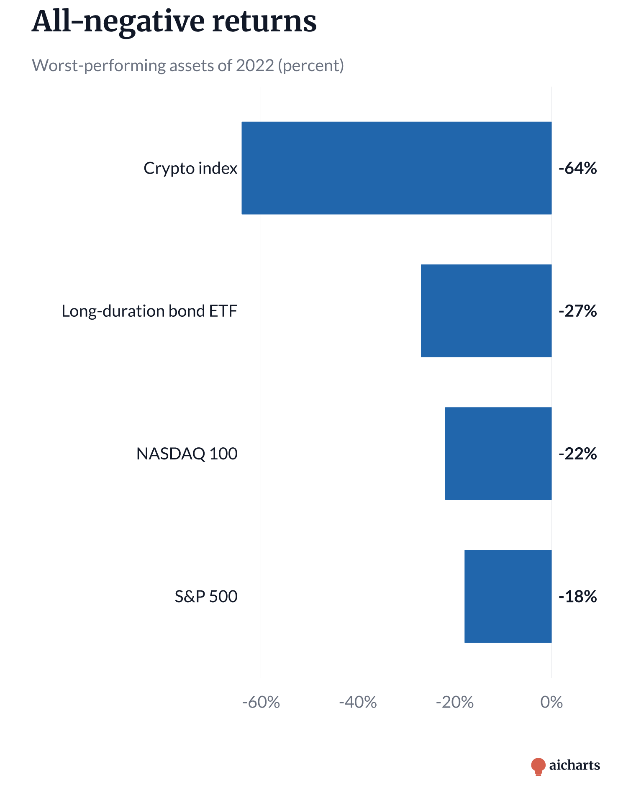](https://mcp-charts.vercel.app/chart?j=%7B%22chart%22%3A%22bar%22%2C%22title%22%3A%22All-negative%20returns%22%2C%22subtitle%22%3A%22Worst-performing%20assets%20of%202022%20(percent)%22%2C%22palette%22%3A%22diverging-sunset%22%2C%22label%22%3A%22asset%22%2C%22value%22%3A%22ret%22%2C%22orientation%22%3A%22horizontal%22%2C%22sort%22%3A%22asc%22%2C%22showValueLabels%22%3Atrue%2C%22yFormat%22%3A%22percent%22%2C%22data%22%3A%5B%7B%22asset%22%3A%22Crypto%20index%22%2C%22ret%22%3A-64%7D%2C%7B%22asset%22%3A%22Long-duration%20bond%20ETF%22%2C%22ret%22%3A-27%7D%2C%7B%22asset%22%3A%22NASDAQ%20100%22%2C%22ret%22%3A-22%7D%2C%7B%22asset%22%3A%22S%26P%20500%22%2C%22ret%22%3A-18%7D%5D%2C%22size%22%3A%22poster%22%7D)

Open rendered PNG: <https://mcp-charts.vercel.app/chart?j=%7B%22chart%22%3A%22bar%22%2C%22title%22%3A%22All-negative%20returns%22%2C%22subtitle%22%3A%22Worst-performing%20assets%20of%202022%20(percent)%22%2C%22palette%22%3A%22diverging-sunset%22%2C%22label%22%3A%22asset%22%2C%22value%22%3A%22ret%22%2C%22orientation%22%3A%22horizontal%22%2C%22sort%22%3A%22asc%22%2C%22showValueLabels%22%3Atrue%2C%22yFormat%22%3A%22percent%22%2C%22data%22%3A%5B%7B%22asset%22%3A%22Crypto%20index%22%2C%22ret%22%3A-64%7D%2C%7B%22asset%22%3A%22Long-duration%20bond%20ETF%22%2C%22ret%22%3A-27%7D%2C%7B%22asset%22%3A%22NASDAQ%20100%22%2C%22ret%22%3A-22%7D%2C%7B%22asset%22%3A%22S%26P%20500%22%2C%22ret%22%3A-18%7D%5D%2C%22size%22%3A%22poster%22%7D>

---

### Pie with far too many slices
_Library should auto-group tail as Other_
Pie · palette: vibrant · size: poster

[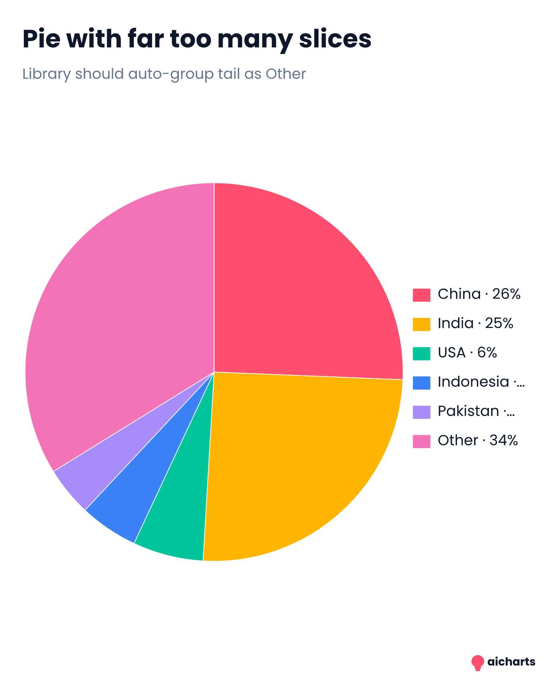](https://mcp-charts.vercel.app/chart?j=%7B%22chart%22%3A%22pie%22%2C%22title%22%3A%22Pie%20with%20far%20too%20many%20slices%22%2C%22subtitle%22%3A%22Library%20should%20auto-group%20tail%20as%20Other%22%2C%22palette%22%3A%22vibrant%22%2C%22label%22%3A%22country%22%2C%22value%22%3A%22pop%22%2C%22sort%22%3A%22desc%22%2C%22data%22%3A%5B%7B%22country%22%3A%22China%22%2C%22pop%22%3A1410%7D%2C%7B%22country%22%3A%22India%22%2C%22pop%22%3A1390%7D%2C%7B%22country%22%3A%22USA%22%2C%22pop%22%3A332%7D%2C%7B%22country%22%3A%22Indonesia%22%2C%22pop%22%3A275%7D%2C%7B%22country%22%3A%22Pakistan%22%2C%22pop%22%3A232%7D%2C%7B%22country%22%3A%22Brazil%22%2C%22pop%22%3A214%7D%2C%7B%22country%22%3A%22Nigeria%22%2C%22pop%22%3A218%7D%2C%7B%22country%22%3A%22Bangladesh%22%2C%22pop%22%3A169%7D%2C%7B%22country%22%3A%22Russia%22%2C%22pop%22%3A144%7D%2C%7B%22country%22%3A%22Mexico%22%2C%22pop%22%3A128%7D%2C%7B%22country%22%3A%22Japan%22%2C%22pop%22%3A125%7D%2C%7B%22country%22%3A%22Ethiopia%22%2C%22pop%22%3A120%7D%2C%7B%22country%22%3A%22Philippines%22%2C%22pop%22%3A114%7D%2C%7B%22country%22%3A%22Egypt%22%2C%22pop%22%3A109%7D%2C%7B%22country%22%3A%22Vietnam%22%2C%22pop%22%3A98%7D%2C%7B%22country%22%3A%22DR%20Congo%22%2C%22pop%22%3A95%7D%2C%7B%22country%22%3A%22Iran%22%2C%22pop%22%3A87%7D%2C%7B%22country%22%3A%22Turkey%22%2C%22pop%22%3A85%7D%2C%7B%22country%22%3A%22Germany%22%2C%22pop%22%3A83%7D%2C%7B%22country%22%3A%22Thailand%22%2C%22pop%22%3A70%7D%5D%2C%22size%22%3A%22poster%22%7D)

Open rendered PNG: <https://mcp-charts.vercel.app/chart?j=%7B%22chart%22%3A%22pie%22%2C%22title%22%3A%22Pie%20with%20far%20too%20many%20slices%22%2C%22subtitle%22%3A%22Library%20should%20auto-group%20tail%20as%20Other%22%2C%22palette%22%3A%22vibrant%22%2C%22label%22%3A%22country%22%2C%22value%22%3A%22pop%22%2C%22sort%22%3A%22desc%22%2C%22data%22%3A%5B%7B%22country%22%3A%22China%22%2C%22pop%22%3A1410%7D%2C%7B%22country%22%3A%22India%22%2C%22pop%22%3A1390%7D%2C%7B%22country%22%3A%22USA%22%2C%22pop%22%3A332%7D%2C%7B%22country%22%3A%22Indonesia%22%2C%22pop%22%3A275%7D%2C%7B%22country%22%3A%22Pakistan%22%2C%22pop%22%3A232%7D%2C%7B%22country%22%3A%22Brazil%22%2C%22pop%22%3A214%7D%2C%7B%22country%22%3A%22Nigeria%22%2C%22pop%22%3A218%7D%2C%7B%22country%22%3A%22Bangladesh%22%2C%22pop%22%3A169%7D%2C%7B%22country%22%3A%22Russia%22%2C%22pop%22%3A144%7D%2C%7B%22country%22%3A%22Mexico%22%2C%22pop%22%3A128%7D%2C%7B%22country%22%3A%22Japan%22%2C%22pop%22%3A125%7D%2C%7B%22country%22%3A%22Ethiopia%22%2C%22pop%22%3A120%7D%2C%7B%22country%22%3A%22Philippines%22%2C%22pop%22%3A114%7D%2C%7B%22country%22%3A%22Egypt%22%2C%22pop%22%3A109%7D%2C%7B%22country%22%3A%22Vietnam%22%2C%22pop%22%3A98%7D%2C%7B%22country%22%3A%22DR%20Congo%22%2C%22pop%22%3A95%7D%2C%7B%22country%22%3A%22Iran%22%2C%22pop%22%3A87%7D%2C%7B%22country%22%3A%22Turkey%22%2C%22pop%22%3A85%7D%2C%7B%22country%22%3A%22Germany%22%2C%22pop%22%3A83%7D%2C%7B%22country%22%3A%22Thailand%22%2C%22pop%22%3A70%7D%5D%2C%22size%22%3A%22poster%22%7D>

---

### Percent values pre-scaled to 0..100
_Share of US workers using AI at work (percent)_
Line · palette: editorial · size: poster

[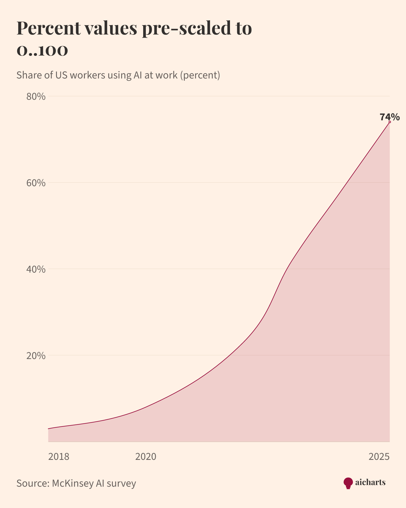](https://mcp-charts.vercel.app/chart?j=%7B%22chart%22%3A%22line%22%2C%22title%22%3A%22Percent%20values%20pre-scaled%20to%200..100%22%2C%22subtitle%22%3A%22Share%20of%20US%20workers%20using%20AI%20at%20work%20(percent)%22%2C%22source%22%3A%22McKinsey%20AI%20survey%22%2C%22palette%22%3A%22editorial%22%2C%22x%22%3A%22year%22%2C%22y%22%3A%22share%22%2C%22interpolation%22%3A%22curved%22%2C%22areaFill%22%3Atrue%2C%22showSymbols%22%3A%22last%22%2C%22showValueLabels%22%3A%22last%22%2C%22yFormat%22%3A%22percent%22%2C%22data%22%3A%5B%7B%22year%22%3A2018%2C%22share%22%3A3%7D%2C%7B%22year%22%3A2020%2C%22share%22%3A8%7D%2C%7B%22year%22%3A2022%2C%22share%22%3A23%7D%2C%7B%22year%22%3A2023%2C%22share%22%3A42%7D%2C%7B%22year%22%3A2024%2C%22share%22%3A58%7D%2C%7B%22year%22%3A2025%2C%22share%22%3A74%7D%5D%2C%22size%22%3A%22poster%22%7D)

Open rendered PNG: <https://mcp-charts.vercel.app/chart?j=%7B%22chart%22%3A%22line%22%2C%22title%22%3A%22Percent%20values%20pre-scaled%20to%200..100%22%2C%22subtitle%22%3A%22Share%20of%20US%20workers%20using%20AI%20at%20work%20(percent)%22%2C%22source%22%3A%22McKinsey%20AI%20survey%22%2C%22palette%22%3A%22editorial%22%2C%22x%22%3A%22year%22%2C%22y%22%3A%22share%22%2C%22interpolation%22%3A%22curved%22%2C%22areaFill%22%3Atrue%2C%22showSymbols%22%3A%22last%22%2C%22showValueLabels%22%3A%22last%22%2C%22yFormat%22%3A%22percent%22%2C%22data%22%3A%5B%7B%22year%22%3A2018%2C%22share%22%3A3%7D%2C%7B%22year%22%3A2020%2C%22share%22%3A8%7D%2C%7B%22year%22%3A2022%2C%22share%22%3A23%7D%2C%7B%22year%22%3A2023%2C%22share%22%3A42%7D%2C%7B%22year%22%3A2024%2C%22share%22%3A58%7D%2C%7B%22year%22%3A2025%2C%22share%22%3A74%7D%5D%2C%22size%22%3A%22poster%22%7D>

Source: McKinsey AI survey

---

### Microscopic values
_Probabilities below 1 percent (as fractions, 0..1)_
Line · palette: mono-blue · size: poster

[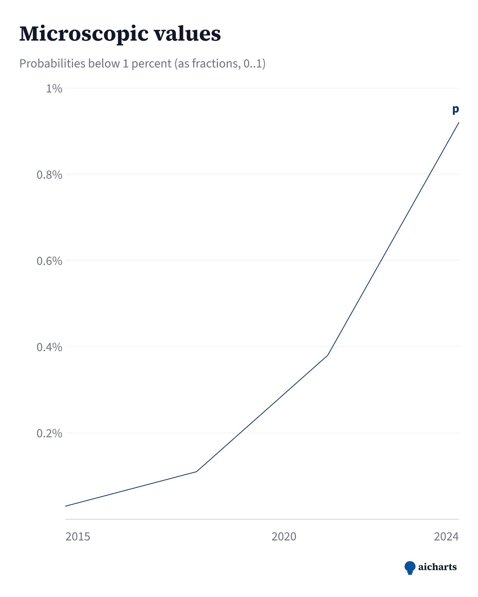](https://mcp-charts.vercel.app/chart?j=%7B%22chart%22%3A%22line%22%2C%22title%22%3A%22Microscopic%20values%22%2C%22subtitle%22%3A%22Probabilities%20below%201%20percent%20(as%20fractions%2C%200..1)%22%2C%22palette%22%3A%22mono-blue%22%2C%22x%22%3A%22year%22%2C%22y%22%3A%22p%22%2C%22yFormat%22%3A%22percent%22%2C%22data%22%3A%5B%7B%22year%22%3A2015%2C%22p%22%3A0.0003%7D%2C%7B%22year%22%3A2018%2C%22p%22%3A0.0011%7D%2C%7B%22year%22%3A2021%2C%22p%22%3A0.0038%7D%2C%7B%22year%22%3A2024%2C%22p%22%3A0.0092%7D%5D%2C%22size%22%3A%22poster%22%7D)

Open rendered PNG: <https://mcp-charts.vercel.app/chart?j=%7B%22chart%22%3A%22line%22%2C%22title%22%3A%22Microscopic%20values%22%2C%22subtitle%22%3A%22Probabilities%20below%201%20percent%20(as%20fractions%2C%200..1)%22%2C%22palette%22%3A%22mono-blue%22%2C%22x%22%3A%22year%22%2C%22y%22%3A%22p%22%2C%22yFormat%22%3A%22percent%22%2C%22data%22%3A%5B%7B%22year%22%3A2015%2C%22p%22%3A0.0003%7D%2C%7B%22year%22%3A2018%2C%22p%22%3A0.0011%7D%2C%7B%22year%22%3A2021%2C%22p%22%3A0.0038%7D%2C%7B%22year%22%3A2024%2C%22p%22%3A0.0092%7D%5D%2C%22size%22%3A%22poster%22%7D>

---

### Eight-way stack
_Lots of overlapping slivers_
Stacked area · palette: earth · size: poster

[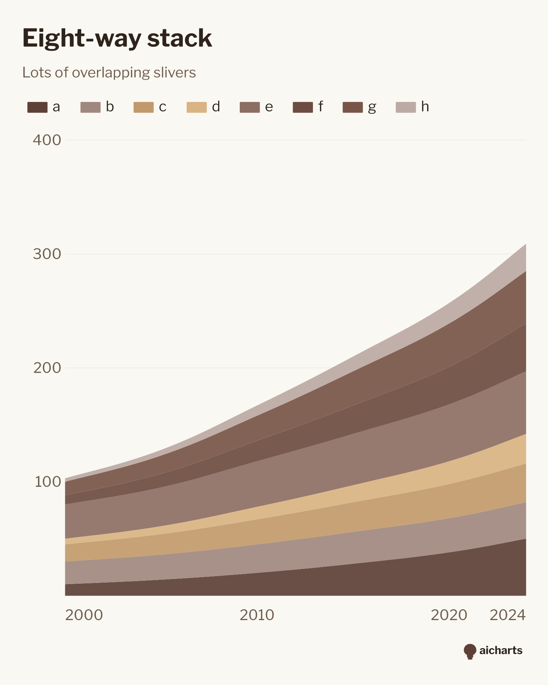](https://mcp-charts.vercel.app/chart?j=%7B%22chart%22%3A%22stacked-area%22%2C%22title%22%3A%22Eight-way%20stack%22%2C%22subtitle%22%3A%22Lots%20of%20overlapping%20slivers%22%2C%22palette%22%3A%22earth%22%2C%22x%22%3A%22year%22%2C%22y%22%3A%5B%22a%22%2C%22b%22%2C%22c%22%2C%22d%22%2C%22e%22%2C%22f%22%2C%22g%22%2C%22h%22%5D%2C%22interpolation%22%3A%22curved%22%2C%22data%22%3A%5B%7B%22year%22%3A2000%2C%22a%22%3A10%2C%22b%22%3A20%2C%22c%22%3A15%2C%22d%22%3A5%2C%22e%22%3A30%2C%22f%22%3A8%2C%22g%22%3A12%2C%22h%22%3A3%7D%2C%7B%22year%22%3A2005%2C%22a%22%3A14%2C%22b%22%3A22%2C%22c%22%3A18%2C%22d%22%3A7%2C%22e%22%3A34%2C%22f%22%3A12%2C%22g%22%3A16%2C%22h%22%3A5%7D%2C%7B%22year%22%3A2010%2C%22a%22%3A20%2C%22b%22%3A25%2C%22c%22%3A22%2C%22d%22%3A11%2C%22e%22%3A40%2C%22f%22%3A18%2C%22g%22%3A22%2C%22h%22%3A9%7D%2C%7B%22year%22%3A2015%2C%22a%22%3A28%2C%22b%22%3A28%2C%22c%22%3A26%2C%22d%22%3A15%2C%22e%22%3A45%2C%22f%22%3A25%2C%22g%22%3A30%2C%22h%22%3A13%7D%2C%7B%22year%22%3A2020%2C%22a%22%3A38%2C%22b%22%3A30%2C%22c%22%3A30%2C%22d%22%3A20%2C%22e%22%3A50%2C%22f%22%3A33%2C%22g%22%3A38%2C%22h%22%3A18%7D%2C%7B%22year%22%3A2024%2C%22a%22%3A50%2C%22b%22%3A32%2C%22c%22%3A34%2C%22d%22%3A26%2C%22e%22%3A55%2C%22f%22%3A42%2C%22g%22%3A46%2C%22h%22%3A24%7D%5D%2C%22size%22%3A%22poster%22%7D)

Open rendered PNG: <https://mcp-charts.vercel.app/chart?j=%7B%22chart%22%3A%22stacked-area%22%2C%22title%22%3A%22Eight-way%20stack%22%2C%22subtitle%22%3A%22Lots%20of%20overlapping%20slivers%22%2C%22palette%22%3A%22earth%22%2C%22x%22%3A%22year%22%2C%22y%22%3A%5B%22a%22%2C%22b%22%2C%22c%22%2C%22d%22%2C%22e%22%2C%22f%22%2C%22g%22%2C%22h%22%5D%2C%22interpolation%22%3A%22curved%22%2C%22data%22%3A%5B%7B%22year%22%3A2000%2C%22a%22%3A10%2C%22b%22%3A20%2C%22c%22%3A15%2C%22d%22%3A5%2C%22e%22%3A30%2C%22f%22%3A8%2C%22g%22%3A12%2C%22h%22%3A3%7D%2C%7B%22year%22%3A2005%2C%22a%22%3A14%2C%22b%22%3A22%2C%22c%22%3A18%2C%22d%22%3A7%2C%22e%22%3A34%2C%22f%22%3A12%2C%22g%22%3A16%2C%22h%22%3A5%7D%2C%7B%22year%22%3A2010%2C%22a%22%3A20%2C%22b%22%3A25%2C%22c%22%3A22%2C%22d%22%3A11%2C%22e%22%3A40%2C%22f%22%3A18%2C%22g%22%3A22%2C%22h%22%3A9%7D%2C%7B%22year%22%3A2015%2C%22a%22%3A28%2C%22b%22%3A28%2C%22c%22%3A26%2C%22d%22%3A15%2C%22e%22%3A45%2C%22f%22%3A25%2C%22g%22%3A30%2C%22h%22%3A13%7D%2C%7B%22year%22%3A2020%2C%22a%22%3A38%2C%22b%22%3A30%2C%22c%22%3A30%2C%22d%22%3A20%2C%22e%22%3A50%2C%22f%22%3A33%2C%22g%22%3A38%2C%22h%22%3A18%7D%2C%7B%22year%22%3A2024%2C%22a%22%3A50%2C%22b%22%3A32%2C%22c%22%3A34%2C%22d%22%3A26%2C%22e%22%3A55%2C%22f%22%3A42%2C%22g%22%3A46%2C%22h%22%3A24%7D%5D%2C%22size%22%3A%22poster%22%7D>

---

### Trillions and billions
_Very large numeric range_
Bar · palette: boardroom · size: poster

[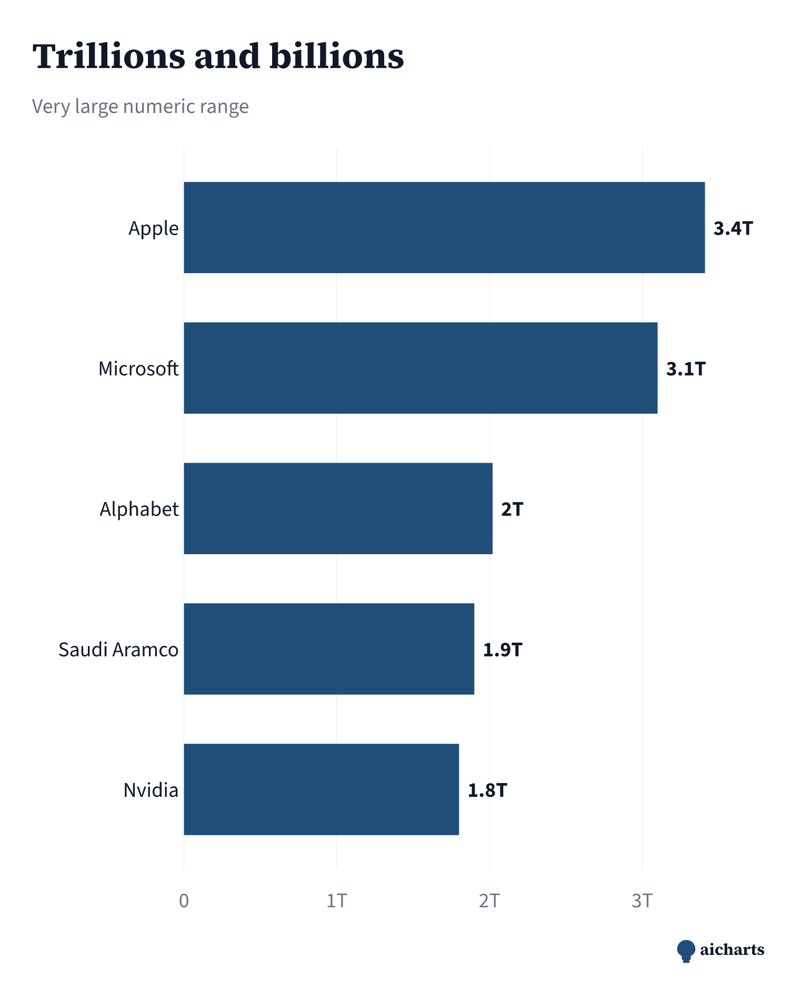](https://mcp-charts.vercel.app/chart?j=%7B%22chart%22%3A%22bar%22%2C%22title%22%3A%22Trillions%20and%20billions%22%2C%22subtitle%22%3A%22Very%20large%20numeric%20range%22%2C%22palette%22%3A%22boardroom%22%2C%22label%22%3A%22company%22%2C%22value%22%3A%22marketCap%22%2C%22orientation%22%3A%22horizontal%22%2C%22sort%22%3A%22desc%22%2C%22showValueLabels%22%3Atrue%2C%22data%22%3A%5B%7B%22company%22%3A%22Apple%22%2C%22marketCap%22%3A3410000000000%7D%2C%7B%22company%22%3A%22Microsoft%22%2C%22marketCap%22%3A3100000000000%7D%2C%7B%22company%22%3A%22Alphabet%22%2C%22marketCap%22%3A2020000000000%7D%2C%7B%22company%22%3A%22Saudi%20Aramco%22%2C%22marketCap%22%3A1900000000000%7D%2C%7B%22company%22%3A%22Nvidia%22%2C%22marketCap%22%3A1800000000000%7D%5D%2C%22size%22%3A%22poster%22%7D)

Open rendered PNG: <https://mcp-charts.vercel.app/chart?j=%7B%22chart%22%3A%22bar%22%2C%22title%22%3A%22Trillions%20and%20billions%22%2C%22subtitle%22%3A%22Very%20large%20numeric%20range%22%2C%22palette%22%3A%22boardroom%22%2C%22label%22%3A%22company%22%2C%22value%22%3A%22marketCap%22%2C%22orientation%22%3A%22horizontal%22%2C%22sort%22%3A%22desc%22%2C%22showValueLabels%22%3Atrue%2C%22data%22%3A%5B%7B%22company%22%3A%22Apple%22%2C%22marketCap%22%3A3410000000000%7D%2C%7B%22company%22%3A%22Microsoft%22%2C%22marketCap%22%3A3100000000000%7D%2C%7B%22company%22%3A%22Alphabet%22%2C%22marketCap%22%3A2020000000000%7D%2C%7B%22company%22%3A%22Saudi%20Aramco%22%2C%22marketCap%22%3A1900000000000%7D%2C%7B%22company%22%3A%22Nvidia%22%2C%22marketCap%22%3A1800000000000%7D%5D%2C%22size%22%3A%22poster%22%7D>

---

### Two points, should still draw a line
_Minimal viable line_
Line · palette: clarity · size: poster

[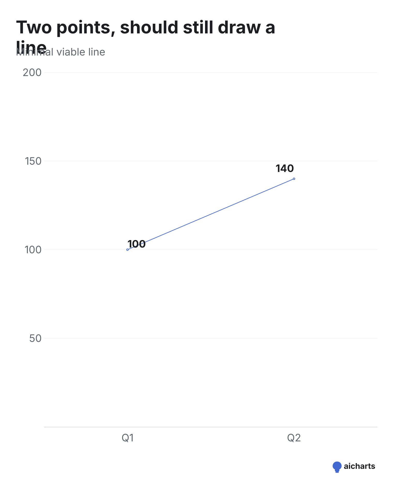](https://mcp-charts.vercel.app/chart?j=%7B%22chart%22%3A%22line%22%2C%22title%22%3A%22Two%20points%2C%20should%20still%20draw%20a%20line%22%2C%22subtitle%22%3A%22Minimal%20viable%20line%22%2C%22palette%22%3A%22clarity%22%2C%22x%22%3A%22quarter%22%2C%22y%22%3A%22rev%22%2C%22showSymbols%22%3A%22all%22%2C%22showValueLabels%22%3A%22all%22%2C%22data%22%3A%5B%7B%22quarter%22%3A%22Q1%22%2C%22rev%22%3A100%7D%2C%7B%22quarter%22%3A%22Q2%22%2C%22rev%22%3A140%7D%5D%2C%22size%22%3A%22poster%22%7D)

Open rendered PNG: <https://mcp-charts.vercel.app/chart?j=%7B%22chart%22%3A%22line%22%2C%22title%22%3A%22Two%20points%2C%20should%20still%20draw%20a%20line%22%2C%22subtitle%22%3A%22Minimal%20viable%20line%22%2C%22palette%22%3A%22clarity%22%2C%22x%22%3A%22quarter%22%2C%22y%22%3A%22rev%22%2C%22showSymbols%22%3A%22all%22%2C%22showValueLabels%22%3A%22all%22%2C%22data%22%3A%5B%7B%22quarter%22%3A%22Q1%22%2C%22rev%22%3A100%7D%2C%7B%22quarter%22%3A%22Q2%22%2C%22rev%22%3A140%7D%5D%2C%22size%22%3A%22poster%22%7D>

---

### Loading state?
_Empty pie with a title — should fall back gracefully_
Pie · palette: vibrant · size: poster

[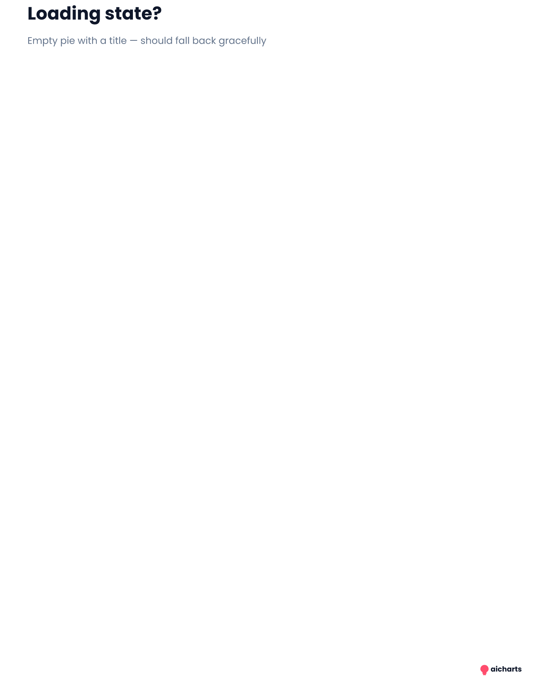](https://mcp-charts.vercel.app/chart?j=%7B%22chart%22%3A%22pie%22%2C%22title%22%3A%22Loading%20state%3F%22%2C%22subtitle%22%3A%22Empty%20pie%20with%20a%20title%20%E2%80%94%20should%20fall%20back%20gracefully%22%2C%22palette%22%3A%22vibrant%22%2C%22label%22%3A%22x%22%2C%22value%22%3A%22y%22%2C%22data%22%3A%5B%5D%2C%22size%22%3A%22poster%22%7D)

Open rendered PNG: <https://mcp-charts.vercel.app/chart?j=%7B%22chart%22%3A%22pie%22%2C%22title%22%3A%22Loading%20state%3F%22%2C%22subtitle%22%3A%22Empty%20pie%20with%20a%20title%20%E2%80%94%20should%20fall%20back%20gracefully%22%2C%22palette%22%3A%22vibrant%22%2C%22label%22%3A%22x%22%2C%22value%22%3A%22y%22%2C%22data%22%3A%5B%5D%2C%22size%22%3A%22poster%22%7D>

---

### Mixed-magnitude combo
_Bars in millions, line in single digits_
Bar + line · palette: editorial · size: poster

[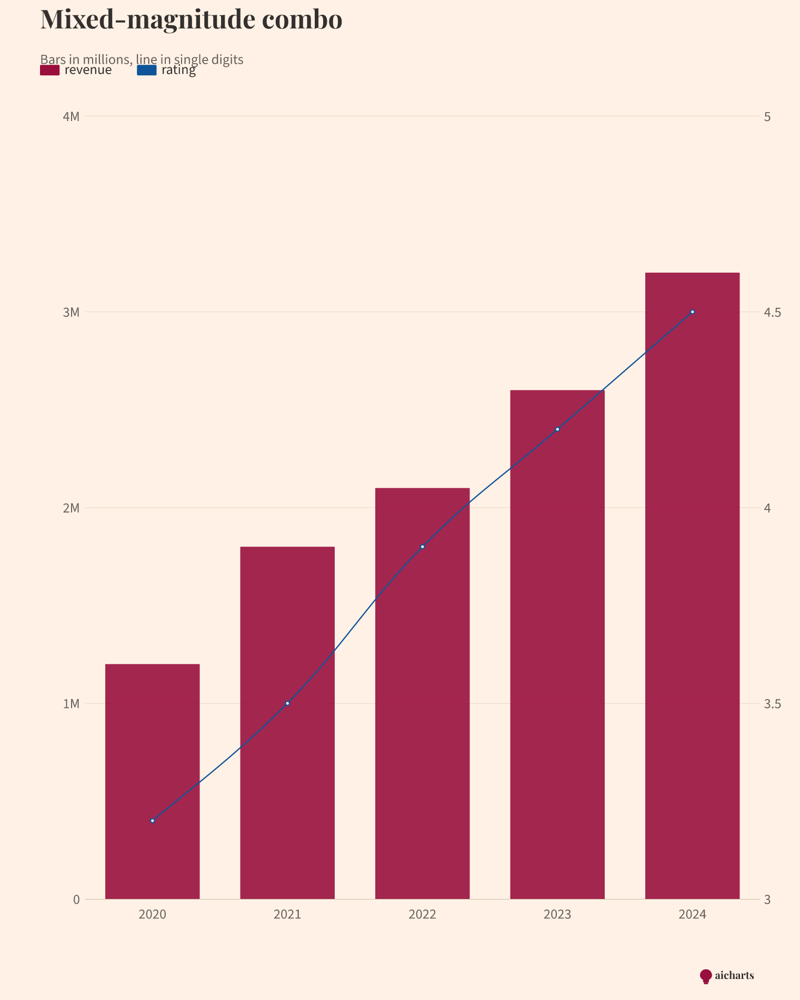](https://mcp-charts.vercel.app/chart?j=%7B%22chart%22%3A%22combo%22%2C%22title%22%3A%22Mixed-magnitude%20combo%22%2C%22subtitle%22%3A%22Bars%20in%20millions%2C%20line%20in%20single%20digits%22%2C%22palette%22%3A%22editorial%22%2C%22x%22%3A%22year%22%2C%22bars%22%3A%22revenue%22%2C%22lines%22%3A%22rating%22%2C%22interpolation%22%3A%22curved%22%2C%22data%22%3A%5B%7B%22year%22%3A2020%2C%22revenue%22%3A1200000%2C%22rating%22%3A3.2%7D%2C%7B%22year%22%3A2021%2C%22revenue%22%3A1800000%2C%22rating%22%3A3.5%7D%2C%7B%22year%22%3A2022%2C%22revenue%22%3A2100000%2C%22rating%22%3A3.9%7D%2C%7B%22year%22%3A2023%2C%22revenue%22%3A2600000%2C%22rating%22%3A4.2%7D%2C%7B%22year%22%3A2024%2C%22revenue%22%3A3200000%2C%22rating%22%3A4.5%7D%5D%2C%22size%22%3A%22poster%22%7D)

Open rendered PNG: <https://mcp-charts.vercel.app/chart?j=%7B%22chart%22%3A%22combo%22%2C%22title%22%3A%22Mixed-magnitude%20combo%22%2C%22subtitle%22%3A%22Bars%20in%20millions%2C%20line%20in%20single%20digits%22%2C%22palette%22%3A%22editorial%22%2C%22x%22%3A%22year%22%2C%22bars%22%3A%22revenue%22%2C%22lines%22%3A%22rating%22%2C%22interpolation%22%3A%22curved%22%2C%22data%22%3A%5B%7B%22year%22%3A2020%2C%22revenue%22%3A1200000%2C%22rating%22%3A3.2%7D%2C%7B%22year%22%3A2021%2C%22revenue%22%3A1800000%2C%22rating%22%3A3.5%7D%2C%7B%22year%22%3A2022%2C%22revenue%22%3A2100000%2C%22rating%22%3A3.9%7D%2C%7B%22year%22%3A2023%2C%22revenue%22%3A2600000%2C%22rating%22%3A4.2%7D%2C%7B%22year%22%3A2024%2C%22revenue%22%3A3200000%2C%22rating%22%3A4.5%7D%5D%2C%22size%22%3A%22poster%22%7D>

---

### Non-year integer x-axis
_Could be trial numbers or round counts_
Line · palette: mono-blue · size: poster

[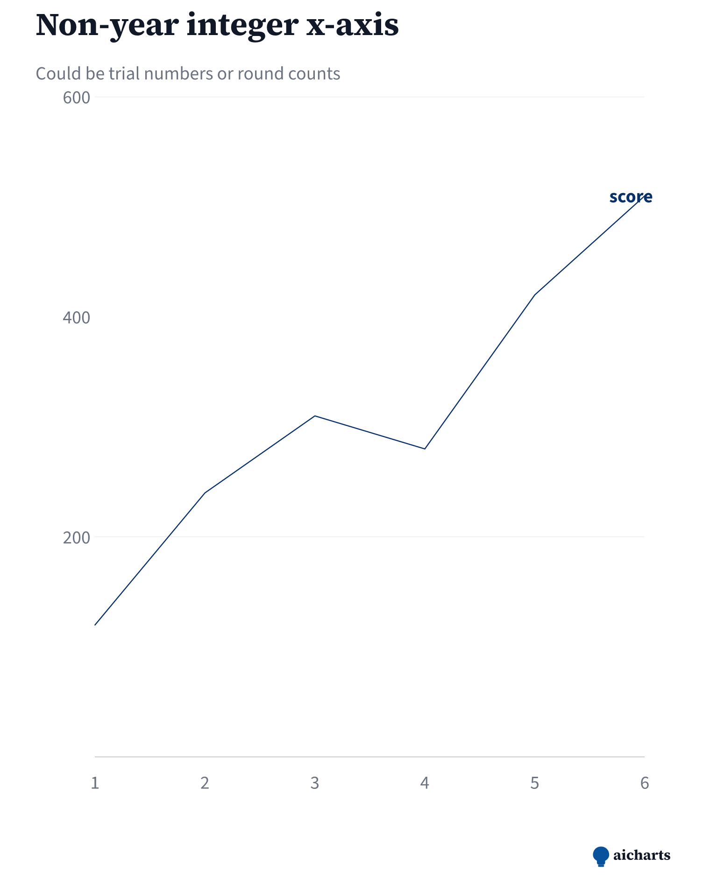](https://mcp-charts.vercel.app/chart?j=%7B%22chart%22%3A%22line%22%2C%22title%22%3A%22Non-year%20integer%20x-axis%22%2C%22subtitle%22%3A%22Could%20be%20trial%20numbers%20or%20round%20counts%22%2C%22palette%22%3A%22mono-blue%22%2C%22x%22%3A%22round%22%2C%22y%22%3A%22score%22%2C%22data%22%3A%5B%7B%22round%22%3A1%2C%22score%22%3A120%7D%2C%7B%22round%22%3A2%2C%22score%22%3A240%7D%2C%7B%22round%22%3A3%2C%22score%22%3A310%7D%2C%7B%22round%22%3A4%2C%22score%22%3A280%7D%2C%7B%22round%22%3A5%2C%22score%22%3A420%7D%2C%7B%22round%22%3A6%2C%22score%22%3A510%7D%5D%2C%22size%22%3A%22poster%22%7D)

Open rendered PNG: <https://mcp-charts.vercel.app/chart?j=%7B%22chart%22%3A%22line%22%2C%22title%22%3A%22Non-year%20integer%20x-axis%22%2C%22subtitle%22%3A%22Could%20be%20trial%20numbers%20or%20round%20counts%22%2C%22palette%22%3A%22mono-blue%22%2C%22x%22%3A%22round%22%2C%22y%22%3A%22score%22%2C%22data%22%3A%5B%7B%22round%22%3A1%2C%22score%22%3A120%7D%2C%7B%22round%22%3A2%2C%22score%22%3A240%7D%2C%7B%22round%22%3A3%2C%22score%22%3A310%7D%2C%7B%22round%22%3A4%2C%22score%22%3A280%7D%2C%7B%22round%22%3A5%2C%22score%22%3A420%7D%2C%7B%22round%22%3A6%2C%22score%22%3A510%7D%5D%2C%22size%22%3A%22poster%22%7D>

---

### Crossing zero
_Line oscillating across the zero baseline_
Line · palette: diverging-sunset · size: poster

[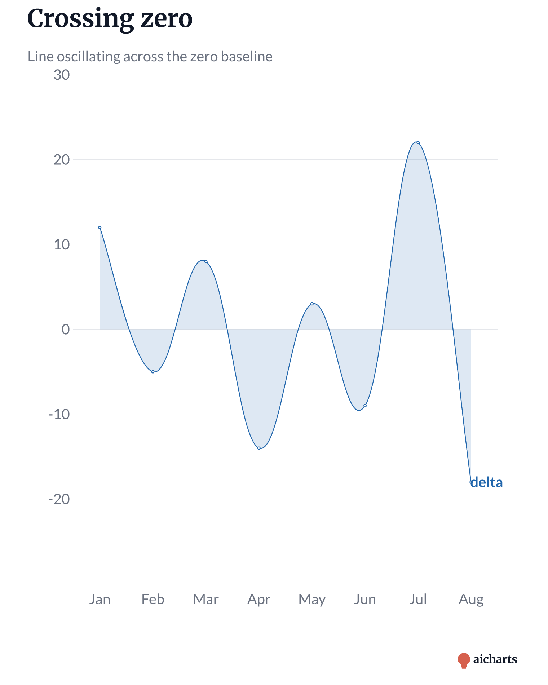](https://mcp-charts.vercel.app/chart?j=%7B%22chart%22%3A%22line%22%2C%22title%22%3A%22Crossing%20zero%22%2C%22subtitle%22%3A%22Line%20oscillating%20across%20the%20zero%20baseline%22%2C%22palette%22%3A%22diverging-sunset%22%2C%22x%22%3A%22month%22%2C%22y%22%3A%22delta%22%2C%22interpolation%22%3A%22curved%22%2C%22areaFill%22%3Atrue%2C%22showSymbols%22%3A%22all%22%2C%22data%22%3A%5B%7B%22month%22%3A%22Jan%22%2C%22delta%22%3A12%7D%2C%7B%22month%22%3A%22Feb%22%2C%22delta%22%3A-5%7D%2C%7B%22month%22%3A%22Mar%22%2C%22delta%22%3A8%7D%2C%7B%22month%22%3A%22Apr%22%2C%22delta%22%3A-14%7D%2C%7B%22month%22%3A%22May%22%2C%22delta%22%3A3%7D%2C%7B%22month%22%3A%22Jun%22%2C%22delta%22%3A-9%7D%2C%7B%22month%22%3A%22Jul%22%2C%22delta%22%3A22%7D%2C%7B%22month%22%3A%22Aug%22%2C%22delta%22%3A-18%7D%5D%2C%22size%22%3A%22poster%22%7D)

Open rendered PNG: <https://mcp-charts.vercel.app/chart?j=%7B%22chart%22%3A%22line%22%2C%22title%22%3A%22Crossing%20zero%22%2C%22subtitle%22%3A%22Line%20oscillating%20across%20the%20zero%20baseline%22%2C%22palette%22%3A%22diverging-sunset%22%2C%22x%22%3A%22month%22%2C%22y%22%3A%22delta%22%2C%22interpolation%22%3A%22curved%22%2C%22areaFill%22%3Atrue%2C%22showSymbols%22%3A%22all%22%2C%22data%22%3A%5B%7B%22month%22%3A%22Jan%22%2C%22delta%22%3A12%7D%2C%7B%22month%22%3A%22Feb%22%2C%22delta%22%3A-5%7D%2C%7B%22month%22%3A%22Mar%22%2C%22delta%22%3A8%7D%2C%7B%22month%22%3A%22Apr%22%2C%22delta%22%3A-14%7D%2C%7B%22month%22%3A%22May%22%2C%22delta%22%3A3%7D%2C%7B%22month%22%3A%22Jun%22%2C%22delta%22%3A-9%7D%2C%7B%22month%22%3A%22Jul%22%2C%22delta%22%3A22%7D%2C%7B%22month%22%3A%22Aug%22%2C%22delta%22%3A-18%7D%5D%2C%22size%22%3A%22poster%22%7D>

---

### Map with one data point
_Single country highlighted on world map_
Map · palette: carbon · size: poster

[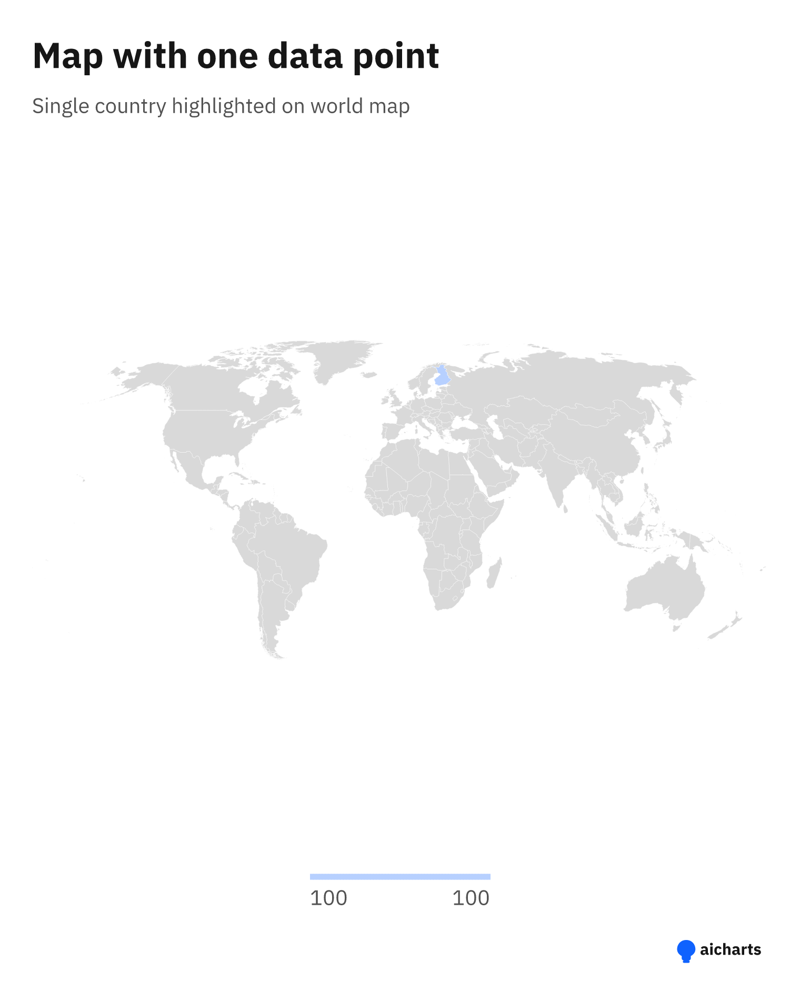](https://mcp-charts.vercel.app/chart?j=%7B%22chart%22%3A%22geo%22%2C%22title%22%3A%22Map%20with%20one%20data%20point%22%2C%22subtitle%22%3A%22Single%20country%20highlighted%20on%20world%20map%22%2C%22palette%22%3A%22carbon%22%2C%22basemap%22%3A%22world%22%2C%22code%22%3A%22country%22%2C%22value%22%3A%22v%22%2C%22scale%22%3A%22stepped%22%2C%22data%22%3A%5B%7B%22country%22%3A%22FIN%22%2C%22v%22%3A100%7D%5D%2C%22size%22%3A%22poster%22%7D)

Open rendered PNG: <https://mcp-charts.vercel.app/chart?j=%7B%22chart%22%3A%22geo%22%2C%22title%22%3A%22Map%20with%20one%20data%20point%22%2C%22subtitle%22%3A%22Single%20country%20highlighted%20on%20world%20map%22%2C%22palette%22%3A%22carbon%22%2C%22basemap%22%3A%22world%22%2C%22code%22%3A%22country%22%2C%22value%22%3A%22v%22%2C%22scale%22%3A%22stepped%22%2C%22data%22%3A%5B%7B%22country%22%3A%22FIN%22%2C%22v%22%3A100%7D%5D%2C%22size%22%3A%22poster%22%7D>

---

## Want something like this in your chat?

Open the [main README](../README.md), copy the ChatGPT prompt into any AI chat, then ask for the chart you want. The assistant will reply with a Markdown image that renders inline.

Full JSON for every chart on this page lives in [`edge-cases.json`](./edge-cases.json). Regenerate all PNGs with `npm run zoo:all` from the repo root.
